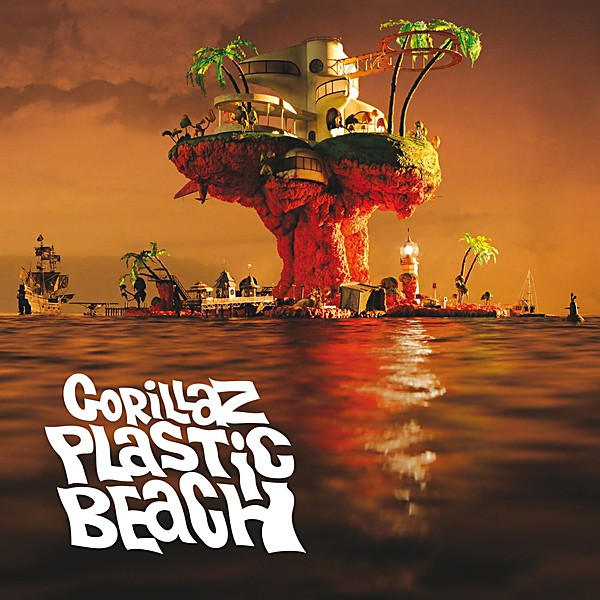

# Plastic Beach

By **Gorillaz**

## Album Data

- **Catalog:** Beets
- **Format:** Digital, Album
- **Album:** Plastic Beach
- **Artist:** Gorillaz
- **Albumartist:** Gorillaz
- **Genre:** Electronica
- **MusicBrainz Album Artist ID:** 
- **MusicBrainz Album ID:** 
- **MusicBrainz Release Group ID:** 
- **Year:** 2010
- **Catalog #:** 
- **Label:** 
- **Total Tracks:** 16

## Album Tracks

### Track 01 - Orchestral Intro (Feat. Sinfonia ViVA)

- **Artist:** Gorillaz
- **Format:** AAC
- **Genre:** Orchestral
- **Length:** 1:09
- **MusicBrainz Track ID:** 
- **Title:** Orchestral Intro (Feat. Sinfonia ViVA)
- **Track:** 01
- **Year:** 2010

### Track 02 - Welcome To The World Of The Plastic Beach (Feat. Snoop Dogg And Hypnotic Brass Ensemble)

- **Artist:** Gorillaz
- **Format:** AAC
- **Genre:** Trip Hop
- **Length:** 3:35
- **MusicBrainz Track ID:** 
- **Title:** Welcome To The World Of The Plastic Beach (Feat. Snoop Dogg And Hypnotic Brass Ensemble)
- **Track:** 02
- **Year:** 2010

### Track 03 - White Flag (Feat. Bashy, Kano And The National Orchestra For Arabic Music)

- **Artist:** Gorillaz
- **Format:** MP3
- **Genre:** Orchestral
- **Length:** 3:43
- **MusicBrainz Track ID:** 
- **Title:** White Flag (Feat. Bashy, Kano And The National Orchestra For Arabic Music)
- **Track:** 03
- **Year:** 2010

### Track 04 - Rhinestone Eyes

- **Artist:** Gorillaz
- **Format:** AAC
- **Genre:** Synthpop
- **Length:** 3:20
- **MusicBrainz Track ID:** 
- **Title:** Rhinestone Eyes
- **Track:** 04
- **Year:** 2010

### Track 05 - Stylo (Album Version) [feat. Mos Def and Bobby Womack]

- **Artist:** Gorillaz
- **Format:** MP3
- **Genre:** Electropop
- **Length:** 4:30
- **MusicBrainz Track ID:** 
- **Title:** Stylo (Album Version) [feat. Mos Def and Bobby Womack]
- **Track:** 05
- **Year:** 2010

### Track 06 - Superfast Jellyfish (Feat. Gruff Rhys And De La Soul)

- **Artist:** Gorillaz
- **Format:** MP3
- **Genre:** Electropop
- **Length:** 2:54
- **MusicBrainz Track ID:** 
- **Title:** Superfast Jellyfish (Feat. Gruff Rhys And De La Soul)
- **Track:** 06
- **Year:** 2010

### Track 07 - Empire Ants (feat. Little Dragon)

- **Artist:** Gorillaz
- **Format:** AAC
- **Genre:** Synthpop
- **Length:** 4:43
- **MusicBrainz Track ID:** 
- **Title:** Empire Ants (feat. Little Dragon)
- **Track:** 07
- **Year:** 2010

### Track 08 - Glitter Freeze (Feat. Mark E Smith)

- **Artist:** Gorillaz
- **Format:** MP3
- **Genre:** Synthpop
- **Length:** 4:03
- **MusicBrainz Track ID:** 
- **Title:** Glitter Freeze (Feat. Mark E Smith)
- **Track:** 08
- **Year:** 2010

### Track 09 - Some Kind Of Nature (Feat. Lou Reed)

- **Artist:** Gorillaz
- **Format:** MP3
- **Genre:** Electropop
- **Length:** 2:59
- **MusicBrainz Track ID:** 
- **Title:** Some Kind Of Nature (Feat. Lou Reed)
- **Track:** 09
- **Year:** 2010

### Track 10 - On Melancholy Hill

- **Artist:** Gorillaz
- **Format:** MP3
- **Genre:** Synthpop
- **Length:** 3:53
- **MusicBrainz Track ID:** 
- **Title:** On Melancholy Hill
- **Track:** 10
- **Year:** 2010

### Track 11 - Broken

- **Artist:** Gorillaz
- **Format:** AAC
- **Genre:** Electropop
- **Length:** 3:17
- **MusicBrainz Track ID:** 
- **Title:** Broken
- **Track:** 11
- **Year:** 2010

### Track 12 - Sweepstakes (Feat. Mos Def And Hypnotic Brass Ensemble)

- **Artist:** Gorillaz
- **Format:** AAC
- **Genre:** Hip House
- **Length:** 5:20
- **MusicBrainz Track ID:** 
- **Title:** Sweepstakes (Feat. Mos Def And Hypnotic Brass Ensemble)
- **Track:** 12
- **Year:** 2010

### Track 13 - Plastic Beach (Feat. Mick Jones And Paul Simonon)

- **Artist:** Gorillaz
- **Format:** MP3
- **Genre:** Synthpop
- **Length:** 3:47
- **MusicBrainz Track ID:** 
- **Title:** Plastic Beach (Feat. Mick Jones And Paul Simonon)
- **Track:** 13
- **Year:** 2010

### Track 14 - To Binge (Feat. Little Dragon)

- **Artist:** Gorillaz
- **Format:** AAC
- **Genre:** Electropop
- **Length:** 3:55
- **MusicBrainz Track ID:** 
- **Title:** To Binge (Feat. Little Dragon)
- **Track:** 14
- **Year:** 2010

### Track 15 - Cloud Of Unknowing (Feat. Bobby Womack And Sinfonia ViVA)

- **Artist:** Gorillaz
- **Format:** AAC
- **Genre:** Electropop
- **Length:** 3:06
- **MusicBrainz Track ID:** 
- **Title:** Cloud Of Unknowing (Feat. Bobby Womack And Sinfonia ViVA)
- **Track:** 15
- **Year:** 2010

### Track 16 - Pirate Jet

- **Artist:** Gorillaz
- **Format:** AAC
- **Genre:** Electropop
- **Length:** 2:32
- **MusicBrainz Track ID:** 
- **Title:** Pirate Jet
- **Track:** 16
- **Year:** 2010

### Track 03 - White Flag

- **Artist:** Gorillaz Feat. Bashy, Kano & The National Orchestra For Arabic Music)
- **Format:** ALAC
- **Genre:** Trip Hop
- **Length:** 3:43
- **MusicBrainz Track ID:** 
- **Title:** White Flag
- **Track:** 03
- **Year:** 2010

### Track 05 - Stylo

- **Artist:** Gorillaz Feat. Bobby Womack & Mos Def
- **Format:** ALAC
- **Genre:** Soul
- **Length:** 4:30
- **MusicBrainz Track ID:** 
- **Title:** Stylo
- **Track:** 05
- **Year:** 2010

### Track 15 - Cloud Of Unknowing

- **Artist:** Gorillaz Feat. Bobby Womack & Sinfonia ViVA
- **Format:** ALAC
- **Genre:** Electronic
- **Length:** 3:06
- **MusicBrainz Track ID:** 
- **Title:** Cloud Of Unknowing
- **Track:** 15
- **Year:** 2010

### Track 06 - Superfast Jellyfish

- **Artist:** Gorillaz Feat. Gruff Rhys & De La Soul
- **Format:** ALAC
- **Genre:** Electropop
- **Length:** 2:54
- **MusicBrainz Track ID:** 
- **Title:** Superfast Jellyfish
- **Track:** 06
- **Year:** 2010

### Track 07 - Empire Ants

- **Artist:** Gorillaz Feat. Little Dragon
- **Format:** ALAC
- **Genre:** Synthpop
- **Length:** 4:43
- **MusicBrainz Track ID:** 
- **Title:** Empire Ants
- **Track:** 07
- **Year:** 2010

### Track 14 - To Binge

- **Artist:** Gorillaz Feat. Little Dragon
- **Format:** ALAC
- **Genre:** Trip Hop
- **Length:** 3:55
- **MusicBrainz Track ID:** 
- **Title:** To Binge
- **Track:** 14
- **Year:** 2010

### Track 09 - Some Kind Of Nature

- **Artist:** Gorillaz Feat. Lou Reed
- **Format:** ALAC
- **Genre:** Electropop
- **Length:** 2:59
- **MusicBrainz Track ID:** 
- **Title:** Some Kind Of Nature
- **Track:** 09
- **Year:** 2010

### Track 08 - Glitter Freeze

- **Artist:** Gorillaz Feat. Mark E Smith
- **Format:** ALAC
- **Genre:** Synthpop
- **Length:** 4:03
- **MusicBrainz Track ID:** 
- **Title:** Glitter Freeze
- **Track:** 08
- **Year:** 2010

### Track 13 - Plastic Beach

- **Artist:** Gorillaz Feat. Mick Jones & Paul Simonon
- **Format:** ALAC
- **Genre:** Alternative Rock
- **Length:** 3:47
- **MusicBrainz Track ID:** 
- **Title:** Plastic Beach
- **Track:** 13
- **Year:** 2010

### Track 12 - Sweepstakes

- **Artist:** Gorillaz Feat. Mos Def & Hypnotic Brass Ensemble
- **Format:** ALAC
- **Genre:** Electronic
- **Length:** 5:20
- **MusicBrainz Track ID:** 
- **Title:** Sweepstakes
- **Track:** 12
- **Year:** 2010

### Track 01 - Orchestral Intro

- **Artist:** Gorillaz Feat. Sinfonia ViVA
- **Format:** ALAC
- **Genre:** Orchestral
- **Length:** 1:09
- **MusicBrainz Track ID:** 
- **Title:** Orchestral Intro
- **Track:** 01
- **Year:** 2010

### Track 02 - Welcome To The World Of The Plastic Beach

- **Artist:** Gorillaz Feat. Snoop Dogg & Hypnotic Brass Ensemble
- **Format:** ALAC
- **Genre:** Electronic
- **Length:** 3:35
- **MusicBrainz Track ID:** 
- **Title:** Welcome To The World Of The Plastic Beach
- **Track:** 02
- **Year:** 2010

## See also

- [Roon: Gorillaz](../../Roon/Gorillaz/Gorillaz.md)
- [Roon: Plastic Beach](../../Roon/Gorillaz/Plastic_Beach.md)
