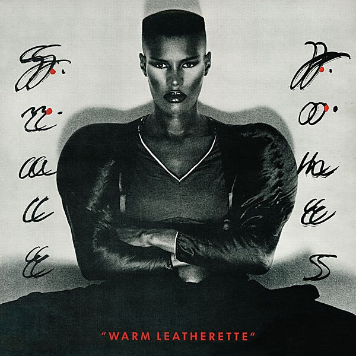

# Warm Leatherette

By **Grace Jones**

## Album Data

- **Catalog:** Beets
- **Format:** Digital, Album
- **Album:** Warm Leatherette
- **Artist:** Grace Jones
- **Albumartist:** Grace Jones
- **Genre:** Synthpop
- **MusicBrainz Album Artist ID:** [b1c124b3-cf60-41a6-8699-92728c8a3fe0](https://musicbrainz.org/artist/b1c124b3-cf60-41a6-8699-92728c8a3fe0)
- **MusicBrainz Album ID:** [0a079029-4081-3a9c-a2a3-51736a3a9ec5](https://musicbrainz.org/release/0a079029-4081-3a9c-a2a3-51736a3a9ec5)
- **MusicBrainz Release Group ID:** [05523d1a-19f5-3c46-8df1-04be0a3af5bc](https://musicbrainz.org/release-group/05523d1a-19f5-3c46-8df1-04be0a3af5bc)
- **Year:** 2001
- **Catalog #:** 842 611-2
- **Label:** Island
- **Total Tracks:** 08

## Album Tracks

### Track 01 - Warm Leatherette

- **Artist:** Grace Jones
- **Format:** AAC
- **Genre:** Alternative Dance
- **Length:** 5:38
- **MusicBrainz Track ID:** [b367ec1a-3e11-4db4-8a1e-ff680e2fcd79](https://musicbrainz.org/recording/b367ec1a-3e11-4db4-8a1e-ff680e2fcd79)
- **Title:** Warm Leatherette
- **Track:** 01
- **Year:** 2001

### Track 02 - Private Life

- **Artist:** Grace Jones
- **Format:** AAC
- **Genre:** Dub
- **Length:** 6:20
- **MusicBrainz Track ID:** [4c27e882-ac65-4f97-b865-4ff15b25519b](https://musicbrainz.org/recording/4c27e882-ac65-4f97-b865-4ff15b25519b)
- **Title:** Private Life
- **Track:** 02
- **Year:** 2001

### Track 03 - A Rolling Stone

- **Artist:** Grace Jones
- **Format:** AAC
- **Genre:** New Wave
- **Length:** 3:32
- **MusicBrainz Track ID:** [08420712-2d44-4296-a7f8-031de1b8479a](https://musicbrainz.org/recording/08420712-2d44-4296-a7f8-031de1b8479a)
- **Title:** A Rolling Stone
- **Track:** 03
- **Year:** 2001

### Track 04 - Love Is the Drug

- **Artist:** Grace Jones
- **Format:** AAC
- **Genre:** New Wave
- **Length:** 8:42
- **MusicBrainz Track ID:** [941cb640-32ae-4afb-b997-1986347d3e36](https://musicbrainz.org/recording/941cb640-32ae-4afb-b997-1986347d3e36)
- **Title:** Love Is the Drug
- **Track:** 04
- **Year:** 2001

### Track 05 - The Hunter Gets Captured by the Game

- **Artist:** Grace Jones
- **Format:** AAC
- **Genre:** New Wave
- **Length:** 6:45
- **MusicBrainz Track ID:** [bccb528d-c287-4dc4-8492-43941fa0d1d7](https://musicbrainz.org/recording/bccb528d-c287-4dc4-8492-43941fa0d1d7)
- **Title:** The Hunter Gets Captured by the Game
- **Track:** 05
- **Year:** 2001

### Track 06 - Bullshit

- **Artist:** Grace Jones
- **Format:** AAC
- **Genre:** Soul
- **Length:** 5:17
- **MusicBrainz Track ID:** [5b72bc54-8fc7-4bb0-9f73-b626c7e82c01](https://musicbrainz.org/recording/5b72bc54-8fc7-4bb0-9f73-b626c7e82c01)
- **Title:** Bullshit
- **Track:** 06
- **Year:** 2001

### Track 07 - Breakdown

- **Artist:** Grace Jones
- **Format:** AAC
- **Genre:** Smooth Jazz
- **Length:** 5:30
- **MusicBrainz Track ID:** [26fcc892-0594-44c3-82dc-56bfe89c47f2](https://musicbrainz.org/recording/26fcc892-0594-44c3-82dc-56bfe89c47f2)
- **Title:** Breakdown
- **Track:** 07
- **Year:** 2001

### Track 08 - Pars

- **Artist:** Grace Jones
- **Format:** AAC
- **Genre:** Latin Pop
- **Length:** 4:51
- **MusicBrainz Track ID:** [afe11291-3f89-4b95-9046-2a48dc799cce](https://musicbrainz.org/recording/afe11291-3f89-4b95-9046-2a48dc799cce)
- **Title:** Pars
- **Track:** 08
- **Year:** 2001

## See also

- [Roon: Fame](../../Roon/Grace_Jones/Fame.md)
- [Roon: Nightclubbing](../../Roon/Grace_Jones/Nightclubbing.md)
- [Roon: Warm Leatherette](../../Roon/Grace_Jones/Warm_Leatherette.md)
- [Vinyl: ](../../Vinyl/Grace_Jones/Grace_Jones.md)
- [Vinyl: Nightclubbing](../../Vinyl/Grace_Jones/Nightclubbing.md)
