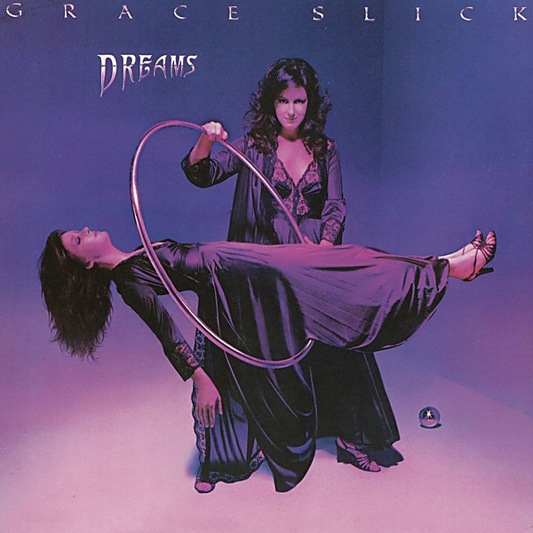

# Dreams

By **Grace Slick**

## Album Data

- **Catalog:** Beets
- **Format:** Digital, Album
- **Album:** Dreams
- **Artist:** Grace Slick
- **Albumartist:** Grace Slick
- **Genre:** Psychedelic Rock
- **MusicBrainz Album Artist ID:** 
- **MusicBrainz Album ID:** 
- **MusicBrainz Release Group ID:** 
- **Year:** 1980
- **Catalog #:** 
- **Label:** Acadia Records (UK)
- **Total Tracks:** 00

## Album Tracks

### Track 02 - theme from the movie manhole

- **Artist:** Grace Slick
- **Format:** MP3
- **Genre:** Psychedelic Rock
- **Length:** 15:26
- **MusicBrainz Track ID:** 
- **Title:** theme from the movie manhole
- **Track:** 02
- **Year:** 1974

### Track 01 - Jay [1974] [Grace Slick]

- **Artist:** Grace Slick
- **Format:** ALAC
- **Genre:** Psychedelic Rock
- **Length:** 2:46
- **MusicBrainz Track ID:** 
- **Title:** Jay [1974] [Grace Slick]
- **Track:** 01
- **Year:** 0000

### Track 02 - Theme From The Movie "Manhole"

- **Artist:** Grace Slick
- **Format:** ALAC
- **Genre:** Rock
- **Length:** 15:24
- **MusicBrainz Track ID:** 
- **Title:** Theme From The Movie "Manhole"
- **Track:** 02
- **Year:** 0000

### Track 03 - ¿Come Again? Toucan [1974] [Grace Slick]

- **Artist:** Grace Slick
- **Format:** ALAC
- **Genre:** Psychedelic Rock
- **Length:** 4:37
- **MusicBrainz Track ID:** 
- **Title:** ¿Come Again? Toucan [1974] [Grace Slick]
- **Track:** 03
- **Year:** 0000

### Track 04 - It's Only Music [1974] [Grace Slick]

- **Artist:** Grace Slick
- **Format:** ALAC
- **Genre:** Psychedelic Rock
- **Length:** 4:30
- **MusicBrainz Track ID:** 
- **Title:** It's Only Music [1974] [Grace Slick]
- **Track:** 04
- **Year:** 0000

### Track 05 - Better Lying Down [1974] [Grace Slick]

- **Artist:** Grace Slick
- **Format:** ALAC
- **Genre:** Psychedelic Rock
- **Length:** 3:12
- **MusicBrainz Track ID:** 
- **Title:** Better Lying Down [1974] [Grace Slick]
- **Track:** 05
- **Year:** 0000

### Track 06 - Epic (#38)

- **Artist:** Grace Slick
- **Format:** ALAC
- **Genre:** Psychedelic Rock
- **Length:** 7:13
- **MusicBrainz Track ID:** 
- **Title:** Epic (#38)
- **Track:** 06
- **Year:** 0000

## See also

- [Manhole](Manhole.md)
- [Software](Software.md)
- [The Best Of Grace Slick](The_Best_Of_Grace_Slick.md)
- [Welcome to the Wrecking Ball!](Welcome_to_the_Wrecking_Ball!.md)
- [CD: Dreams](../../CD/Grace_Slick/Dreams.md)
- [CD: ](../../CD/Grace_Slick/Grace_Slick.md)
- [CD: Manhole](../../CD/Grace_Slick/Manhole.md)
- [CD: Welcome To The Wrecking Ball!/Software (Two Lp's On One Cd)](../../CD/Grace_Slick/Welcome_To_The_Wrecking_Ball!-Software_Two_Lps_On_One_Cd.md)
- [Roon: Baron von Tollbooth & The Chrome Nun (2020 Remaster)](../../Roon/Grace_Slick/Baron_von_Tollbooth_and_The_Chrome_Nun_2020_Remaster.md)
- [Roon: Dreams](../../Roon/Grace_Slick/Dreams.md)
- [Roon: Manhole](../../Roon/Grace_Slick/Manhole.md)
- [Roon: Software](../../Roon/Grace_Slick/Software.md)
- [Roon: Sunfighter](../../Roon/Grace_Slick/Sunfighter.md)
- [Roon: Welcome To The Wrecking Ball!](../../Roon/Grace_Slick/Welcome_To_The_Wrecking_Ball!.md)
- [Vinyl: ](../../Vinyl/Grace_Slick/Grace_Slick.md)
- [Vinyl: Manhole](../../Vinyl/Grace_Slick/Manhole.md)
