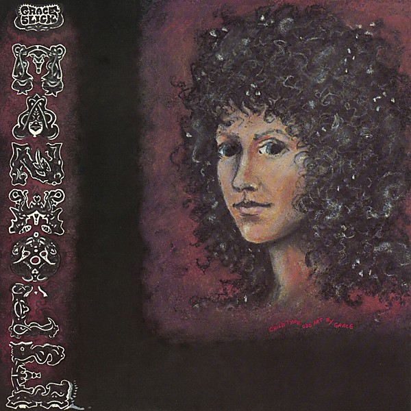

# Manhole

By **Grace Slick**

## Album Data

- **Catalog:** Beets
- **Format:** Digital, Album
- **Album:** Manhole
- **Artist:** Grace Slick
- **Albumartist:** Grace Slick
- **Genre:** Psychedelic Rock
- **MusicBrainz Album Artist ID:** 
- **MusicBrainz Album ID:** 
- **MusicBrainz Release Group ID:** 
- **Year:** 0000
- **Catalog #:** 
- **Label:** 
- **Total Tracks:** 18

## Album Tracks

### Track 03 - Rejoyce - Jefferson Airplane

- **Artist:** Grace Slick
- **Format:** ALAC
- **Genre:** Psychedelic Rock
- **Length:** 4:04
- **MusicBrainz Track ID:** 
- **Title:** Rejoyce - Jefferson Airplane
- **Track:** 03
- **Year:** 1967

### Track 04 - Lather - Jefferson Airplane

- **Artist:** Grace Slick
- **Format:** ALAC
- **Genre:** Psychedelic Rock
- **Length:** 2:59
- **MusicBrainz Track ID:** 
- **Title:** Lather - Jefferson Airplane
- **Track:** 04
- **Year:** 1968

### Track 05 - Triad - Jefferson Airplane

- **Artist:** Grace Slick
- **Format:** ALAC
- **Genre:** Psychedelic Rock
- **Length:** 4:53
- **MusicBrainz Track ID:** 
- **Title:** Triad - Jefferson Airplane
- **Track:** 05
- **Year:** 1968

### Track 06 - Eskimo Blue Day (Volunteers)

- **Artist:** Grace Slick
- **Format:** ALAC
- **Genre:** Psychedelic Rock
- **Length:** 6:35
- **MusicBrainz Track ID:** 
- **Title:** Eskimo Blue Day (Volunteers)
- **Track:** 06
- **Year:** 1969

### Track 07 - Sunrise - Paul Kantner Jefferson Starship

- **Artist:** Grace Slick
- **Format:** ALAC
- **Genre:** Psychedelic Rock
- **Length:** 1:57
- **MusicBrainz Track ID:** 
- **Title:** Sunrise - Paul Kantner Jefferson Starship
- **Track:** 07
- **Year:** 1970

### Track 08 - Mexico - Jefferson Airplane

- **Artist:** Grace Slick
- **Format:** ALAC
- **Genre:** Psychedelic Rock
- **Length:** 2:08
- **MusicBrainz Track ID:** 
- **Title:** Mexico - Jefferson Airplane
- **Track:** 08
- **Year:** 1999

### Track 09 - Law Man - Jefferson Airplane

- **Artist:** Grace Slick
- **Format:** ALAC
- **Genre:** Psychedelic Rock
- **Length:** 2:43
- **MusicBrainz Track ID:** 
- **Title:** Law Man - Jefferson Airplane
- **Track:** 09
- **Year:** 1971

### Track 10 - Across The Board (Baron Von Tollbooth & The Chrome Nun)

- **Artist:** Grace Slick
- **Format:** ALAC
- **Genre:** Psychedelic Rock
- **Length:** 4:37
- **MusicBrainz Track ID:** 
- **Title:** Across The Board (Baron Von Tollbooth & The Chrome Nun)
- **Track:** 10
- **Year:** 1973

### Track 11 - Better Lying Down

- **Artist:** Grace Slick
- **Format:** ALAC
- **Genre:** Psychedelic Rock
- **Length:** 3:15
- **MusicBrainz Track ID:** 
- **Title:** Better Lying Down
- **Track:** 11
- **Year:** 1973

### Track 12 - Hyperdrive (Dragon Fly)

- **Artist:** Grace Slick
- **Format:** ALAC
- **Genre:** Psychedelic Rock
- **Length:** 7:44
- **MusicBrainz Track ID:** 
- **Title:** Hyperdrive (Dragon Fly)
- **Track:** 12
- **Year:** 1974

### Track 13 - Fast Buck Freddie (Red Octopus)

- **Artist:** Grace Slick
- **Format:** ALAC
- **Genre:** Psychedelic Rock
- **Length:** 3:31
- **MusicBrainz Track ID:** 
- **Title:** Fast Buck Freddie (Red Octopus)
- **Track:** 13
- **Year:** 1975

### Track 14 - All The Machines

- **Artist:** Grace Slick
- **Format:** ALAC
- **Genre:** Pop Rock
- **Length:** 4:51
- **MusicBrainz Track ID:** 
- **Title:** All The Machines
- **Track:** 14
- **Year:** 1983

### Track 15 - Wrecking Ball

- **Artist:** Grace Slick
- **Format:** ALAC
- **Genre:** Psychedelic Rock
- **Length:** 3:53
- **MusicBrainz Track ID:** 
- **Title:** Wrecking Ball
- **Track:** 15
- **Year:** 1982

### Track 17 - Do You Remember Me?

- **Artist:** Grace Slick
- **Format:** ALAC
- **Genre:** Psychedelic Rock
- **Length:** 3:47
- **MusicBrainz Track ID:** 
- **Title:** Do You Remember Me?
- **Track:** 17
- **Year:** 1999

### Track 18 - Nothing's Gonna Stop Us Now (No Protection)

- **Artist:** Grace Slick
- **Format:** ALAC
- **Genre:** Psychedelic Rock
- **Length:** 4:29
- **MusicBrainz Track ID:** 
- **Title:** Nothing's Gonna Stop Us Now (No Protection)
- **Track:** 18
- **Year:** 1987

### Track 01 - Somebody To Love

- **Artist:** Paul Kantner, Grace Slick
- **Format:** ALAC
- **Genre:** Psychedelic Rock
- **Length:** 3:00
- **MusicBrainz Track ID:** 
- **Title:** Somebody To Love
- **Track:** 01
- **Year:** 1967

### Track 02 - White Rabbit

- **Artist:** Paul Kantner, Grace Slick
- **Format:** ALAC
- **Genre:** Psychedelic Rock
- **Length:** 2:35
- **MusicBrainz Track ID:** 
- **Title:** White Rabbit
- **Track:** 02
- **Year:** 1967

### Track 16 - We Built This City

- **Artist:** Starship
- **Format:** ALAC
- **Genre:** Rock
- **Length:** 4:56
- **MusicBrainz Track ID:** 
- **Title:** We Built This City
- **Track:** 16
- **Year:** 1985

## See also

- [Dreams](Dreams.md)
- [Software](Software.md)
- [The Best Of Grace Slick](The_Best_Of_Grace_Slick.md)
- [Welcome to the Wrecking Ball!](Welcome_to_the_Wrecking_Ball!.md)
- [CD: Dreams](../../CD/Grace_Slick/Dreams.md)
- [CD: ](../../CD/Grace_Slick/Grace_Slick.md)
- [CD: Manhole](../../CD/Grace_Slick/Manhole.md)
- [CD: Welcome To The Wrecking Ball!/Software (Two Lp's On One Cd)](../../CD/Grace_Slick/Welcome_To_The_Wrecking_Ball!-Software_Two_Lps_On_One_Cd.md)
- [Roon: Baron von Tollbooth & The Chrome Nun (2020 Remaster)](../../Roon/Grace_Slick/Baron_von_Tollbooth_and_The_Chrome_Nun_2020_Remaster.md)
- [Roon: Dreams](../../Roon/Grace_Slick/Dreams.md)
- [Roon: Manhole](../../Roon/Grace_Slick/Manhole.md)
- [Roon: Software](../../Roon/Grace_Slick/Software.md)
- [Roon: Sunfighter](../../Roon/Grace_Slick/Sunfighter.md)
- [Roon: Welcome To The Wrecking Ball!](../../Roon/Grace_Slick/Welcome_To_The_Wrecking_Ball!.md)
- [Vinyl: ](../../Vinyl/Grace_Slick/Grace_Slick.md)
- [Vinyl: Manhole](../../Vinyl/Grace_Slick/Manhole.md)
