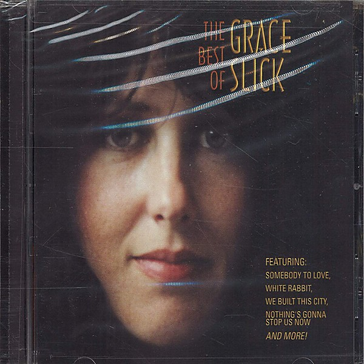

# The Best Of Grace Slick

By **Grace Slick**

## Album Data

- **Catalog:** Beets
- **Format:** Digital, Album
- **Album:** The Best Of Grace Slick
- **Artist:** Grace Slick
- **Albumartist:** Grace Slick
- **Genre:** Psychedelic Rock
- **MusicBrainz Album Artist ID:** 
- **MusicBrainz Album ID:** 
- **MusicBrainz Release Group ID:** 
- **Year:** 1967
- **Catalog #:** AFL1-4791
- **Label:** RCA
- **Total Tracks:** 09

## Album Tracks

### Track 01 - Call It Right Call It Wrong

- **Artist:** Grace Slick
- **Format:** ALAC
- **Genre:** Rock
- **Length:** 3:49
- **MusicBrainz Track ID:** [32303ac6-f867-47b2-8f05-5f9b53708bc4](https://musicbrainz.org/recording/32303ac6-f867-47b2-8f05-5f9b53708bc4)
- **Title:** Call It Right Call It Wrong
- **Track:** 01
- **Year:** 1984

### Track 02 - Me and Me

- **Artist:** Grace Slick
- **Format:** ALAC
- **Genre:** Rock
- **Length:** 3:51
- **MusicBrainz Track ID:** [4c8be4bc-a03d-4b3e-bfbc-ab6954587ce8](https://musicbrainz.org/recording/4c8be4bc-a03d-4b3e-bfbc-ab6954587ce8)
- **Title:** Me and Me
- **Track:** 02
- **Year:** 1984

### Track 03 - All the Machines

- **Artist:** Grace Slick
- **Format:** ALAC
- **Genre:** Pop Rock
- **Length:** 4:49
- **MusicBrainz Track ID:** [a89d8f92-6136-43b1-9a27-d6ab159f6706](https://musicbrainz.org/recording/a89d8f92-6136-43b1-9a27-d6ab159f6706)
- **Title:** All the Machines
- **Track:** 03
- **Year:** 1984

### Track 04 - Fox Face

- **Artist:** Grace Slick
- **Format:** ALAC
- **Genre:** Rock
- **Length:** 4:58
- **MusicBrainz Track ID:** [413bb554-a0be-483f-a280-94a21c17785c](https://musicbrainz.org/recording/413bb554-a0be-483f-a280-94a21c17785c)
- **Title:** Fox Face
- **Track:** 04
- **Year:** 1984

### Track 05 - Through the Window

- **Artist:** Grace Slick
- **Format:** ALAC
- **Genre:** Pop Rock
- **Length:** 3:33
- **MusicBrainz Track ID:** [b6f43c90-8fec-4e58-b386-35d24026fc5c](https://musicbrainz.org/recording/b6f43c90-8fec-4e58-b386-35d24026fc5c)
- **Title:** Through the Window
- **Track:** 05
- **Year:** 1984

### Track 06 - It Just Won't Stop

- **Artist:** Grace Slick
- **Format:** ALAC
- **Genre:** Rock
- **Length:** 4:08
- **MusicBrainz Track ID:** [b8998023-1978-4bcf-ab4b-9d0455457e33](https://musicbrainz.org/recording/b8998023-1978-4bcf-ab4b-9d0455457e33)
- **Title:** It Just Won't Stop
- **Track:** 06
- **Year:** 1984

### Track 07 - Habits

- **Artist:** Grace Slick
- **Format:** ALAC
- **Genre:** Rock
- **Length:** 3:55
- **MusicBrainz Track ID:** [67ea520d-bc62-40c0-a7ea-c2e0713a6d75](https://musicbrainz.org/recording/67ea520d-bc62-40c0-a7ea-c2e0713a6d75)
- **Title:** Habits
- **Track:** 07
- **Year:** 1984

### Track 08 - Rearrange My Face

- **Artist:** Grace Slick
- **Format:** ALAC
- **Genre:** Rock
- **Length:** 3:25
- **MusicBrainz Track ID:** [739c08b1-5495-4f8b-a85a-6b9c85d5a71b](https://musicbrainz.org/recording/739c08b1-5495-4f8b-a85a-6b9c85d5a71b)
- **Title:** Rearrange My Face
- **Track:** 08
- **Year:** 1984

### Track 09 - Bikini Atoll

- **Artist:** Grace Slick
- **Format:** ALAC
- **Genre:** Rock
- **Length:** 4:50
- **MusicBrainz Track ID:** [6a4acdc1-f9b9-4f45-9999-3d8d1a9579f3](https://musicbrainz.org/recording/6a4acdc1-f9b9-4f45-9999-3d8d1a9579f3)
- **Title:** Bikini Atoll
- **Track:** 09
- **Year:** 1984

## See also

- [Dreams](Dreams.md)
- [Manhole](Manhole.md)
- [Software](Software.md)
- [Welcome to the Wrecking Ball!](Welcome_to_the_Wrecking_Ball!.md)
- [CD: Dreams](../../CD/Grace_Slick/Dreams.md)
- [CD: ](../../CD/Grace_Slick/Grace_Slick.md)
- [CD: Manhole](../../CD/Grace_Slick/Manhole.md)
- [CD: Welcome To The Wrecking Ball!/Software (Two Lp's On One Cd)](../../CD/Grace_Slick/Welcome_To_The_Wrecking_Ball!-Software_Two_Lps_On_One_Cd.md)
- [Roon: Baron von Tollbooth & The Chrome Nun (2020 Remaster)](../../Roon/Grace_Slick/Baron_von_Tollbooth_and_The_Chrome_Nun_2020_Remaster.md)
- [Roon: Dreams](../../Roon/Grace_Slick/Dreams.md)
- [Roon: Manhole](../../Roon/Grace_Slick/Manhole.md)
- [Roon: Software](../../Roon/Grace_Slick/Software.md)
- [Roon: Sunfighter](../../Roon/Grace_Slick/Sunfighter.md)
- [Roon: Welcome To The Wrecking Ball!](../../Roon/Grace_Slick/Welcome_To_The_Wrecking_Ball!.md)
- [Vinyl: ](../../Vinyl/Grace_Slick/Grace_Slick.md)
- [Vinyl: Manhole](../../Vinyl/Grace_Slick/Manhole.md)
