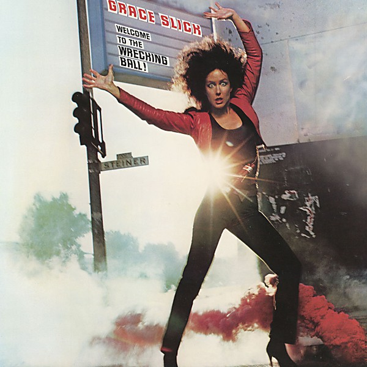

# Welcome to the Wrecking Ball!

By **Grace Slick**

## Album Data

- **Catalog:** Beets
- **Format:** Digital, Album
- **Album:** Welcome to the Wrecking Ball!
- **Artist:** Grace Slick
- **Albumartist:** Grace Slick
- **Genre:** Psychedelic Rock
- **MusicBrainz Album Artist ID:** [5015d411-eec3-4126-a613-60532e33d5cb](https://musicbrainz.org/artist/5015d411-eec3-4126-a613-60532e33d5cb)
- **MusicBrainz Album ID:** [913a51b0-4cde-43ad-81fb-36e3c386dd8e](https://musicbrainz.org/release/913a51b0-4cde-43ad-81fb-36e3c386dd8e)
- **MusicBrainz Release Group ID:** [7e643568-58ff-38c7-9d92-d8445cccb9d4](https://musicbrainz.org/release-group/7e643568-58ff-38c7-9d92-d8445cccb9d4)
- **Year:** 2019
- **Catalog #:** 
- **Label:** Rhino
- **Total Tracks:** 10

## Album Tracks

### Track 01 - Wrecking Ball

- **Artist:** Grace Slick
- **Format:** ALAC
- **Genre:** Psychedelic Rock
- **Length:** 3:51
- **MusicBrainz Track ID:** [5b7953fd-3eb4-4223-ab0b-6c79138fa0c7](https://musicbrainz.org/recording/5b7953fd-3eb4-4223-ab0b-6c79138fa0c7)
- **Title:** Wrecking Ball
- **Track:** 01
- **Year:** 2019

### Track 02 - Mistreater

- **Artist:** Grace Slick
- **Format:** ALAC
- **Genre:** Psychedelic Rock
- **Length:** 3:26
- **MusicBrainz Track ID:** [c6d4e264-4ab7-4524-85a5-179b1b9ad4c6](https://musicbrainz.org/recording/c6d4e264-4ab7-4524-85a5-179b1b9ad4c6)
- **Title:** Mistreater
- **Track:** 02
- **Year:** 2019

### Track 03 - Shot in the Dark

- **Artist:** Grace Slick
- **Format:** ALAC
- **Genre:** Psychedelic Rock
- **Length:** 3:19
- **MusicBrainz Track ID:** [7e170172-1ce2-4f52-b046-9bceee896e45](https://musicbrainz.org/recording/7e170172-1ce2-4f52-b046-9bceee896e45)
- **Title:** Shot in the Dark
- **Track:** 03
- **Year:** 2019

### Track 04 - Round & Round

- **Artist:** Grace Slick
- **Format:** ALAC
- **Genre:** Progressive Rock
- **Length:** 3:38
- **MusicBrainz Track ID:** [df7e04f5-8b0a-4bec-8207-ef8761eff0f6](https://musicbrainz.org/recording/df7e04f5-8b0a-4bec-8207-ef8761eff0f6)
- **Title:** Round & Round
- **Track:** 04
- **Year:** 2019

### Track 05 - Shooting Star

- **Artist:** Grace Slick
- **Format:** ALAC
- **Genre:** Psychedelic Rock
- **Length:** 5:21
- **MusicBrainz Track ID:** [b30b5bc7-f6d7-4653-90b8-7182e5cf9401](https://musicbrainz.org/recording/b30b5bc7-f6d7-4653-90b8-7182e5cf9401)
- **Title:** Shooting Star
- **Track:** 05
- **Year:** 2019

### Track 06 - Just a Little Love

- **Artist:** Grace Slick
- **Format:** ALAC
- **Genre:** Psychedelic Rock
- **Length:** 4:22
- **MusicBrainz Track ID:** [ae6c7ae0-9e69-43a0-b0f6-860478aa1d2f](https://musicbrainz.org/recording/ae6c7ae0-9e69-43a0-b0f6-860478aa1d2f)
- **Title:** Just a Little Love
- **Track:** 06
- **Year:** 2019

### Track 07 - Sea of Love

- **Artist:** Grace Slick
- **Format:** ALAC
- **Genre:** Psychedelic Rock
- **Length:** 4:05
- **MusicBrainz Track ID:** [395862fe-73a5-4add-8d15-b5bb186a403e](https://musicbrainz.org/recording/395862fe-73a5-4add-8d15-b5bb186a403e)
- **Title:** Sea of Love
- **Track:** 07
- **Year:** 2019

### Track 08 - Lines

- **Artist:** Grace Slick
- **Format:** ALAC
- **Genre:** Psychedelic Rock
- **Length:** 3:21
- **MusicBrainz Track ID:** [3e7a129e-284e-499a-8bb4-40b6f0b61338](https://musicbrainz.org/recording/3e7a129e-284e-499a-8bb4-40b6f0b61338)
- **Title:** Lines
- **Track:** 08
- **Year:** 2019

### Track 09 - Right Kind

- **Artist:** Grace Slick
- **Format:** ALAC
- **Genre:** Psychedelic Rock
- **Length:** 3:07
- **MusicBrainz Track ID:** [fe083773-be81-4f10-9bd2-8d8aba577365](https://musicbrainz.org/recording/fe083773-be81-4f10-9bd2-8d8aba577365)
- **Title:** Right Kind
- **Track:** 09
- **Year:** 2019

### Track 10 - No More Heroes

- **Artist:** Grace Slick
- **Format:** ALAC
- **Genre:** Psychedelic Rock
- **Length:** 3:58
- **MusicBrainz Track ID:** [a3fcc717-850f-4b54-858f-bbf86e3997bb](https://musicbrainz.org/recording/a3fcc717-850f-4b54-858f-bbf86e3997bb)
- **Title:** No More Heroes
- **Track:** 10
- **Year:** 2019

## See also

- [Dreams](Dreams.md)
- [Manhole](Manhole.md)
- [Software](Software.md)
- [The Best Of Grace Slick](The_Best_Of_Grace_Slick.md)
- [CD: Dreams](../../CD/Grace_Slick/Dreams.md)
- [CD: ](../../CD/Grace_Slick/Grace_Slick.md)
- [CD: Manhole](../../CD/Grace_Slick/Manhole.md)
- [CD: Welcome To The Wrecking Ball!/Software (Two Lp's On One Cd)](../../CD/Grace_Slick/Welcome_To_The_Wrecking_Ball!-Software_Two_Lps_On_One_Cd.md)
- [Roon: Baron von Tollbooth & The Chrome Nun (2020 Remaster)](../../Roon/Grace_Slick/Baron_von_Tollbooth_and_The_Chrome_Nun_2020_Remaster.md)
- [Roon: Dreams](../../Roon/Grace_Slick/Dreams.md)
- [Roon: Manhole](../../Roon/Grace_Slick/Manhole.md)
- [Roon: Software](../../Roon/Grace_Slick/Software.md)
- [Roon: Sunfighter](../../Roon/Grace_Slick/Sunfighter.md)
- [Roon: Welcome To The Wrecking Ball!](../../Roon/Grace_Slick/Welcome_To_The_Wrecking_Ball!.md)
- [Vinyl: ](../../Vinyl/Grace_Slick/Grace_Slick.md)
- [Vinyl: Manhole](../../Vinyl/Grace_Slick/Manhole.md)
