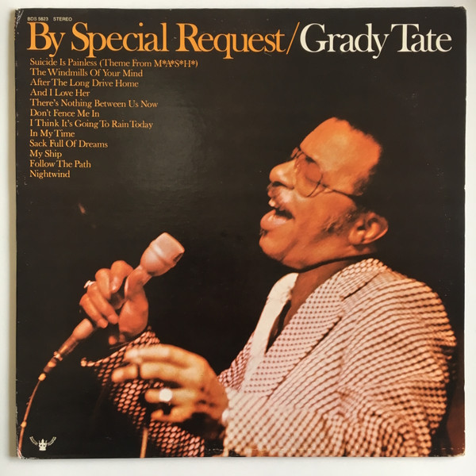

# By Special Request

By **Grady Tate**

## Album Data

- **Catalog:** Beets
- **Format:** Digital, Album
- **Album:** By Special Request
- **Artist:** Grady Tate
- **Albumartist:** Grady Tate
- **Genre:** Vocal Jazz
- **MusicBrainz Album Artist ID:** 
- **MusicBrainz Album ID:** 
- **MusicBrainz Release Group ID:** 
- **Year:** 1974
- **Catalog #:** 
- **Label:** 
- **Total Tracks:** 00

## Album Tracks

### Track 13 - And I Love Her

- **Artist:** Grady Tate
- **Format:** MP3
- **Genre:** Soul
- **Length:** 4:51
- **MusicBrainz Track ID:** 
- **Title:** And I Love Her
- **Track:** 13
- **Year:** 1974

