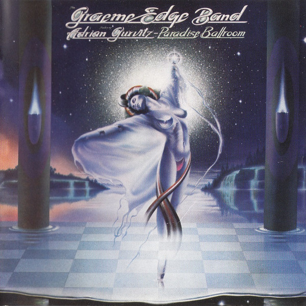

# Paradise Ballroom

By **Graeme Edge Band**

## Album Data

- **Catalog:** Beets
- **Format:** Digital, Album
- **Album:** Paradise Ballroom
- **Artist:** Graeme Edge Band
- **Albumartist:** Graeme Edge Band
- **Genre:** Progressive Rock
- **MusicBrainz Album Artist ID:** 
- **MusicBrainz Album ID:** 
- **MusicBrainz Release Group ID:** 
- **Year:** 1977
- **Catalog #:** 
- **Label:** 
- **Total Tracks:** 07

## Album Tracks

### Track 01 - Paradise Ballroom

- **Artist:** Graeme Edge Band
- **Format:** MP3
- **Genre:** Progressive Rock
- **Length:** 8:20
- **MusicBrainz Track ID:** 
- **Title:** Paradise Ballroom
- **Track:** 01
- **Year:** 1977

### Track 02 - Human

- **Artist:** Graeme Edge Band
- **Format:** MP3
- **Genre:** Progressive Rock
- **Length:** 6:12
- **MusicBrainz Track ID:** 
- **Title:** Human
- **Track:** 02
- **Year:** 1977

### Track 03 - Everybody Needs Somebody

- **Artist:** Graeme Edge Band
- **Format:** MP3
- **Genre:** Progressive Rock
- **Length:** 3:27
- **MusicBrainz Track ID:** 
- **Title:** Everybody Needs Somebody
- **Track:** 03
- **Year:** 1977

### Track 04 - All Is Fair in Love

- **Artist:** Graeme Edge Band
- **Format:** MP3
- **Genre:** Progressive Rock
- **Length:** 5:08
- **MusicBrainz Track ID:** 
- **Title:** All Is Fair in Love
- **Track:** 04
- **Year:** 1977

### Track 05 - Down, Down, Down

- **Artist:** Graeme Edge Band
- **Format:** MP3
- **Genre:** Progressive Rock
- **Length:** 5:58
- **MusicBrainz Track ID:** 
- **Title:** Down, Down, Down
- **Track:** 05
- **Year:** 1977

### Track 06 - In the Light of Night

- **Artist:** Graeme Edge Band
- **Format:** MP3
- **Genre:** Progressive Rock
- **Length:** 3:09
- **MusicBrainz Track ID:** 
- **Title:** In the Light of Night
- **Track:** 06
- **Year:** 1977

### Track 07 - Caroline

- **Artist:** Graeme Edge Band
- **Format:** MP3
- **Genre:** Progressive Rock
- **Length:** 6:01
- **MusicBrainz Track ID:** 
- **Title:** Caroline
- **Track:** 07
- **Year:** 1977

