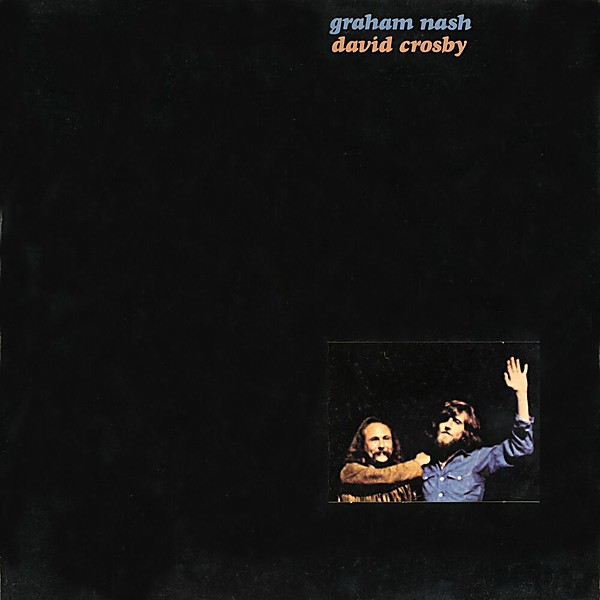

# Graham Nash, David Crosby

By **Graham Nash, David Crosby**

## Album Data

- **Catalog:** Beets
- **Format:** Digital, Album
- **Album:** Graham Nash, David Crosby
- **Artist:** Graham Nash, David Crosby
- **Albumartist:** Graham Nash, David Crosby
- **Genre:** Rock
- **MusicBrainz Album Artist ID:** 
- **MusicBrainz Album ID:** 
- **MusicBrainz Release Group ID:** 
- **Year:** 1972
- **Catalog #:** 
- **Label:** 
- **Total Tracks:** 11

## Album Tracks

### Track 01 - Southbound Train

- **Artist:** Graham Nash, David Crosby
- **Format:** ALAC
- **Genre:** Rock
- **Length:** 3:55
- **MusicBrainz Track ID:** 
- **Title:** Southbound Train
- **Track:** 01
- **Year:** 1972

### Track 02 - Whole Cloth

- **Artist:** Graham Nash, David Crosby
- **Format:** ALAC
- **Genre:** Rock
- **Length:** 4:34
- **MusicBrainz Track ID:** 
- **Title:** Whole Cloth
- **Track:** 02
- **Year:** 1972

### Track 03 - Blacknotes

- **Artist:** Graham Nash, David Crosby
- **Format:** ALAC
- **Genre:** Rock
- **Length:** 0:57
- **MusicBrainz Track ID:** 
- **Title:** Blacknotes
- **Track:** 03
- **Year:** 1972

### Track 04 - Strangers Room

- **Artist:** Graham Nash, David Crosby
- **Format:** ALAC
- **Genre:** Rock
- **Length:** 2:27
- **MusicBrainz Track ID:** 
- **Title:** Strangers Room
- **Track:** 04
- **Year:** 1972

### Track 05 - Where Will I Be?

- **Artist:** Graham Nash, David Crosby
- **Format:** ALAC
- **Genre:** Rock
- **Length:** 3:21
- **MusicBrainz Track ID:** 
- **Title:** Where Will I Be?
- **Track:** 05
- **Year:** 1972

### Track 06 - Page 43

- **Artist:** Graham Nash, David Crosby
- **Format:** ALAC
- **Genre:** Rock
- **Length:** 2:55
- **MusicBrainz Track ID:** 
- **Title:** Page 43
- **Track:** 06
- **Year:** 1972

### Track 07 - Frozen Smiles

- **Artist:** Graham Nash, David Crosby
- **Format:** ALAC
- **Genre:** Rock
- **Length:** 2:19
- **MusicBrainz Track ID:** 
- **Title:** Frozen Smiles
- **Track:** 07
- **Year:** 1972

### Track 08 - Games

- **Artist:** Graham Nash, David Crosby
- **Format:** ALAC
- **Genre:** Rock
- **Length:** 4:01
- **MusicBrainz Track ID:** 
- **Title:** Games
- **Track:** 08
- **Year:** 1972

### Track 09 - Girl To Be On My Mind

- **Artist:** Graham Nash, David Crosby
- **Format:** ALAC
- **Genre:** Rock
- **Length:** 3:27
- **MusicBrainz Track ID:** 
- **Title:** Girl To Be On My Mind
- **Track:** 09
- **Year:** 1972

### Track 10 - The Wall Song

- **Artist:** Graham Nash, David Crosby
- **Format:** ALAC
- **Genre:** Rock
- **Length:** 4:26
- **MusicBrainz Track ID:** 
- **Title:** The Wall Song
- **Track:** 10
- **Year:** 1972

### Track 11 - Immigration Man

- **Artist:** Graham Nash, David Crosby
- **Format:** ALAC
- **Genre:** Rock
- **Length:** 2:58
- **MusicBrainz Track ID:** 
- **Title:** Immigration Man
- **Track:** 11
- **Year:** 1972

