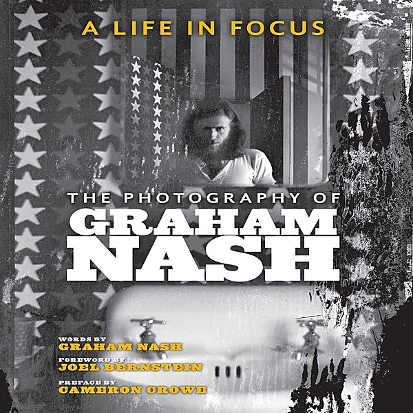

# Graham Nash & David Crosby (US Release)

By **Graham Nash & David Crosby**

## Album Data

- **Catalog:** Beets
- **Format:** Digital, Album
- **Album:** Graham Nash & David Crosby (US Release)
- **Artist:** Graham Nash & David Crosby
- **Albumartist:** Graham Nash & David Crosby
- **Genre:** Rock
- **MusicBrainz Album Artist ID:** 
- **MusicBrainz Album ID:** 
- **MusicBrainz Release Group ID:** 
- **Year:** 2005
- **Catalog #:** 
- **Label:** 
- **Total Tracks:** 11

## Album Tracks

### Track 05 - Where Will I Be? (LP Version)

- **Artist:** Crosby & Nash
- **Format:** MP3
- **Genre:** Folk Rock
- **Length:** 3:21
- **MusicBrainz Track ID:** 
- **Title:** Where Will I Be? (LP Version)
- **Track:** 05
- **Year:** 2005

### Track 06 - Page 43 (LP version)

- **Artist:** Crosby & Nash
- **Format:** MP3
- **Genre:** Folk Rock
- **Length:** 2:53
- **MusicBrainz Track ID:** 
- **Title:** Page 43 (LP version)
- **Track:** 06
- **Year:** 2005

### Track 01 - Southbound Train (LP Version)

- **Artist:** Graham Nash / David Crosby
- **Format:** MP3
- **Genre:** Rock
- **Length:** 3:56
- **MusicBrainz Track ID:** 
- **Title:** Southbound Train (LP Version)
- **Track:** 01
- **Year:** 2005

### Track 11 - Immigration Man (LP Version)

- **Artist:** Graham Nash / David Crosby
- **Format:** MP3
- **Genre:** Rock
- **Length:** 2:58
- **MusicBrainz Track ID:** 
- **Title:** Immigration Man (LP Version)
- **Track:** 11
- **Year:** 2005

### Track 02 - Whole Cloth (LP Version)

- **Artist:** Graham Nash/David Crosby
- **Format:** MP3
- **Genre:** Rock
- **Length:** 4:33
- **MusicBrainz Track ID:** 
- **Title:** Whole Cloth (LP Version)
- **Track:** 02
- **Year:** 2005

### Track 03 - Blacknotes (LP Version)

- **Artist:** Graham Nash/David Crosby
- **Format:** MP3
- **Genre:** Rock
- **Length:** 0:57
- **MusicBrainz Track ID:** 
- **Title:** Blacknotes (LP Version)
- **Track:** 03
- **Year:** 2005

### Track 04 - Strangers Room (LP Version)

- **Artist:** Graham Nash/David Crosby
- **Format:** MP3
- **Genre:** Rock
- **Length:** 2:25
- **MusicBrainz Track ID:** 
- **Title:** Strangers Room (LP Version)
- **Track:** 04
- **Year:** 2005

### Track 07 - Frozen Smiles (LP Version)

- **Artist:** Graham Nash/David Crosby
- **Format:** MP3
- **Genre:** Folk Rock
- **Length:** 2:18
- **MusicBrainz Track ID:** 
- **Title:** Frozen Smiles (LP Version)
- **Track:** 07
- **Year:** 2005

### Track 08 - Games (LP Version)

- **Artist:** Graham Nash/David Crosby
- **Format:** MP3
- **Genre:** Rock
- **Length:** 3:59
- **MusicBrainz Track ID:** 
- **Title:** Games (LP Version)
- **Track:** 08
- **Year:** 2005

### Track 09 - Girl To Be On My Mind (LP Version)

- **Artist:** Graham Nash/David Crosby
- **Format:** MP3
- **Genre:** Rock
- **Length:** 3:25
- **MusicBrainz Track ID:** 
- **Title:** Girl To Be On My Mind (LP Version)
- **Track:** 09
- **Year:** 2005

### Track 10 - The Wall Song (LP Version)

- **Artist:** Graham Nash/David Crosby
- **Format:** MP3
- **Genre:** Rock
- **Length:** 4:25
- **MusicBrainz Track ID:** 
- **Title:** The Wall Song (LP Version)
- **Track:** 10
- **Year:** 2005

