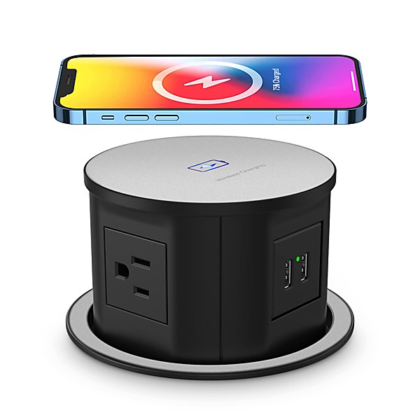

# Legacy of Power Pop - Power Pop Planet Best Of

By **Grand Atlantic**

## Album Data

- **Catalog:** Beets
- **Format:** Digital, Album
- **Album:** Legacy of Power Pop - Power Pop Planet Best Of
- **Artist:** Grand Atlantic
- **Albumartist:** Grand Atlantic
- **Genre:** Indie Rock
- **MusicBrainz Album Artist ID:** 
- **MusicBrainz Album ID:** 
- **MusicBrainz Release Group ID:** 
- **Year:** 2012
- **Catalog #:** 
- **Label:** 
- **Total Tracks:** 00

## Album Tracks

### Track 00 - Nice Guys

- **Artist:** Grand Atlantic
- **Format:** MP3
- **Genre:** Indie Rock
- **Length:** 3:28
- **MusicBrainz Track ID:** 
- **Title:** Nice Guys
- **Track:** 00
- **Year:** 2012

## See also

- [Roon: The Best of Power Pop Compilation Series - DAY 1 - Legacy of Power Pop - Power Pop Planet Best Of](../../Roon/Grand_Atlantic/The_Best_of_Power_Pop_Compilation_Series_-_DAY_1_-_Legacy_of_Power_Pop_-_Power_Pop_Planet_Best_Of.md)
