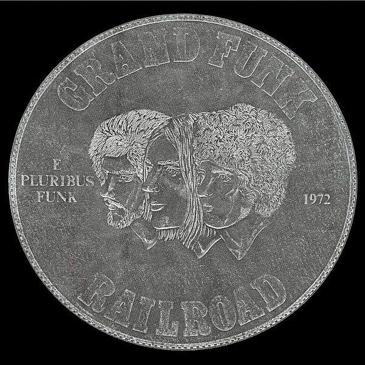

# E Pluribus Funk

By **Grand Funk Railroad**

## Album Data

- **Catalog:** Beets
- **Format:** Digital, Album
- **Album:** E Pluribus Funk
- **Artist:** Grand Funk Railroad
- **Albumartist:** Grand Funk Railroad
- **Genre:** Acid Rock
- **MusicBrainz Album Artist ID:** [103241b0-6adf-4b4f-9cff-5c87459f61a4](https://musicbrainz.org/artist/103241b0-6adf-4b4f-9cff-5c87459f61a4)
- **MusicBrainz Album ID:** [4f8223c0-1424-439e-8ea3-a69942d31feb](https://musicbrainz.org/release/4f8223c0-1424-439e-8ea3-a69942d31feb)
- **MusicBrainz Release Group ID:** [ccf60b32-82a7-37cc-b4cb-33d34fc5c7c9](https://musicbrainz.org/release-group/ccf60b32-82a7-37cc-b4cb-33d34fc5c7c9)
- **Year:** 1971
- **Catalog #:** MCA-2216
- **Label:** MCA Records
- **Total Tracks:** 11

## Album Tracks

### Track 01 - Just Couldn’t Wait

- **Artist:** Grand Funk Railroad
- **Format:** MP3
- **Genre:** Hard Rock
- **Length:** 3:31
- **MusicBrainz Track ID:** [467d4998-da22-4da2-84ed-adc3075a958a](https://musicbrainz.org/recording/467d4998-da22-4da2-84ed-adc3075a958a)
- **Title:** Just Couldn’t Wait
- **Track:** 01
- **Year:** 1976

### Track 02 - Can You Do It

- **Artist:** Grand Funk Railroad
- **Format:** MP3
- **Genre:** Acid Rock
- **Length:** 3:18
- **MusicBrainz Track ID:** [2b165300-8987-4946-a999-74ffe8eda57e](https://musicbrainz.org/recording/2b165300-8987-4946-a999-74ffe8eda57e)
- **Title:** Can You Do It
- **Track:** 02
- **Year:** 1976

### Track 03 - Pass It Arround

- **Artist:** Grand Funk Railroad
- **Format:** MP3
- **Genre:** Hard Rock
- **Length:** 5:01
- **MusicBrainz Track ID:** [0e248cad-2b3e-49e7-9d67-12eb8ea38bbf](https://musicbrainz.org/recording/0e248cad-2b3e-49e7-9d67-12eb8ea38bbf)
- **Title:** Pass It Arround
- **Track:** 03
- **Year:** 1976

### Track 04 - Don’t Let ’em Take Your Gun

- **Artist:** Grand Funk Railroad
- **Format:** MP3
- **Genre:** Hard Rock
- **Length:** 3:42
- **MusicBrainz Track ID:** [31352c54-d6fa-4abd-beff-44fa74cffa0f](https://musicbrainz.org/recording/31352c54-d6fa-4abd-beff-44fa74cffa0f)
- **Title:** Don’t Let ’em Take Your Gun
- **Track:** 04
- **Year:** 1976

### Track 05 - Miss My Baby

- **Artist:** Grand Funk Railroad
- **Format:** MP3
- **Genre:** Hard Rock
- **Length:** 7:24
- **MusicBrainz Track ID:** [23ffbd73-5f9d-4779-a673-3b407b453fe0](https://musicbrainz.org/recording/23ffbd73-5f9d-4779-a673-3b407b453fe0)
- **Title:** Miss My Baby
- **Track:** 05
- **Year:** 1976

### Track 06 - Big Buns

- **Artist:** Grand Funk Railroad
- **Format:** MP3
- **Genre:** Hard Rock
- **Length:** 0:30
- **MusicBrainz Track ID:** [2aa0f1ab-0895-486d-b7e3-63825f076be7](https://musicbrainz.org/recording/2aa0f1ab-0895-486d-b7e3-63825f076be7)
- **Title:** Big Buns
- **Track:** 06
- **Year:** 1976

### Track 07 - Out to Get You

- **Artist:** Grand Funk Railroad
- **Format:** MP3
- **Genre:** Hard Rock
- **Length:** 4:45
- **MusicBrainz Track ID:** [e41afba7-fd87-4cb5-8476-ac8c3bc1aa3a](https://musicbrainz.org/recording/e41afba7-fd87-4cb5-8476-ac8c3bc1aa3a)
- **Title:** Out to Get You
- **Track:** 07
- **Year:** 1976

### Track 08 - Crossfire

- **Artist:** Grand Funk Railroad
- **Format:** MP3
- **Genre:** Funk
- **Length:** 4:23
- **MusicBrainz Track ID:** [6192144b-0984-45bb-978a-9bdaa6fa13e9](https://musicbrainz.org/recording/6192144b-0984-45bb-978a-9bdaa6fa13e9)
- **Title:** Crossfire
- **Track:** 08
- **Year:** 1976

### Track 09 - 1976

- **Artist:** Grand Funk Railroad
- **Format:** MP3
- **Genre:** Hard Rock
- **Length:** 4:18
- **MusicBrainz Track ID:** [c112a190-1a88-42bb-9934-ef34c9871329](https://musicbrainz.org/recording/c112a190-1a88-42bb-9934-ef34c9871329)
- **Title:** 1976
- **Track:** 09
- **Year:** 1976

### Track 10 - Release Your Love

- **Artist:** Grand Funk Railroad
- **Format:** MP3
- **Genre:** Hard Rock
- **Length:** 3:53
- **MusicBrainz Track ID:** [0c4ff88a-d77b-4ea8-b2a7-648d4c80dcd1](https://musicbrainz.org/recording/0c4ff88a-d77b-4ea8-b2a7-648d4c80dcd1)
- **Title:** Release Your Love
- **Track:** 10
- **Year:** 1976

### Track 11 - Goin’ for the Pastor

- **Artist:** Grand Funk Railroad
- **Format:** MP3
- **Genre:** Hard Rock
- **Length:** 5:22
- **MusicBrainz Track ID:** [483b3910-24ef-4000-ba64-a46052d6a035](https://musicbrainz.org/recording/483b3910-24ef-4000-ba64-a46052d6a035)
- **Title:** Goin’ for the Pastor
- **Track:** 11
- **Year:** 1976

## See also

- [Good Singin’, Good Playin’](Good_Singin’__Good_Playin’.md)
- [Grand Funk](Grand_Funk.md)
- [Live Album](Live_Album.md)
- [We’re an American Band](We’re_an_American_Band.md)
- [Roon: Closer To Home](../../Roon/Grand_Funk_Railroad/Closer_To_Home.md)
- [Roon: E Pluribus Funk (Remastered)](../../Roon/Grand_Funk_Railroad/E_Pluribus_Funk_Remastered.md)
- [Roon: Grand Funk (Red Album) (Expanded Edition)](../../Roon/Grand_Funk_Railroad/Grand_Funk_Red_Album_Expanded_Edition.md)
- [Roon: Live Album (Live/1970)](../../Roon/Grand_Funk_Railroad/Live_Album_Live-1970.md)
- [Roon: On Time (Remastered 2002 / Expanded Edition)](../../Roon/Grand_Funk_Railroad/On_Time_Remastered_2002_-_Expanded_Edition.md)
- [Roon: We're An American Band (Remastered)](../../Roon/Grand_Funk_Railroad/Were_An_American_Band_Remastered.md)
- [Vinyl: Caught In The Act](../../Vinyl/Grand_Funk_Railroad/Caught_In_The_Act.md)
- [Vinyl: E Pluribus Funk](../../Vinyl/Grand_Funk_Railroad/E_Pluribus_Funk.md)
- [Vinyl: ](../../Vinyl/Grand_Funk_Railroad/Grand_Funk_Railroad.md)
- [Vinyl: We're An American Band](../../Vinyl/Grand_Funk_Railroad/Were_An_American_Band.md)
