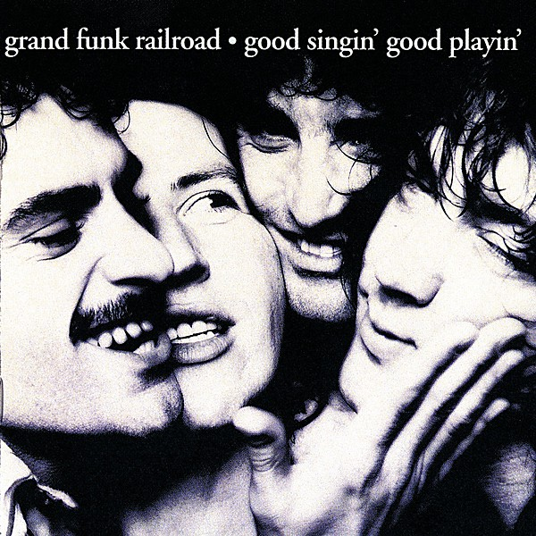

# Good Singin’, Good Playin’

By **Grand Funk Railroad**

## Album Data

- **Catalog:** Beets
- **Format:** Digital, Album
- **Album:** Good Singin’, Good Playin’
- **Artist:** Grand Funk Railroad
- **Albumartist:** Grand Funk Railroad
- **Genre:** Hard Rock
- **MusicBrainz Album Artist ID:** [103241b0-6adf-4b4f-9cff-5c87459f61a4](https://musicbrainz.org/artist/103241b0-6adf-4b4f-9cff-5c87459f61a4)
- **MusicBrainz Album ID:** [009455bb-0751-4180-8259-4375106ff512](https://musicbrainz.org/release/009455bb-0751-4180-8259-4375106ff512)
- **MusicBrainz Release Group ID:** [f2439e3d-f554-33b1-8da1-93d7c772cfd7](https://musicbrainz.org/release-group/f2439e3d-f554-33b1-8da1-93d7c772cfd7)
- **Year:** 1976
- **Catalog #:** 
- **Label:** Capitol Records
- **Total Tracks:** 08

## Album Tracks

### Track 01 - Got This Thing on the Move

- **Artist:** Grand Funk Railroad
- **Format:** MP3
- **Genre:** Uk Garage
- **Length:** 4:36
- **MusicBrainz Track ID:** [adc4a328-bf32-498f-b776-0ac6952c4688](https://musicbrainz.org/recording/adc4a328-bf32-498f-b776-0ac6952c4688)
- **Title:** Got This Thing on the Move
- **Track:** 01
- **Year:** 1969

### Track 02 - Please Don't Worry

- **Artist:** Grand Funk Railroad
- **Format:** MP3
- **Genre:** Hard Rock
- **Length:** 4:24
- **MusicBrainz Track ID:** [712b2e11-8a9a-4a16-8e91-7424f51df0e9](https://musicbrainz.org/recording/712b2e11-8a9a-4a16-8e91-7424f51df0e9)
- **Title:** Please Don't Worry
- **Track:** 02
- **Year:** 1969

### Track 03 - High Falootin' Woman

- **Artist:** Grand Funk Railroad
- **Format:** MP3
- **Genre:** Hard Rock
- **Length:** 3:01
- **MusicBrainz Track ID:** [ea9e0a4e-1c40-429e-8125-b23a2027b39a](https://musicbrainz.org/recording/ea9e0a4e-1c40-429e-8125-b23a2027b39a)
- **Title:** High Falootin' Woman
- **Track:** 03
- **Year:** 1969

### Track 04 - Mr. Limousine Driver

- **Artist:** Grand Funk Railroad
- **Format:** MP3
- **Genre:** Hard Rock
- **Length:** 4:29
- **MusicBrainz Track ID:** [625723a1-37ab-4522-86e9-b539c0275991](https://musicbrainz.org/recording/625723a1-37ab-4522-86e9-b539c0275991)
- **Title:** Mr. Limousine Driver
- **Track:** 04
- **Year:** 1969

### Track 05 - In Need

- **Artist:** Grand Funk Railroad
- **Format:** MP3
- **Genre:** Hard Rock
- **Length:** 8:01
- **MusicBrainz Track ID:** [a279d642-577f-4da9-9fb8-c08c8f9b3ff9](https://musicbrainz.org/recording/a279d642-577f-4da9-9fb8-c08c8f9b3ff9)
- **Title:** In Need
- **Track:** 05
- **Year:** 1969

### Track 06 - Winter and My Soul

- **Artist:** Grand Funk Railroad
- **Format:** MP3
- **Genre:** Hard Rock
- **Length:** 6:43
- **MusicBrainz Track ID:** [e3028368-e33c-4b4a-a3be-c10411435ff4](https://musicbrainz.org/recording/e3028368-e33c-4b4a-a3be-c10411435ff4)
- **Title:** Winter and My Soul
- **Track:** 06
- **Year:** 1969

### Track 07 - Paranoid

- **Artist:** Grand Funk Railroad
- **Format:** MP3
- **Genre:** Hard Rock
- **Length:** 7:56
- **MusicBrainz Track ID:** [76eb4bf5-8616-49d3-a7cc-235e789f6619](https://musicbrainz.org/recording/76eb4bf5-8616-49d3-a7cc-235e789f6619)
- **Title:** Paranoid
- **Track:** 07
- **Year:** 1969

### Track 08 - Inside Looking Out

- **Artist:** Grand Funk Railroad
- **Format:** MP3
- **Genre:** Hard Rock
- **Length:** 9:39
- **MusicBrainz Track ID:** [e396a5c4-328a-4680-a26d-f41bdca4d0b1](https://musicbrainz.org/recording/e396a5c4-328a-4680-a26d-f41bdca4d0b1)
- **Title:** Inside Looking Out
- **Track:** 08
- **Year:** 1969

## See also

- [E Pluribus Funk](E_Pluribus_Funk.md)
- [Grand Funk](Grand_Funk.md)
- [Live Album](Live_Album.md)
- [We’re an American Band](We’re_an_American_Band.md)
- [Roon: Closer To Home](../../Roon/Grand_Funk_Railroad/Closer_To_Home.md)
- [Roon: E Pluribus Funk (Remastered)](../../Roon/Grand_Funk_Railroad/E_Pluribus_Funk_Remastered.md)
- [Roon: Grand Funk (Red Album) (Expanded Edition)](../../Roon/Grand_Funk_Railroad/Grand_Funk_Red_Album_Expanded_Edition.md)
- [Roon: Live Album (Live/1970)](../../Roon/Grand_Funk_Railroad/Live_Album_Live-1970.md)
- [Roon: On Time (Remastered 2002 / Expanded Edition)](../../Roon/Grand_Funk_Railroad/On_Time_Remastered_2002_-_Expanded_Edition.md)
- [Roon: We're An American Band (Remastered)](../../Roon/Grand_Funk_Railroad/Were_An_American_Band_Remastered.md)
- [Vinyl: Caught In The Act](../../Vinyl/Grand_Funk_Railroad/Caught_In_The_Act.md)
- [Vinyl: E Pluribus Funk](../../Vinyl/Grand_Funk_Railroad/E_Pluribus_Funk.md)
- [Vinyl: ](../../Vinyl/Grand_Funk_Railroad/Grand_Funk_Railroad.md)
- [Vinyl: We're An American Band](../../Vinyl/Grand_Funk_Railroad/Were_An_American_Band.md)
