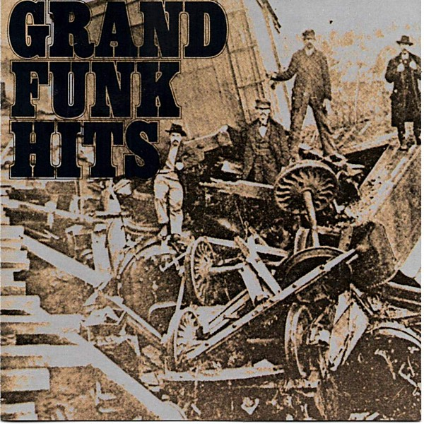

# Grand Funk

By **Grand Funk Railroad**

## Album Data

- **Catalog:** Beets
- **Format:** Digital, Album
- **Album:** Grand Funk
- **Artist:** Grand Funk Railroad
- **Albumartist:** Grand Funk Railroad
- **Genre:** Hard Rock
- **MusicBrainz Album Artist ID:** [103241b0-6adf-4b4f-9cff-5c87459f61a4](https://musicbrainz.org/artist/103241b0-6adf-4b4f-9cff-5c87459f61a4)
- **MusicBrainz Album ID:** [9814afc8-30d5-47fa-9eb6-e312e61bde81](https://musicbrainz.org/release/9814afc8-30d5-47fa-9eb6-e312e61bde81)
- **MusicBrainz Release Group ID:** [af1e5a33-4b25-30e1-af65-03ea42890090](https://musicbrainz.org/release-group/af1e5a33-4b25-30e1-af65-03ea42890090)
- **Year:** 1969
- **Catalog #:** CP19-6040
- **Label:** Capitol Records
- **Total Tracks:** 11

## Album Tracks

### Track 01 - Introduction

- **Artist:** Grand Funk Railroad
- **Format:** MP3
- **Genre:** Acid Rock
- **Length:** 2:33
- **MusicBrainz Track ID:** [81fbb656-d9cb-42b0-b08c-523728e0e6f7](https://musicbrainz.org/recording/81fbb656-d9cb-42b0-b08c-523728e0e6f7)
- **Title:** Introduction
- **Track:** 01
- **Year:** 1989

### Track 02 - Are You Ready

- **Artist:** Grand Funk Railroad
- **Format:** MP3
- **Genre:** Hard Rock
- **Length:** 3:40
- **MusicBrainz Track ID:** [7cc0e2ee-9a5e-46ae-9fd8-8b75d31d5fe8](https://musicbrainz.org/recording/7cc0e2ee-9a5e-46ae-9fd8-8b75d31d5fe8)
- **Title:** Are You Ready
- **Track:** 02
- **Year:** 1989

### Track 03 - Paranoid

- **Artist:** Grand Funk Railroad
- **Format:** MP3
- **Genre:** Hard Rock
- **Length:** 6:46
- **MusicBrainz Track ID:** [663ab0e2-93de-4bf8-b712-900a79c494e3](https://musicbrainz.org/recording/663ab0e2-93de-4bf8-b712-900a79c494e3)
- **Title:** Paranoid
- **Track:** 03
- **Year:** 1989

### Track 04 - In Need

- **Artist:** Grand Funk Railroad
- **Format:** MP3
- **Genre:** Hard Rock
- **Length:** 10:54
- **MusicBrainz Track ID:** [c2c301d3-b18b-4a7f-9d17-28eed39c3755](https://musicbrainz.org/recording/c2c301d3-b18b-4a7f-9d17-28eed39c3755)
- **Title:** In Need
- **Track:** 04
- **Year:** 1989

### Track 05 - Heartbreaker

- **Artist:** Grand Funk Railroad
- **Format:** MP3
- **Genre:** Hard Rock
- **Length:** 8:09
- **MusicBrainz Track ID:** [d6d1e180-88f2-42c0-949c-2d8999d5b97d](https://musicbrainz.org/recording/d6d1e180-88f2-42c0-949c-2d8999d5b97d)
- **Title:** Heartbreaker
- **Track:** 05
- **Year:** 1989

### Track 06 - Inside Looking Out

- **Artist:** Grand Funk Railroad
- **Format:** MP3
- **Genre:** Hard Rock
- **Length:** 13:16
- **MusicBrainz Track ID:** [3aabd708-9195-4a6e-9b00-be8d4e434fc1](https://musicbrainz.org/recording/3aabd708-9195-4a6e-9b00-be8d4e434fc1)
- **Title:** Inside Looking Out
- **Track:** 06
- **Year:** 1989

### Track 07 - Words of Wisdom

- **Artist:** Grand Funk Railroad
- **Format:** MP3
- **Genre:** Acid Rock
- **Length:** 0:56
- **MusicBrainz Track ID:** [e6a418f0-eb3e-4130-8944-1ab564c0c37e](https://musicbrainz.org/recording/e6a418f0-eb3e-4130-8944-1ab564c0c37e)
- **Title:** Words of Wisdom
- **Track:** 07
- **Year:** 1989

### Track 08 - Mean Mistreater

- **Artist:** Grand Funk Railroad
- **Format:** MP3
- **Genre:** Hard Rock
- **Length:** 4:49
- **MusicBrainz Track ID:** [f15f36e8-1eb7-4aac-8c43-216c0d0d7e40](https://musicbrainz.org/recording/f15f36e8-1eb7-4aac-8c43-216c0d0d7e40)
- **Title:** Mean Mistreater
- **Track:** 08
- **Year:** 1989

### Track 09 - Mark Say's Alright

- **Artist:** Grand Funk Railroad
- **Format:** MP3
- **Genre:** Heavy Metal
- **Length:** 5:14
- **MusicBrainz Track ID:** [bd7d27b5-7260-4ec4-baa1-33c15d65b3a4](https://musicbrainz.org/recording/bd7d27b5-7260-4ec4-baa1-33c15d65b3a4)
- **Title:** Mark Say's Alright
- **Track:** 09
- **Year:** 1989

### Track 10 - T.N.U.C.

- **Artist:** Grand Funk Railroad
- **Format:** MP3
- **Genre:** Hard Rock
- **Length:** 11:53
- **MusicBrainz Track ID:** [7ad47b70-fbdc-43dd-a615-68921ee76321](https://musicbrainz.org/recording/7ad47b70-fbdc-43dd-a615-68921ee76321)
- **Title:** T.N.U.C.
- **Track:** 10
- **Year:** 1989

### Track 11 - Into the Sun

- **Artist:** Grand Funk Railroad
- **Format:** MP3
- **Genre:** Psychedelic Rock
- **Length:** 12:24
- **MusicBrainz Track ID:** [27c38fe1-b773-44a5-afba-f9221e047df1](https://musicbrainz.org/recording/27c38fe1-b773-44a5-afba-f9221e047df1)
- **Title:** Into the Sun
- **Track:** 11
- **Year:** 1989

## See also

- [E Pluribus Funk](E_Pluribus_Funk.md)
- [Good Singin’, Good Playin’](Good_Singin’__Good_Playin’.md)
- [Live Album](Live_Album.md)
- [We’re an American Band](We’re_an_American_Band.md)
- [Roon: Closer To Home](../../Roon/Grand_Funk_Railroad/Closer_To_Home.md)
- [Roon: E Pluribus Funk (Remastered)](../../Roon/Grand_Funk_Railroad/E_Pluribus_Funk_Remastered.md)
- [Roon: Grand Funk (Red Album) (Expanded Edition)](../../Roon/Grand_Funk_Railroad/Grand_Funk_Red_Album_Expanded_Edition.md)
- [Roon: Live Album (Live/1970)](../../Roon/Grand_Funk_Railroad/Live_Album_Live-1970.md)
- [Roon: On Time (Remastered 2002 / Expanded Edition)](../../Roon/Grand_Funk_Railroad/On_Time_Remastered_2002_-_Expanded_Edition.md)
- [Roon: We're An American Band (Remastered)](../../Roon/Grand_Funk_Railroad/Were_An_American_Band_Remastered.md)
- [Vinyl: Caught In The Act](../../Vinyl/Grand_Funk_Railroad/Caught_In_The_Act.md)
- [Vinyl: E Pluribus Funk](../../Vinyl/Grand_Funk_Railroad/E_Pluribus_Funk.md)
- [Vinyl: ](../../Vinyl/Grand_Funk_Railroad/Grand_Funk_Railroad.md)
- [Vinyl: We're An American Band](../../Vinyl/Grand_Funk_Railroad/Were_An_American_Band.md)
