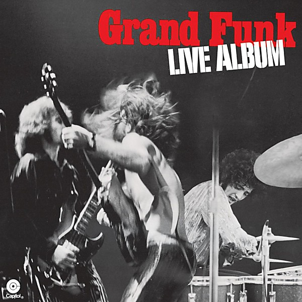

# Live Album

By **Grand Funk Railroad**

## Album Data

- **Catalog:** Beets
- **Format:** Digital, Album
- **Album:** Live Album
- **Artist:** Grand Funk Railroad
- **Albumartist:** Grand Funk Railroad
- **Genre:** Acid Rock
- **MusicBrainz Album Artist ID:** [103241b0-6adf-4b4f-9cff-5c87459f61a4](https://musicbrainz.org/artist/103241b0-6adf-4b4f-9cff-5c87459f61a4)
- **MusicBrainz Album ID:** [ecaf0372-d34f-44db-92a5-3cb4aea2ce1e](https://musicbrainz.org/release/ecaf0372-d34f-44db-92a5-3cb4aea2ce1e)
- **MusicBrainz Release Group ID:** [96534db9-62bb-3484-b464-acb93ed271e3](https://musicbrainz.org/release-group/96534db9-62bb-3484-b464-acb93ed271e3)
- **Year:** 1989
- **Catalog #:** 
- **Label:** Capitol Records
- **Total Tracks:** 08

## Album Tracks

### Track 01 - We’re an American Band

- **Artist:** Grand Funk Railroad
- **Format:** MP3
- **Genre:** Hard Rock
- **Length:** 3:31
- **MusicBrainz Track ID:** [06a4fd43-4994-4a51-945a-f405cabb99bb](https://musicbrainz.org/recording/06a4fd43-4994-4a51-945a-f405cabb99bb)
- **Title:** We’re an American Band
- **Track:** 01
- **Year:** 2013

### Track 02 - Stop Lookin’ Back

- **Artist:** Grand Funk Railroad
- **Format:** MP3
- **Genre:** Hard Rock
- **Length:** 4:56
- **MusicBrainz Track ID:** [83dc1f17-c3c8-4684-b4e4-e349f0aa6990](https://musicbrainz.org/recording/83dc1f17-c3c8-4684-b4e4-e349f0aa6990)
- **Title:** Stop Lookin’ Back
- **Track:** 02
- **Year:** 2013

### Track 03 - Creepin’

- **Artist:** Grand Funk Railroad
- **Format:** MP3
- **Genre:** Hard Rock
- **Length:** 7:07
- **MusicBrainz Track ID:** [0856bbf3-9fdb-4541-b9b0-bd7b0acf64a3](https://musicbrainz.org/recording/0856bbf3-9fdb-4541-b9b0-bd7b0acf64a3)
- **Title:** Creepin’
- **Track:** 03
- **Year:** 2013

### Track 04 - Black Licorice

- **Artist:** Grand Funk Railroad
- **Format:** MP3
- **Genre:** Hard Rock
- **Length:** 4:51
- **MusicBrainz Track ID:** [7123798f-f610-485e-89ae-8e3c08cb4f03](https://musicbrainz.org/recording/7123798f-f610-485e-89ae-8e3c08cb4f03)
- **Title:** Black Licorice
- **Track:** 04
- **Year:** 2013

### Track 05 - The Railroad

- **Artist:** Grand Funk Railroad
- **Format:** MP3
- **Genre:** Hard Rock
- **Length:** 6:18
- **MusicBrainz Track ID:** [1b2ac25f-e90a-4f55-b22e-260a32986744](https://musicbrainz.org/recording/1b2ac25f-e90a-4f55-b22e-260a32986744)
- **Title:** The Railroad
- **Track:** 05
- **Year:** 2013

### Track 06 - Ain’t Got Nobody

- **Artist:** Grand Funk Railroad
- **Format:** MP3
- **Genre:** Hard Rock
- **Length:** 4:29
- **MusicBrainz Track ID:** [c6d6a215-773b-44ba-b9d8-15a5dfd2c038](https://musicbrainz.org/recording/c6d6a215-773b-44ba-b9d8-15a5dfd2c038)
- **Title:** Ain’t Got Nobody
- **Track:** 06
- **Year:** 2013

### Track 07 - Walk Like a Man (You Can Call Me Your Man)

- **Artist:** Grand Funk Railroad
- **Format:** MP3
- **Genre:** Hard Rock
- **Length:** 4:08
- **MusicBrainz Track ID:** [8a137484-d0b5-4cdf-a117-b00d67b7a7d1](https://musicbrainz.org/recording/8a137484-d0b5-4cdf-a117-b00d67b7a7d1)
- **Title:** Walk Like a Man (You Can Call Me Your Man)
- **Track:** 07
- **Year:** 2013

### Track 08 - Loneliest Rider

- **Artist:** Grand Funk Railroad
- **Format:** MP3
- **Genre:** Southern Rock
- **Length:** 5:24
- **MusicBrainz Track ID:** [fcdd25a1-726f-4b58-8b5b-73ba0c9fded4](https://musicbrainz.org/recording/fcdd25a1-726f-4b58-8b5b-73ba0c9fded4)
- **Title:** Loneliest Rider
- **Track:** 08
- **Year:** 2013

## See also

- [E Pluribus Funk](E_Pluribus_Funk.md)
- [Good Singin’, Good Playin’](Good_Singin’__Good_Playin’.md)
- [Grand Funk](Grand_Funk.md)
- [We’re an American Band](We’re_an_American_Band.md)
- [Roon: Closer To Home](../../Roon/Grand_Funk_Railroad/Closer_To_Home.md)
- [Roon: E Pluribus Funk (Remastered)](../../Roon/Grand_Funk_Railroad/E_Pluribus_Funk_Remastered.md)
- [Roon: Grand Funk (Red Album) (Expanded Edition)](../../Roon/Grand_Funk_Railroad/Grand_Funk_Red_Album_Expanded_Edition.md)
- [Roon: Live Album (Live/1970)](../../Roon/Grand_Funk_Railroad/Live_Album_Live-1970.md)
- [Roon: On Time (Remastered 2002 / Expanded Edition)](../../Roon/Grand_Funk_Railroad/On_Time_Remastered_2002_-_Expanded_Edition.md)
- [Roon: We're An American Band (Remastered)](../../Roon/Grand_Funk_Railroad/Were_An_American_Band_Remastered.md)
- [Vinyl: Caught In The Act](../../Vinyl/Grand_Funk_Railroad/Caught_In_The_Act.md)
- [Vinyl: E Pluribus Funk](../../Vinyl/Grand_Funk_Railroad/E_Pluribus_Funk.md)
- [Vinyl: ](../../Vinyl/Grand_Funk_Railroad/Grand_Funk_Railroad.md)
- [Vinyl: We're An American Band](../../Vinyl/Grand_Funk_Railroad/Were_An_American_Band.md)
