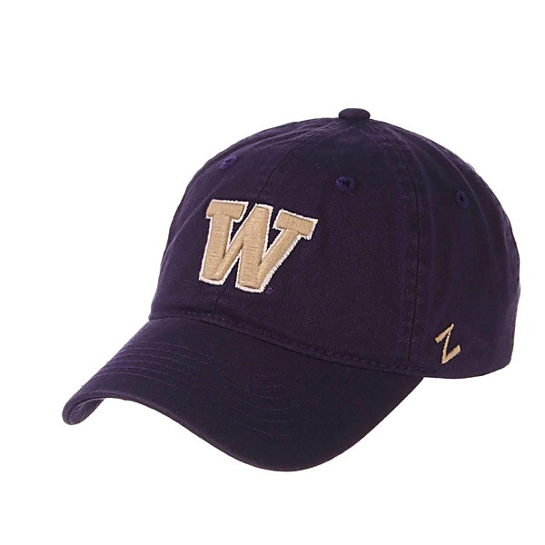

# 1974-05-21 - Edmundson Pavilion, U of Washington

By **Grateful Dead**

## Album Data

- **Catalog:** Beets
- **Format:** Digital, Album
- **Album:** 1974-05-21 - Edmundson Pavilion, U of Washington
- **Artist:** Grateful Dead
- **Albumartist:** Grateful Dead
- **Genre:** Psychedelic Rock
- **MusicBrainz Album Artist ID:** 
- **MusicBrainz Album ID:** 
- **MusicBrainz Release Group ID:** 
- **Year:** 0000
- **Catalog #:** 
- **Label:** 
- **Total Tracks:** 10

## Album Tracks

### Track 01 - Box of Rain

- **Artist:** Grateful Dead
- **Format:** ALAC
- **Genre:** Psychedelic Rock
- **Length:** 5:18
- **MusicBrainz Track ID:** [d715a3eb-1d69-4ac0-bbc6-a59485db4459](https://musicbrainz.org/recording/d715a3eb-1d69-4ac0-bbc6-a59485db4459)
- **Title:** Box of Rain
- **Track:** 01
- **Year:** 1980

### Track 02 - Friend of the Devil

- **Artist:** Grateful Dead
- **Format:** ALAC
- **Genre:** Psychedelic Rock
- **Length:** 3:24
- **MusicBrainz Track ID:** [7ce32b74-1843-4fbd-a50b-0ea01a4d44fd](https://musicbrainz.org/recording/7ce32b74-1843-4fbd-a50b-0ea01a4d44fd)
- **Title:** Friend of the Devil
- **Track:** 02
- **Year:** 1980

### Track 03 - Sugar Magnolia

- **Artist:** Grateful Dead
- **Format:** ALAC
- **Genre:** Psychedelic Rock
- **Length:** 3:19
- **MusicBrainz Track ID:** [d4d0f5b7-b4f4-47fd-b38c-1796bf114937](https://musicbrainz.org/recording/d4d0f5b7-b4f4-47fd-b38c-1796bf114937)
- **Title:** Sugar Magnolia
- **Track:** 03
- **Year:** 1980

### Track 04 - Operator

- **Artist:** Grateful Dead
- **Format:** ALAC
- **Genre:** Psychedelic Rock
- **Length:** 2:25
- **MusicBrainz Track ID:** [bebac02d-9c7f-4af8-a8a6-afb508cd2502](https://musicbrainz.org/recording/bebac02d-9c7f-4af8-a8a6-afb508cd2502)
- **Title:** Operator
- **Track:** 04
- **Year:** 1980

### Track 05 - Candyman

- **Artist:** Grateful Dead
- **Format:** ALAC
- **Genre:** Psychedelic Rock
- **Length:** 6:14
- **MusicBrainz Track ID:** [729d5bce-d8bf-4e38-8a5d-659d507783ef](https://musicbrainz.org/recording/729d5bce-d8bf-4e38-8a5d-659d507783ef)
- **Title:** Candyman
- **Track:** 05
- **Year:** 1980

### Track 06 - Ripple

- **Artist:** Grateful Dead
- **Format:** ALAC
- **Genre:** Psychedelic Rock
- **Length:** 4:09
- **MusicBrainz Track ID:** [03655575-2581-4d0e-ad26-7584ad0f2e51](https://musicbrainz.org/recording/03655575-2581-4d0e-ad26-7584ad0f2e51)
- **Title:** Ripple
- **Track:** 06
- **Year:** 1980

### Track 07 - Brokedown Palace

- **Artist:** Grateful Dead
- **Format:** ALAC
- **Genre:** Psychedelic Rock
- **Length:** 4:09
- **MusicBrainz Track ID:** [eb553698-fdbe-4307-87b3-92b05e818cf8](https://musicbrainz.org/recording/eb553698-fdbe-4307-87b3-92b05e818cf8)
- **Title:** Brokedown Palace
- **Track:** 07
- **Year:** 1980

### Track 08 - Till the Morning Comes

- **Artist:** Grateful Dead
- **Format:** ALAC
- **Genre:** Rock And Roll
- **Length:** 3:08
- **MusicBrainz Track ID:** [6492defa-6b64-443b-adf6-bf14824334f2](https://musicbrainz.org/recording/6492defa-6b64-443b-adf6-bf14824334f2)
- **Title:** Till the Morning Comes
- **Track:** 08
- **Year:** 1980

### Track 09 - Attics of My Life

- **Artist:** Grateful Dead
- **Format:** ALAC
- **Genre:** Psychedelic Rock
- **Length:** 5:12
- **MusicBrainz Track ID:** [5b20726f-d8c6-41c0-a62b-97e75e8c9114](https://musicbrainz.org/recording/5b20726f-d8c6-41c0-a62b-97e75e8c9114)
- **Title:** Attics of My Life
- **Track:** 09
- **Year:** 1980

### Track 10 - Truckin’

- **Artist:** Grateful Dead
- **Format:** ALAC
- **Genre:** Psychedelic Rock
- **Length:** 5:03
- **MusicBrainz Track ID:** [5ad0969a-f3ea-42cb-9c68-25d9b7a99221](https://musicbrainz.org/recording/5ad0969a-f3ea-42cb-9c68-25d9b7a99221)
- **Title:** Truckin’
- **Track:** 10
- **Year:** 1980

## See also

- [American Beauty](American_Beauty.md)
- [Terrapin Station](Terrapin_Station.md)
- [Roon: American Beauty (Édition Studio Masters)](../../Roon/Grateful_Dead/American_Beauty_Édition_Studio_Masters.md)
- [Roon: Dick's Picks Vol. 12](../../Roon/Grateful_Dead/Dicks_Picks_Vol_12-_Providence_Civic_Center__Providence__RI_6-26-74_-_Boston_Garden__Boston__MA_6-28-74_Live.md)
- [Roon: Live / Dead](../../Roon/Grateful_Dead/Live_-_Dead.md)
- [Roon: Terrapin Station](../../Roon/Grateful_Dead/Terrapin_Station.md)
- [Roon: The Best of the Grateful Dead](../../Roon/Grateful_Dead/The_Best_of_the_Grateful_Dead.md)
- [Roon: Workingman's Dead (Edition Studio Masters)](../../Roon/Grateful_Dead/Workingmans_Dead_Edition_Studio_Masters.md)
