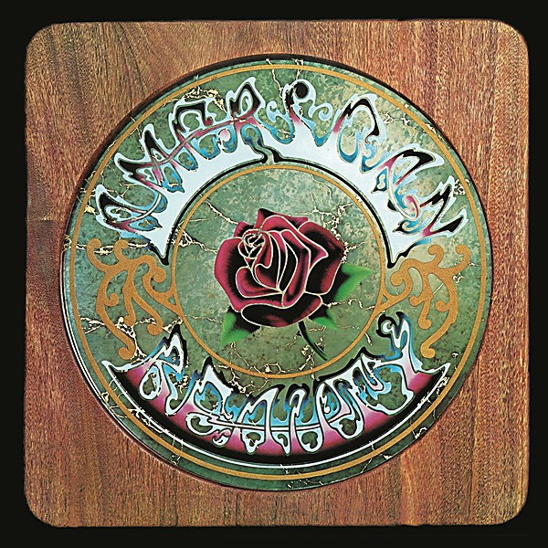

# American Beauty

By **Grateful Dead**

## Album Data

- **Catalog:** Beets
- **Format:** Digital, Album
- **Album:** American Beauty
- **Artist:** Grateful Dead
- **Albumartist:** Grateful Dead
- **Genre:** Psychedelic Rock
- **MusicBrainz Album Artist ID:** [6faa7ca7-0d99-4a5e-bfa6-1fd5037520c6](https://musicbrainz.org/artist/6faa7ca7-0d99-4a5e-bfa6-1fd5037520c6)
- **MusicBrainz Album ID:** [890b13c3-9422-4d78-b5a9-62451f43ebba](https://musicbrainz.org/release/890b13c3-9422-4d78-b5a9-62451f43ebba)
- **MusicBrainz Release Group ID:** [994c2c59-d32f-304e-8f53-bda17a254f52](https://musicbrainz.org/release-group/994c2c59-d32f-304e-8f53-bda17a254f52)
- **Year:** 1980
- **Catalog #:** 
- **Label:** Grateful Dead Records
- **Total Tracks:** 06

## Album Tracks

### Track 01 - Estimated Prophet

- **Artist:** Grateful Dead
- **Format:** AAC
- **Genre:** Psychedelic Rock
- **Length:** 5:42
- **MusicBrainz Track ID:** [59794eac-a797-4622-8e50-b44e00026d8e](https://musicbrainz.org/recording/59794eac-a797-4622-8e50-b44e00026d8e)
- **Title:** Estimated Prophet
- **Track:** 01
- **Year:** 2008

### Track 02 - Dancin' in the Streets

- **Artist:** Grateful Dead
- **Format:** AAC
- **Genre:** Acid Rock
- **Length:** 3:29
- **MusicBrainz Track ID:** [96c58f69-0a8e-496f-ad19-22e05b3a9510](https://musicbrainz.org/recording/96c58f69-0a8e-496f-ad19-22e05b3a9510)
- **Title:** Dancin' in the Streets
- **Track:** 02
- **Year:** 2008

### Track 03 - Passenger

- **Artist:** Grateful Dead
- **Format:** AAC
- **Genre:** Psychedelic Rock
- **Length:** 2:57
- **MusicBrainz Track ID:** [71da58f4-587c-49ab-a828-395db425fb5f](https://musicbrainz.org/recording/71da58f4-587c-49ab-a828-395db425fb5f)
- **Title:** Passenger
- **Track:** 03
- **Year:** 2008

### Track 04 - Samson & Delilah

- **Artist:** Grateful Dead
- **Format:** AAC
- **Genre:** Psychedelic Rock
- **Length:** 3:30
- **MusicBrainz Track ID:** [92c81c62-db2d-4655-87b3-27abff7dff1c](https://musicbrainz.org/recording/92c81c62-db2d-4655-87b3-27abff7dff1c)
- **Title:** Samson & Delilah
- **Track:** 04
- **Year:** 2008

### Track 05 - Sunrise

- **Artist:** Grateful Dead
- **Format:** AAC
- **Genre:** Rock
- **Length:** 4:14
- **MusicBrainz Track ID:** [395b7cf6-d4b0-4e55-bfd2-4bd07987bf89](https://musicbrainz.org/recording/395b7cf6-d4b0-4e55-bfd2-4bd07987bf89)
- **Title:** Sunrise
- **Track:** 05
- **Year:** 2008

### Track 06 - Terrapin Station, Part 1

- **Artist:** Grateful Dead
- **Format:** AAC
- **Genre:** Psychedelic Rock
- **Length:** 16:42
- **MusicBrainz Track ID:** [c326e6e3-4173-451b-b11e-8e59c3fb5ddc](https://musicbrainz.org/recording/c326e6e3-4173-451b-b11e-8e59c3fb5ddc)
- **Title:** Terrapin Station, Part 1
- **Track:** 06
- **Year:** 2008

## See also

- [1974-05-21 - Edmundson Pavilion, U of Washington](1974-05-21_-_Edmundson_Pavilion__U_of_Washington.md)
- [Terrapin Station](Terrapin_Station.md)
- [Roon: American Beauty (Édition Studio Masters)](../../Roon/Grateful_Dead/American_Beauty_Édition_Studio_Masters.md)
- [Roon: Dick's Picks Vol. 12](../../Roon/Grateful_Dead/Dicks_Picks_Vol_12-_Providence_Civic_Center__Providence__RI_6-26-74_-_Boston_Garden__Boston__MA_6-28-74_Live.md)
- [Roon: Live / Dead](../../Roon/Grateful_Dead/Live_-_Dead.md)
- [Roon: Terrapin Station](../../Roon/Grateful_Dead/Terrapin_Station.md)
- [Roon: The Best of the Grateful Dead](../../Roon/Grateful_Dead/The_Best_of_the_Grateful_Dead.md)
- [Roon: Workingman's Dead (Edition Studio Masters)](../../Roon/Grateful_Dead/Workingmans_Dead_Edition_Studio_Masters.md)
