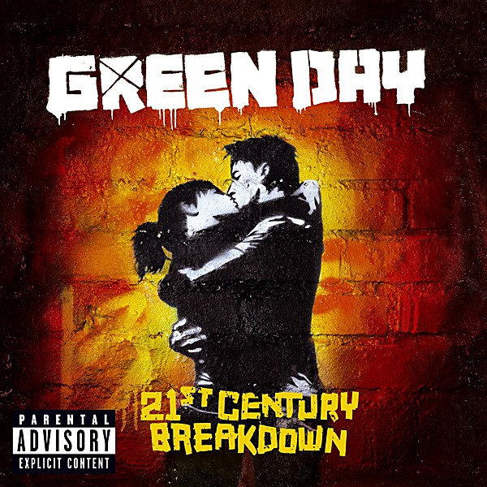

# 21st Century Breakdown (Amazon MP3 Exclusive) [Explicit]

By **Green Day**

## Album Data

- **Catalog:** Beets
- **Format:** Digital, Album
- **Album:** 21st Century Breakdown (Amazon MP3 Exclusive) [Explicit]
- **Artist:** Green Day
- **Albumartist:** Green Day
- **Genre:** Alternative Rock
- **MusicBrainz Album Artist ID:** 
- **MusicBrainz Album ID:** 
- **MusicBrainz Release Group ID:** 
- **Year:** 2009
- **Catalog #:** WPCR-11910
- **Label:** Reprise Records
- **Total Tracks:** 14

## Album Tracks

### Track 01 - American Idiot

- **Artist:** Green Day
- **Format:** ALAC
- **Genre:** Pop Punk
- **Length:** 2:54
- **MusicBrainz Track ID:** [d3bd52f1-3d84-445b-84f5-7899de8f9340](https://musicbrainz.org/recording/d3bd52f1-3d84-445b-84f5-7899de8f9340)
- **Title:** American Idiot
- **Track:** 01
- **Year:** 2004

### Track 02 - Jesus of Suburbia

- **Artist:** Green Day
- **Format:** ALAC
- **Genre:** Pop Punk
- **Length:** 9:08
- **MusicBrainz Track ID:** [fdab5639-2406-4a1d-a603-620c63fe146b](https://musicbrainz.org/recording/fdab5639-2406-4a1d-a603-620c63fe146b)
- **Title:** Jesus of Suburbia
- **Track:** 02
- **Year:** 2004

### Track 03 - Holiday

- **Artist:** Green Day
- **Format:** ALAC
- **Genre:** Pop Punk
- **Length:** 3:52
- **MusicBrainz Track ID:** [80549cae-482b-4e25-8f86-b41f47ef9782](https://musicbrainz.org/recording/80549cae-482b-4e25-8f86-b41f47ef9782)
- **Title:** Holiday
- **Track:** 03
- **Year:** 2004

### Track 04 - Boulevard of Broken Dreams

- **Artist:** Green Day
- **Format:** ALAC
- **Genre:** Pop Punk
- **Length:** 4:20
- **MusicBrainz Track ID:** [0ba72f0d-70ae-4655-94d9-c1069b5abcfb](https://musicbrainz.org/recording/0ba72f0d-70ae-4655-94d9-c1069b5abcfb)
- **Title:** Boulevard of Broken Dreams
- **Track:** 04
- **Year:** 2004

### Track 05 - Are We the Waiting

- **Artist:** Green Day
- **Format:** ALAC
- **Genre:** Pop Punk
- **Length:** 2:42
- **MusicBrainz Track ID:** [332f1000-6387-404f-afb7-037a2b59a9e3](https://musicbrainz.org/recording/332f1000-6387-404f-afb7-037a2b59a9e3)
- **Title:** Are We the Waiting
- **Track:** 05
- **Year:** 2004

### Track 06 - St. Jimmy

- **Artist:** Green Day
- **Format:** ALAC
- **Genre:** Pop Punk
- **Length:** 2:55
- **MusicBrainz Track ID:** [edefed39-8601-4a3e-a3c7-736447446557](https://musicbrainz.org/recording/edefed39-8601-4a3e-a3c7-736447446557)
- **Title:** St. Jimmy
- **Track:** 06
- **Year:** 2004

### Track 07 - Give Me Novacaine

- **Artist:** Green Day
- **Format:** ALAC
- **Genre:** Pop Punk
- **Length:** 3:25
- **MusicBrainz Track ID:** [3f178c54-1cd7-4617-8a62-f9d86f499eaa](https://musicbrainz.org/recording/3f178c54-1cd7-4617-8a62-f9d86f499eaa)
- **Title:** Give Me Novacaine
- **Track:** 07
- **Year:** 2004

### Track 08 - She’s a Rebel

- **Artist:** Green Day
- **Format:** ALAC
- **Genre:** Pop Punk
- **Length:** 2:00
- **MusicBrainz Track ID:** [cb705a26-1de8-447f-af40-e6bf0e66e976](https://musicbrainz.org/recording/cb705a26-1de8-447f-af40-e6bf0e66e976)
- **Title:** She’s a Rebel
- **Track:** 08
- **Year:** 2004

### Track 09 - Extraordinary Girl

- **Artist:** Green Day
- **Format:** ALAC
- **Genre:** Pop Punk
- **Length:** 3:33
- **MusicBrainz Track ID:** [dfe6dd93-de4d-4259-b0a2-ca9580d60d50](https://musicbrainz.org/recording/dfe6dd93-de4d-4259-b0a2-ca9580d60d50)
- **Title:** Extraordinary Girl
- **Track:** 09
- **Year:** 2004

### Track 10 - Letterbomb

- **Artist:** Green Day
- **Format:** ALAC
- **Genre:** Pop Punk
- **Length:** 4:06
- **MusicBrainz Track ID:** [a0744d9f-d2e7-4e63-aae3-0ff234c9ff3b](https://musicbrainz.org/recording/a0744d9f-d2e7-4e63-aae3-0ff234c9ff3b)
- **Title:** Letterbomb
- **Track:** 10
- **Year:** 2004

### Track 11 - Wake Me Up When September Ends

- **Artist:** Green Day
- **Format:** ALAC
- **Genre:** Pop Punk
- **Length:** 4:45
- **MusicBrainz Track ID:** [a23f107f-36cd-4a4c-b8d5-6dd73b9148c7](https://musicbrainz.org/recording/a23f107f-36cd-4a4c-b8d5-6dd73b9148c7)
- **Title:** Wake Me Up When September Ends
- **Track:** 11
- **Year:** 2004

### Track 12 - Homecoming

- **Artist:** Green Day
- **Format:** ALAC
- **Genre:** Pop Punk
- **Length:** 9:18
- **MusicBrainz Track ID:** [6de49025-14ac-4e48-8a49-bbcb5cf2c938](https://musicbrainz.org/recording/6de49025-14ac-4e48-8a49-bbcb5cf2c938)
- **Title:** Homecoming
- **Track:** 12
- **Year:** 2004

### Track 13 - Whatsername

- **Artist:** Green Day
- **Format:** ALAC
- **Genre:** Pop Punk
- **Length:** 4:12
- **MusicBrainz Track ID:** [badc7d8d-0de0-4379-b0e9-a8c91b92d1ef](https://musicbrainz.org/recording/badc7d8d-0de0-4379-b0e9-a8c91b92d1ef)
- **Title:** Whatsername
- **Track:** 13
- **Year:** 2004

### Track 14 - Favorite Son

- **Artist:** Green Day
- **Format:** ALAC
- **Genre:** Pop Punk
- **Length:** 4:12
- **MusicBrainz Track ID:** [68435537-3fd2-4726-8eca-1f97b230f590](https://musicbrainz.org/recording/68435537-3fd2-4726-8eca-1f97b230f590)
- **Title:** Favorite Son
- **Track:** 14
- **Year:** 2004

## See also

- [21st Century Breakdown](21st_Century_Breakdown.md)
- [American Idiot](American_Idiot.md)
- [Dookie](Dookie.md)
- [Revolution Radio](Revolution_Radio.md)
- [CD: 21st Century Breakdown](../../CD/Green_Day/21st_Century_Breakdown.md)
- [CD: ](../../CD/Green_Day/Green_Day.md)
- [Roon: 21st Century Breakdown (Édition Studio Masters)](../../Roon/Green_Day/21st_Century_Breakdown_Édition_Studio_Masters.md)
- [Roon: American Idiot](../../Roon/Green_Day/American_Idiot.md)
- [Roon: Revolution Radio](../../Roon/Green_Day/Revolution_Radio.md)
- [Vinyl: American Idiot](../../Vinyl/Green_Day/American_Idiot.md)
- [Vinyl: ](../../Vinyl/Green_Day/Green_Day.md)
- [Vinyl: Revolution Radio](../../Vinyl/Green_Day/Revolution_Radio.md)
