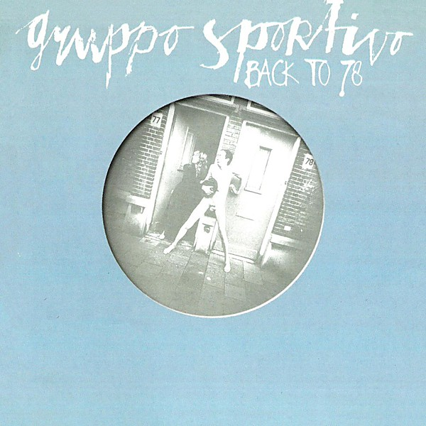

# Back To '78

By **Gruppo Sportivo**

## Album Data

- **Catalog:** Beets
- **Format:** Digital, Album
- **Album:** Back To '78
- **Artist:** Gruppo Sportivo
- **Albumartist:** Gruppo Sportivo
- **Genre:** New Wave
- **MusicBrainz Album Artist ID:** 
- **MusicBrainz Album ID:** 
- **MusicBrainz Release Group ID:** 
- **Year:** 1978
- **Catalog #:** 
- **Label:** 
- **Total Tracks:** 12

## Album Tracks

### Track 01 - Go 'N Get It!

- **Artist:** Gruppo Sportivo
- **Format:** MP3
- **Genre:** New Wave
- **Length:** 2:17
- **MusicBrainz Track ID:** [478f7e16-2be9-42de-ae07-96a57504c47b](https://musicbrainz.org/recording/478f7e16-2be9-42de-ae07-96a57504c47b)
- **Title:** Go 'N Get It!
- **Track:** 01
- **Year:** 1982

### Track 02 - (Gimme A) Break

- **Artist:** Gruppo Sportivo
- **Format:** MP3
- **Genre:** New Wave
- **Length:** 2:36
- **MusicBrainz Track ID:** [6653e231-8901-4768-8404-acb694be7d05](https://musicbrainz.org/recording/6653e231-8901-4768-8404-acb694be7d05)
- **Title:** (Gimme A) Break
- **Track:** 02
- **Year:** 1982

### Track 03 - Happily Unemployed

- **Artist:** Gruppo Sportivo
- **Format:** MP3
- **Genre:** New Wave
- **Length:** 2:34
- **MusicBrainz Track ID:** [75b3da22-d090-487c-bcd4-efba67dd20e5](https://musicbrainz.org/recording/75b3da22-d090-487c-bcd4-efba67dd20e5)
- **Title:** Happily Unemployed
- **Track:** 03
- **Year:** 1982

### Track 04 - Memories Are Memories

- **Artist:** Gruppo Sportivo
- **Format:** MP3
- **Genre:** New Wave
- **Length:** 2:30
- **MusicBrainz Track ID:** [b2342387-be56-4d43-a678-7dee8cf26a31](https://musicbrainz.org/recording/b2342387-be56-4d43-a678-7dee8cf26a31)
- **Title:** Memories Are Memories
- **Track:** 04
- **Year:** 1982

### Track 05 - Mein Geilstes Lied

- **Artist:** Gruppo Sportivo
- **Format:** MP3
- **Genre:** New Wave
- **Length:** 4:08
- **MusicBrainz Track ID:** [78052a90-0e18-4309-be48-f2b0e7397cd1](https://musicbrainz.org/recording/78052a90-0e18-4309-be48-f2b0e7397cd1)
- **Title:** Mein Geilstes Lied
- **Track:** 05
- **Year:** 1982

### Track 06 - And So On

- **Artist:** Gruppo Sportivo
- **Format:** MP3
- **Genre:** New Wave
- **Length:** 3:28
- **MusicBrainz Track ID:** [915a7fbe-335a-4e5c-9004-ba6714233f67](https://musicbrainz.org/recording/915a7fbe-335a-4e5c-9004-ba6714233f67)
- **Title:** And So On
- **Track:** 06
- **Year:** 1982

### Track 07 - Blame It on the Mad

- **Artist:** Gruppo Sportivo
- **Format:** MP3
- **Genre:** New Wave
- **Length:** 2:35
- **MusicBrainz Track ID:** [21e0291e-c8cc-4334-97fa-29daffe98af1](https://musicbrainz.org/recording/21e0291e-c8cc-4334-97fa-29daffe98af1)
- **Title:** Blame It on the Mad
- **Track:** 07
- **Year:** 1982

### Track 08 - James' Last Car

- **Artist:** Gruppo Sportivo
- **Format:** MP3
- **Genre:** New Wave
- **Length:** 3:17
- **MusicBrainz Track ID:** [77c2dc47-48ef-4d14-b9d1-376a420e4a04](https://musicbrainz.org/recording/77c2dc47-48ef-4d14-b9d1-376a420e4a04)
- **Title:** James' Last Car
- **Track:** 08
- **Year:** 1982

### Track 09 - Newspaper

- **Artist:** Gruppo Sportivo
- **Format:** MP3
- **Genre:** New Wave
- **Length:** 3:02
- **MusicBrainz Track ID:** [f53239f9-aab2-4ad5-8be3-92a1e551981c](https://musicbrainz.org/recording/f53239f9-aab2-4ad5-8be3-92a1e551981c)
- **Title:** Newspaper
- **Track:** 09
- **Year:** 1982

### Track 10 - Fiona

- **Artist:** Gruppo Sportivo
- **Format:** MP3
- **Genre:** New Wave
- **Length:** 3:39
- **MusicBrainz Track ID:** [ff37690f-4fd3-404e-bd03-67f8124f94c7](https://musicbrainz.org/recording/ff37690f-4fd3-404e-bd03-67f8124f94c7)
- **Title:** Fiona
- **Track:** 10
- **Year:** 1982

### Track 11 - On Her Own

- **Artist:** Gruppo Sportivo
- **Format:** MP3
- **Genre:** New Wave
- **Length:** 3:21
- **MusicBrainz Track ID:** [d99b07d6-9d50-4adc-bd02-e2b5c8c6bd00](https://musicbrainz.org/recording/d99b07d6-9d50-4adc-bd02-e2b5c8c6bd00)
- **Title:** On Her Own
- **Track:** 11
- **Year:** 1982

### Track 12 - The Goofananahoo

- **Artist:** Gruppo Sportivo
- **Format:** MP3
- **Genre:** New Wave
- **Length:** 2:35
- **MusicBrainz Track ID:** [18963cc2-c41f-4249-a0c2-8245ba0ac2d6](https://musicbrainz.org/recording/18963cc2-c41f-4249-a0c2-8245ba0ac2d6)
- **Title:** The Goofananahoo
- **Track:** 12
- **Year:** 1982

## See also

- [Design Moderne](Design_Moderne.md)
- [Disco Really Made It 45](Disco_Really_Made_It_45.md)
- [Mistakes](Mistakes.md)
- [Roon: 10 Mistakes](../../Roon/Gruppo_Sportivo/10_Mistakes.md)
- [Roon: Back to 78](../../Roon/Gruppo_Sportivo/Back_to_78.md)
- [Roon: Copy Copy](../../Roon/Gruppo_Sportivo/Copy_Copy.md)
- [Roon: Design Moderne](../../Roon/Gruppo_Sportivo/Design_Moderne.md)
- [Roon: Pop! Goes The Brain](../../Roon/Gruppo_Sportivo/Pop!_Goes_The_Brain.md)
- [Vinyl: Back To 78](../../Vinyl/Gruppo_Sportivo/Back_To_78.md)
- [Vinyl: Design Moderne](../../Vinyl/Gruppo_Sportivo/Design_Moderne.md)
- [Vinyl: Disco Really Made It](../../Vinyl/Gruppo_Sportivo/Disco_Really_Made_It.md)
- [Vinyl: ](../../Vinyl/Gruppo_Sportivo/Gruppo_Sportivo.md)
- [Vinyl: Mistakes](../../Vinyl/Gruppo_Sportivo/Mistakes.md)
