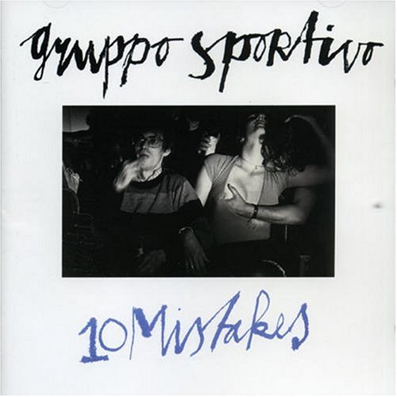

# Mistakes

By **Gruppo Sportivo**

## Album Data

- **Catalog:** Beets
- **Format:** Digital, Album
- **Album:** Mistakes
- **Artist:** Gruppo Sportivo
- **Albumartist:** Gruppo Sportivo
- **Genre:** New Wave
- **MusicBrainz Album Artist ID:** [f7dba4f7-f935-48e1-9d0f-3d67172b935c](https://musicbrainz.org/artist/f7dba4f7-f935-48e1-9d0f-3d67172b935c)
- **MusicBrainz Album ID:** [7f65c130-e6ed-4c11-a170-7ecc566ee426](https://musicbrainz.org/release/7f65c130-e6ed-4c11-a170-7ecc566ee426)
- **MusicBrainz Release Group ID:** [cafa851b-5509-42f3-9ec9-e87ec587d0d0](https://musicbrainz.org/release-group/cafa851b-5509-42f3-9ec9-e87ec587d0d0)
- **Year:** 1978
- **Catalog #:** SRK 6066
- **Label:** Sire Records
- **Total Tracks:** 13

## Album Tracks

### Track 01 - Mission A Paris

- **Artist:** Gruppo Sportivo
- **Format:** MP3
- **Genre:** Rock
- **Length:** 4:17
- **MusicBrainz Track ID:** [084b2cb1-d544-40ac-8375-b4b39ef6b569](https://musicbrainz.org/recording/084b2cb1-d544-40ac-8375-b4b39ef6b569)
- **Title:** Mission A Paris
- **Track:** 01
- **Year:** 1978

### Track 02 - Dreamin’

- **Artist:** Gruppo Sportivo
- **Format:** MP3
- **Genre:** New Wave
- **Length:** 4:23
- **MusicBrainz Track ID:** [24d6a966-e6e4-422a-8136-bbe6b0d1f82c](https://musicbrainz.org/recording/24d6a966-e6e4-422a-8136-bbe6b0d1f82c)
- **Title:** Dreamin’
- **Track:** 02
- **Year:** 1978

### Track 03 - Henri

- **Artist:** Gruppo Sportivo
- **Format:** MP3
- **Genre:** New Wave
- **Length:** 4:25
- **MusicBrainz Track ID:** [5f48c096-9914-405a-9b35-e1a0d33ca0b0](https://musicbrainz.org/recording/5f48c096-9914-405a-9b35-e1a0d33ca0b0)
- **Title:** Henri
- **Track:** 03
- **Year:** 1978

### Track 04 - Hey Girl

- **Artist:** Gruppo Sportivo
- **Format:** MP3
- **Genre:** Power Pop
- **Length:** 2:28
- **MusicBrainz Track ID:** [30b58dfb-8b14-47e8-a268-74ae561d7ef9](https://musicbrainz.org/recording/30b58dfb-8b14-47e8-a268-74ae561d7ef9)
- **Title:** Hey Girl
- **Track:** 04
- **Year:** 1978

### Track 05 - I Said No

- **Artist:** Gruppo Sportivo
- **Format:** MP3
- **Genre:** New Wave
- **Length:** 4:18
- **MusicBrainz Track ID:** [88339894-2abb-450b-bdc5-e03ebf78d5f5](https://musicbrainz.org/recording/88339894-2abb-450b-bdc5-e03ebf78d5f5)
- **Title:** I Said No
- **Track:** 05
- **Year:** 1978

### Track 06 - I Shot My Manager

- **Artist:** Gruppo Sportivo
- **Format:** MP3
- **Genre:** New Wave
- **Length:** 2:50
- **MusicBrainz Track ID:** [cbfd7a82-6ad9-475a-9570-7a58d14407f6](https://musicbrainz.org/recording/cbfd7a82-6ad9-475a-9570-7a58d14407f6)
- **Title:** I Shot My Manager
- **Track:** 06
- **Year:** 1978

### Track 07 - Blah Blah Magazines

- **Artist:** Gruppo Sportivo
- **Format:** MP3
- **Genre:** Rock
- **Length:** 2:04
- **MusicBrainz Track ID:** [8b0c1e18-49ee-44af-b29b-6334ee5dfa19](https://musicbrainz.org/recording/8b0c1e18-49ee-44af-b29b-6334ee5dfa19)
- **Title:** Blah Blah Magazines
- **Track:** 07
- **Year:** 1978

### Track 08 - Beep Beep Love

- **Artist:** Gruppo Sportivo
- **Format:** MP3
- **Genre:** New Wave
- **Length:** 2:55
- **MusicBrainz Track ID:** [65b45c83-4b14-4365-ab79-db212e52a565](https://musicbrainz.org/recording/65b45c83-4b14-4365-ab79-db212e52a565)
- **Title:** Beep Beep Love
- **Track:** 08
- **Year:** 1978

### Track 09 - P.S. 78

- **Artist:** Gruppo Sportivo
- **Format:** MP3
- **Genre:** Pop
- **Length:** 3:03
- **MusicBrainz Track ID:** [d0ee9752-38db-4508-bf27-5343942f0faf](https://musicbrainz.org/recording/d0ee9752-38db-4508-bf27-5343942f0faf)
- **Title:** P.S. 78
- **Track:** 09
- **Year:** 1978

### Track 10 - Superman

- **Artist:** Gruppo Sportivo
- **Format:** MP3
- **Genre:** New Wave
- **Length:** 6:27
- **MusicBrainz Track ID:** [5509e4a7-0825-4a33-92af-375d10223839](https://musicbrainz.org/recording/5509e4a7-0825-4a33-92af-375d10223839)
- **Title:** Superman
- **Track:** 10
- **Year:** 1978

### Track 11 - One Way Love (From Me to You)

- **Artist:** Gruppo Sportivo
- **Format:** MP3
- **Genre:** New Wave
- **Length:** 3:09
- **MusicBrainz Track ID:** [90835109-0d25-4b51-bc74-40f7b6c6c497](https://musicbrainz.org/recording/90835109-0d25-4b51-bc74-40f7b6c6c497)
- **Title:** One Way Love (From Me to You)
- **Track:** 11
- **Year:** 1978

### Track 12 - Bottom of the Class

- **Artist:** Gruppo Sportivo
- **Format:** MP3
- **Genre:** Nederpop
- **Length:** 2:04
- **MusicBrainz Track ID:** [23989fc5-8f1f-4466-844c-561362289db3](https://musicbrainz.org/recording/23989fc5-8f1f-4466-844c-561362289db3)
- **Title:** Bottom of the Class
- **Track:** 12
- **Year:** 1978

### Track 13 - The (single)

- **Artist:** Gruppo Sportivo
- **Format:** MP3
- **Genre:** New Wave
- **Length:** 1:14
- **MusicBrainz Track ID:** [79579fe3-6019-47ed-ae71-62887f2cb22d](https://musicbrainz.org/recording/79579fe3-6019-47ed-ae71-62887f2cb22d)
- **Title:** The (single)
- **Track:** 13
- **Year:** 1978

## See also

- [Back To '78](Back_To_78.md)
- [Design Moderne](Design_Moderne.md)
- [Disco Really Made It 45](Disco_Really_Made_It_45.md)
- [Roon: 10 Mistakes](../../Roon/Gruppo_Sportivo/10_Mistakes.md)
- [Roon: Back to 78](../../Roon/Gruppo_Sportivo/Back_to_78.md)
- [Roon: Copy Copy](../../Roon/Gruppo_Sportivo/Copy_Copy.md)
- [Roon: Design Moderne](../../Roon/Gruppo_Sportivo/Design_Moderne.md)
- [Roon: Pop! Goes The Brain](../../Roon/Gruppo_Sportivo/Pop!_Goes_The_Brain.md)
- [Vinyl: Back To 78](../../Vinyl/Gruppo_Sportivo/Back_To_78.md)
- [Vinyl: Design Moderne](../../Vinyl/Gruppo_Sportivo/Design_Moderne.md)
- [Vinyl: Disco Really Made It](../../Vinyl/Gruppo_Sportivo/Disco_Really_Made_It.md)
- [Vinyl: ](../../Vinyl/Gruppo_Sportivo/Gruppo_Sportivo.md)
- [Vinyl: Mistakes](../../Vinyl/Gruppo_Sportivo/Mistakes.md)
