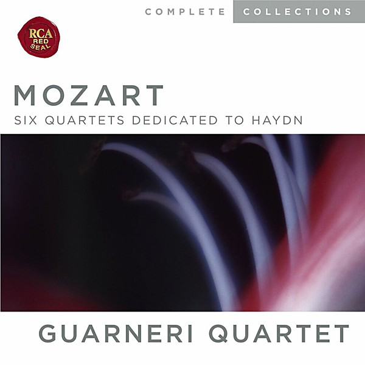

# Six Mozart Quartets Dedicated To Haydn

By **Guarneri Quartet**

## Album Data

- **Catalog:** Beets
- **Format:** Digital, Album
- **Album:** Six Mozart Quartets Dedicated To Haydn
- **Artist:** Guarneri Quartet
- **Albumartist:** Guarneri Quartet
- **Genre:** String Quartet
- **MusicBrainz Album Artist ID:** 
- **MusicBrainz Album ID:** 
- **MusicBrainz Release Group ID:** 
- **Year:** 1976
- **Catalog #:** 
- **Label:** 
- **Total Tracks:** 00

## Album Tracks

### Track 01 - I. Allegro vivace assai

- **Artist:** Guarneri Quartet
- **Format:** MP3
- **Genre:** String Quartet
- **Length:** 8:10
- **MusicBrainz Track ID:** 
- **Title:** I. Allegro vivace assai
- **Track:** 01
- **Year:** 1976

### Track 02 - II. Menuetto Allegro

- **Artist:** Guarneri Quartet
- **Format:** MP3
- **Genre:** String Quartet
- **Length:** 9:25
- **MusicBrainz Track ID:** 
- **Title:** II. Menuetto Allegro
- **Track:** 02
- **Year:** 1976

### Track 03 - III. Andante cantabile

- **Artist:** Guarneri Quartet
- **Format:** MP3
- **Genre:** String Quartet
- **Length:** 7:12
- **MusicBrainz Track ID:** 
- **Title:** III. Andante cantabile
- **Track:** 03
- **Year:** 1976

### Track 04 - IV. Molto allegro

- **Artist:** Guarneri Quartet
- **Format:** MP3
- **Genre:** String Quartet
- **Length:** 5:41
- **MusicBrainz Track ID:** 
- **Title:** IV. Molto allegro
- **Track:** 04
- **Year:** 1976

