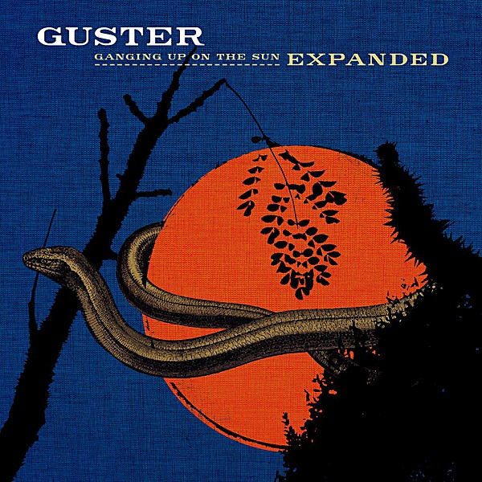

# Ganging Up On The Sun

By **Guster**

## Album Data

- **Catalog:** Beets
- **Format:** Digital, Album
- **Album:** Ganging Up On The Sun
- **Artist:** Guster
- **Albumartist:** Guster
- **Genre:** rock
- **MusicBrainz Album Artist ID:** [https](https://musicbrainz.org/artist/https)
- **MusicBrainz Album ID:** [https](https://musicbrainz.org/release/https)
- **MusicBrainz Release Group ID:** 
- **Year:** 2006
- **Catalog #:** 
- **Label:** Nettwerk
- **Total Tracks:** 14

## Album Tracks

### Track 01 - Diane

- **Artist:** Guster
- **Format:** ALAC
- **Genre:** rock
- **Length:** 3:46
- **MusicBrainz Track ID:** [https](https://musicbrainz.org/recording/https)
- **Title:** Diane
- **Track:** 01
- **Year:** 2003

### Track 02 - Careful

- **Artist:** Guster
- **Format:** ALAC
- **Genre:** rock
- **Length:** 3:42
- **MusicBrainz Track ID:** [https](https://musicbrainz.org/recording/https)
- **Title:** Careful
- **Track:** 02
- **Year:** 2003

### Track 03 - Amsterdam

- **Artist:** Guster
- **Format:** ALAC
- **Genre:** rock
- **Length:** 3:37
- **MusicBrainz Track ID:** [https](https://musicbrainz.org/recording/https)
- **Title:** Amsterdam
- **Track:** 03
- **Year:** 2003

### Track 04 - Backyard

- **Artist:** Guster
- **Format:** ALAC
- **Genre:** rock
- **Length:** 2:55
- **MusicBrainz Track ID:** [https](https://musicbrainz.org/recording/https)
- **Title:** Backyard
- **Track:** 04
- **Year:** 2003

### Track 05 - Homecoming King

- **Artist:** Guster
- **Format:** ALAC
- **Genre:** rock
- **Length:** 3:37
- **MusicBrainz Track ID:** [https](https://musicbrainz.org/recording/https)
- **Title:** Homecoming King
- **Track:** 05
- **Year:** 2003

### Track 06 - Ramona

- **Artist:** Guster
- **Format:** ALAC
- **Genre:** rock
- **Length:** 3:06
- **MusicBrainz Track ID:** [https](https://musicbrainz.org/recording/https)
- **Title:** Ramona
- **Track:** 06
- **Year:** 2003

### Track 07 - Jesus On The Radio

- **Artist:** Guster
- **Format:** ALAC
- **Genre:** rock
- **Length:** 2:17
- **MusicBrainz Track ID:** [https](https://musicbrainz.org/recording/https)
- **Title:** Jesus On The Radio
- **Track:** 07
- **Year:** 2003

### Track 08 - Keep It Together

- **Artist:** Guster
- **Format:** ALAC
- **Genre:** rock
- **Length:** 3:43
- **MusicBrainz Track ID:** [https](https://musicbrainz.org/recording/https)
- **Title:** Keep It Together
- **Track:** 08
- **Year:** 2003

### Track 09 - Come Downstairs & Say Hello

- **Artist:** Guster
- **Format:** ALAC
- **Genre:** rock
- **Length:** 5:16
- **MusicBrainz Track ID:** [https](https://musicbrainz.org/recording/https)
- **Title:** Come Downstairs & Say Hello
- **Track:** 09
- **Year:** 2003

### Track 10 - Red Oyster Cult

- **Artist:** Guster
- **Format:** ALAC
- **Genre:** rock
- **Length:** 3:27
- **MusicBrainz Track ID:** [https](https://musicbrainz.org/recording/https)
- **Title:** Red Oyster Cult
- **Track:** 10
- **Year:** 2003

### Track 11 - Long Way Down

- **Artist:** Guster
- **Format:** ALAC
- **Genre:** rock
- **Length:** 4:34
- **MusicBrainz Track ID:** [https](https://musicbrainz.org/recording/https)
- **Title:** Long Way Down
- **Track:** 11
- **Year:** 2003

### Track 12 - I Hope Tomorrow Is Like Today

- **Artist:** Guster
- **Format:** ALAC
- **Genre:** rock
- **Length:** 3:22
- **MusicBrainz Track ID:** [https](https://musicbrainz.org/recording/https)
- **Title:** I Hope Tomorrow Is Like Today
- **Track:** 12
- **Year:** 2003

### Track 13 - Silence

- **Artist:** Guster
- **Format:** ALAC
- **Genre:** rock
- **Length:** 0:30
- **MusicBrainz Track ID:** [https](https://musicbrainz.org/recording/https)
- **Title:** Silence
- **Track:** 13
- **Year:** 2003

### Track 14 - Two at a Time

- **Artist:** Guster
- **Format:** ALAC
- **Genre:** rock
- **Length:** 4:57
- **MusicBrainz Track ID:** [https](https://musicbrainz.org/recording/https)
- **Title:** Two at a Time
- **Track:** 14
- **Year:** 2003

