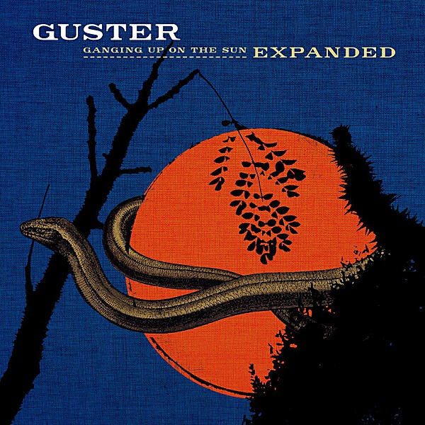

# Ganging Up on the Sun

By **Guster**

## Album Data

- **Catalog:** Beets
- **Format:** Digital, Album
- **Album:** Ganging Up on the Sun
- **Artist:** Guster
- **Albumartist:** Guster
- **Genre:** Indie Rock
- **MusicBrainz Album Artist ID:** [6cbe1e63-5895-4168-ac7e-f0d2836ba0c1](https://musicbrainz.org/artist/6cbe1e63-5895-4168-ac7e-f0d2836ba0c1)
- **MusicBrainz Album ID:** [b7a7ab9b-cc95-4f60-a68a-1e67e77e6987](https://musicbrainz.org/release/b7a7ab9b-cc95-4f60-a68a-1e67e77e6987)
- **MusicBrainz Release Group ID:** [7b6ad5f1-e104-3724-983b-a3df2f147272](https://musicbrainz.org/release-group/7b6ad5f1-e104-3724-983b-a3df2f147272)
- **Year:** 2006
- **Catalog #:** 
- **Label:** Nettwerk
- **Total Tracks:** 12

## Album Tracks

### Track 01 - Lightning Rod

- **Artist:** Guster
- **Format:** ALAC
- **Genre:** rock
- **Length:** 2:55
- **MusicBrainz Track ID:** [https](https://musicbrainz.org/recording/https)
- **Title:** Lightning Rod
- **Track:** 01
- **Year:** 2006

### Track 02 - Satellite

- **Artist:** Guster
- **Format:** ALAC
- **Genre:** rock
- **Length:** 4:34
- **MusicBrainz Track ID:** [https](https://musicbrainz.org/recording/https)
- **Title:** Satellite
- **Track:** 02
- **Year:** 2006

### Track 03 - Manifest Destiny

- **Artist:** Guster
- **Format:** ALAC
- **Genre:** rock
- **Length:** 3:01
- **MusicBrainz Track ID:** [https](https://musicbrainz.org/recording/https)
- **Title:** Manifest Destiny
- **Track:** 03
- **Year:** 2006

### Track 04 - One Man Wrecking Machine

- **Artist:** Guster
- **Format:** ALAC
- **Genre:** rock
- **Length:** 4:14
- **MusicBrainz Track ID:** [https](https://musicbrainz.org/recording/https)
- **Title:** One Man Wrecking Machine
- **Track:** 04
- **Year:** 2006

### Track 05 - The Captain

- **Artist:** Guster
- **Format:** ALAC
- **Genre:** rock
- **Length:** 3:26
- **MusicBrainz Track ID:** [https](https://musicbrainz.org/recording/https)
- **Title:** The Captain
- **Track:** 05
- **Year:** 2006

### Track 06 - The New Underground

- **Artist:** Guster
- **Format:** ALAC
- **Genre:** rock
- **Length:** 2:50
- **MusicBrainz Track ID:** [https](https://musicbrainz.org/recording/https)
- **Title:** The New Underground
- **Track:** 06
- **Year:** 2006

### Track 07 - Ruby Falls

- **Artist:** Guster
- **Format:** ALAC
- **Genre:** rock
- **Length:** 7:06
- **MusicBrainz Track ID:** [https](https://musicbrainz.org/recording/https)
- **Title:** Ruby Falls
- **Track:** 07
- **Year:** 2006

### Track 08 - C'Mon

- **Artist:** Guster
- **Format:** ALAC
- **Genre:** rock
- **Length:** 3:53
- **MusicBrainz Track ID:** [https](https://musicbrainz.org/recording/https)
- **Title:** C'Mon
- **Track:** 08
- **Year:** 2006

### Track 09 - Empire State

- **Artist:** Guster
- **Format:** ALAC
- **Genre:** rock
- **Length:** 4:59
- **MusicBrainz Track ID:** [https](https://musicbrainz.org/recording/https)
- **Title:** Empire State
- **Track:** 09
- **Year:** 2006

### Track 10 - Dear Valentine

- **Artist:** Guster
- **Format:** ALAC
- **Genre:** rock
- **Length:** 4:34
- **MusicBrainz Track ID:** [https](https://musicbrainz.org/recording/https)
- **Title:** Dear Valentine
- **Track:** 10
- **Year:** 2006

### Track 11 - The Beginning of the End

- **Artist:** Guster
- **Format:** ALAC
- **Genre:** rock
- **Length:** 2:52
- **MusicBrainz Track ID:** [https](https://musicbrainz.org/recording/https)
- **Title:** The Beginning of the End
- **Track:** 11
- **Year:** 2006

### Track 12 - Hang On

- **Artist:** Guster
- **Format:** ALAC
- **Genre:** rock
- **Length:** 4:32
- **MusicBrainz Track ID:** [https](https://musicbrainz.org/recording/https)
- **Title:** Hang On
- **Track:** 12
- **Year:** 2006

## See also

- [Easy Wonderful](Easy_Wonderful.md)
- [Evermotion](Evermotion.md)
- [Ganging Up On The Sun](Ganging_Up_On_The_Sun.md)
- [Keep It Together](Keep_It_Together.md)
- [Lost and Gone Forever](Lost_and_Gone_Forever.md)
- [Satellite EP](Satellite_EP.md)
- [CD: ](../../CD/Guster/Guster.md)
- [CD: Keep It Together](../../CD/Guster/Keep_It_Together.md)
- [CD: Lost And Gone Forever](../../CD/Guster/Lost_And_Gone_Forever.md)
- [Roon: Easy Wonderful (Album Version)](../../Roon/Guster/Easy_Wonderful_Album_Version.md)
- [Roon: Evermotion](../../Roon/Guster/Evermotion.md)
- [Roon: Ganging Up on the Sun](../../Roon/Guster/Ganging_Up_on_the_Sun.md)
- [Roon: Keep It Together (10 Year Anniversary Edition)](../../Roon/Guster/Keep_It_Together_10_Year_Anniversary_Edition.md)
- [Roon: Lost and Gone Forever](../../Roon/Guster/Lost_and_Gone_Forever.md)
- [Roon: Satellite](../../Roon/Guster/Satellite.md)
