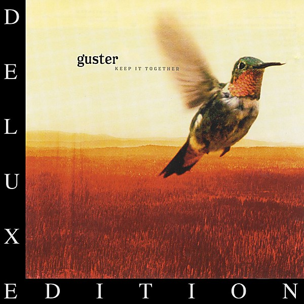

# Keep It Together

By **Guster**

## Album Data

- **Catalog:** Beets
- **Format:** Digital, Album
- **Album:** Keep It Together
- **Artist:** Guster
- **Albumartist:** Guster
- **Genre:** rock
- **MusicBrainz Album Artist ID:** [https](https://musicbrainz.org/artist/https)
- **MusicBrainz Album ID:** [https](https://musicbrainz.org/release/https)
- **MusicBrainz Release Group ID:** 
- **Year:** 2003
- **Catalog #:** 
- **Label:** Nettwerk
- **Total Tracks:** 11

## Album Tracks

### Track 01 - What You Wish For

- **Artist:** Guster
- **Format:** ALAC
- **Genre:** rock
- **Length:** 3:51
- **MusicBrainz Track ID:** [https](https://musicbrainz.org/recording/https)
- **Title:** What You Wish For
- **Track:** 01
- **Year:** 1999

### Track 02 - Barrel of a Gun

- **Artist:** Guster
- **Format:** ALAC
- **Genre:** rock
- **Length:** 3:11
- **MusicBrainz Track ID:** [https](https://musicbrainz.org/recording/https)
- **Title:** Barrel of a Gun
- **Track:** 02
- **Year:** 1999

### Track 03 - Either Way

- **Artist:** Guster
- **Format:** ALAC
- **Genre:** rock
- **Length:** 4:43
- **MusicBrainz Track ID:** [https](https://musicbrainz.org/recording/https)
- **Title:** Either Way
- **Track:** 03
- **Year:** 1999

### Track 04 - Fa Fa

- **Artist:** Guster
- **Format:** ALAC
- **Genre:** rock
- **Length:** 4:43
- **MusicBrainz Track ID:** [https](https://musicbrainz.org/recording/https)
- **Title:** Fa Fa
- **Track:** 04
- **Year:** 1999

### Track 05 - I Spy

- **Artist:** Guster
- **Format:** ALAC
- **Genre:** rock
- **Length:** 2:57
- **MusicBrainz Track ID:** [https](https://musicbrainz.org/recording/https)
- **Title:** I Spy
- **Track:** 05
- **Year:** 1999

### Track 06 - Center of Attention

- **Artist:** Guster
- **Format:** ALAC
- **Genre:** rock
- **Length:** 4:07
- **MusicBrainz Track ID:** [https](https://musicbrainz.org/recording/https)
- **Title:** Center of Attention
- **Track:** 06
- **Year:** 1999

### Track 07 - All The Way Up to Heaven

- **Artist:** Guster
- **Format:** ALAC
- **Genre:** rock
- **Length:** 5:00
- **MusicBrainz Track ID:** [https](https://musicbrainz.org/recording/https)
- **Title:** All The Way Up to Heaven
- **Track:** 07
- **Year:** 1999

### Track 08 - Happier

- **Artist:** Guster
- **Format:** ALAC
- **Genre:** rock
- **Length:** 3:52
- **MusicBrainz Track ID:** [https](https://musicbrainz.org/recording/https)
- **Title:** Happier
- **Track:** 08
- **Year:** 1999

### Track 09 - So Long

- **Artist:** Guster
- **Format:** ALAC
- **Genre:** rock
- **Length:** 2:38
- **MusicBrainz Track ID:** [https](https://musicbrainz.org/recording/https)
- **Title:** So Long
- **Track:** 09
- **Year:** 1999

### Track 10 - Two Points for Honesty

- **Artist:** Guster
- **Format:** ALAC
- **Genre:** rock
- **Length:** 3:32
- **MusicBrainz Track ID:** [https](https://musicbrainz.org/recording/https)
- **Title:** Two Points for Honesty
- **Track:** 10
- **Year:** 1999

### Track 11 - Rainy Day

- **Artist:** Guster
- **Format:** ALAC
- **Genre:** rock
- **Length:** 5:23
- **MusicBrainz Track ID:** [https](https://musicbrainz.org/recording/https)
- **Title:** Rainy Day
- **Track:** 11
- **Year:** 1999

## See also

- [Easy Wonderful](Easy_Wonderful.md)
- [Evermotion](Evermotion.md)
- [Ganging Up on the Sun](Ganging_Up_on_the_Sun.md)
- [Ganging Up On The Sun](Ganging_Up_On_The_Sun.md)
- [Lost and Gone Forever](Lost_and_Gone_Forever.md)
- [Satellite EP](Satellite_EP.md)
- [CD: ](../../CD/Guster/Guster.md)
- [CD: Keep It Together](../../CD/Guster/Keep_It_Together.md)
- [CD: Lost And Gone Forever](../../CD/Guster/Lost_And_Gone_Forever.md)
- [Roon: Easy Wonderful (Album Version)](../../Roon/Guster/Easy_Wonderful_Album_Version.md)
- [Roon: Evermotion](../../Roon/Guster/Evermotion.md)
- [Roon: Ganging Up on the Sun](../../Roon/Guster/Ganging_Up_on_the_Sun.md)
- [Roon: Keep It Together (10 Year Anniversary Edition)](../../Roon/Guster/Keep_It_Together_10_Year_Anniversary_Edition.md)
- [Roon: Lost and Gone Forever](../../Roon/Guster/Lost_and_Gone_Forever.md)
- [Roon: Satellite](../../Roon/Guster/Satellite.md)
