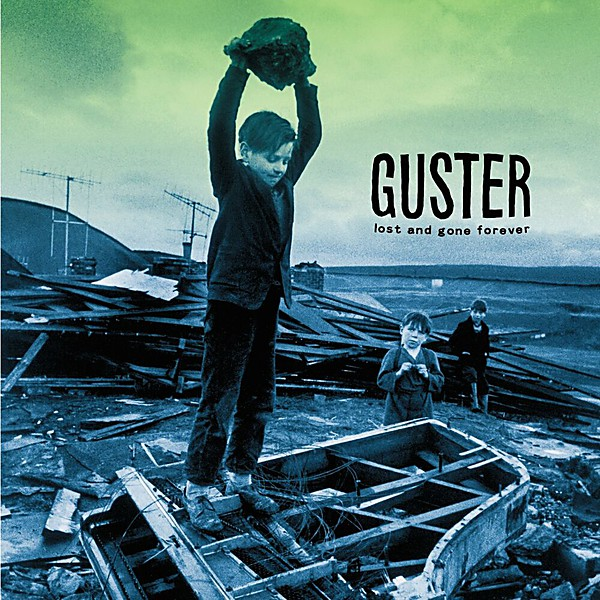

# Lost and Gone Forever

By **Guster**

## Album Data

- **Catalog:** Beets
- **Format:** Digital, Album
- **Album:** Lost and Gone Forever
- **Artist:** Guster
- **Albumartist:** Guster
- **Genre:** rock
- **MusicBrainz Album Artist ID:** [https](https://musicbrainz.org/artist/https)
- **MusicBrainz Album ID:** [https](https://musicbrainz.org/release/https)
- **MusicBrainz Release Group ID:** 
- **Year:** 1999
- **Catalog #:** 
- **Label:** 
- **Total Tracks:** 08

## Album Tracks

### Track 06 - Satellite [The Astronauts Remix]

- **Artist:** Guster
- **Format:** MP3
- **Genre:** Indie Rock
- **Length:** 6:06
- **MusicBrainz Track ID:** 
- **Title:** Satellite [The Astronauts Remix]
- **Track:** 06
- **Year:** 2007

## See also

- [Easy Wonderful](Easy_Wonderful.md)
- [Evermotion](Evermotion.md)
- [Ganging Up on the Sun](Ganging_Up_on_the_Sun.md)
- [Ganging Up On The Sun](Ganging_Up_On_The_Sun.md)
- [Keep It Together](Keep_It_Together.md)
- [Satellite EP](Satellite_EP.md)
- [CD: ](../../CD/Guster/Guster.md)
- [CD: Keep It Together](../../CD/Guster/Keep_It_Together.md)
- [CD: Lost And Gone Forever](../../CD/Guster/Lost_And_Gone_Forever.md)
- [Roon: Easy Wonderful (Album Version)](../../Roon/Guster/Easy_Wonderful_Album_Version.md)
- [Roon: Evermotion](../../Roon/Guster/Evermotion.md)
- [Roon: Ganging Up on the Sun](../../Roon/Guster/Ganging_Up_on_the_Sun.md)
- [Roon: Keep It Together (10 Year Anniversary Edition)](../../Roon/Guster/Keep_It_Together_10_Year_Anniversary_Edition.md)
- [Roon: Lost and Gone Forever](../../Roon/Guster/Lost_and_Gone_Forever.md)
- [Roon: Satellite](../../Roon/Guster/Satellite.md)
