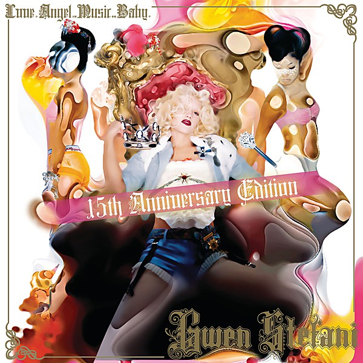

# Love. Angel. Music. Baby.

By **Gwen Stefani**

## Album Data

- **Catalog:** Beets
- **Format:** Digital, Album
- **Album:** Love. Angel. Music. Baby.
- **Artist:** Gwen Stefani
- **Albumartist:** Gwen Stefani
- **Genre:** Rock
- **MusicBrainz Album Artist ID:** [2e41ae9c-afd2-4f20-8f1e-17281ce9b472](https://musicbrainz.org/artist/2e41ae9c-afd2-4f20-8f1e-17281ce9b472)
- **MusicBrainz Album ID:** [eea9db35-28d9-4c58-bad0-90d57c626269](https://musicbrainz.org/release/eea9db35-28d9-4c58-bad0-90d57c626269)
- **MusicBrainz Release Group ID:** [3873f5a4-e3e2-3e88-ae7e-c2ea5de1a5ba](https://musicbrainz.org/release-group/3873f5a4-e3e2-3e88-ae7e-c2ea5de1a5ba)
- **Year:** 2004
- **Catalog #:** B0008099‐02 IN02
- **Label:** 
- **Total Tracks:** 12

## Album Tracks

### Track 01 - Wind It Up

- **Artist:** Gwen Stefani
- **Format:** ALAC
- **Genre:** Pop
- **Length:** 3:09
- **MusicBrainz Track ID:** [88fb6b56-d2e4-48bb-8960-a6300086846c](https://musicbrainz.org/recording/88fb6b56-d2e4-48bb-8960-a6300086846c)
- **Title:** Wind It Up
- **Track:** 01
- **Year:** 2006

### Track 03 - Orange County Girl

- **Artist:** Gwen Stefani
- **Format:** ALAC
- **Genre:** Rock
- **Length:** 3:23
- **MusicBrainz Track ID:** [b8ea7f7f-b75d-4a1a-b318-1d5eb39cf330](https://musicbrainz.org/recording/b8ea7f7f-b75d-4a1a-b318-1d5eb39cf330)
- **Title:** Orange County Girl
- **Track:** 03
- **Year:** 2006

### Track 04 - Early Winter

- **Artist:** Gwen Stefani
- **Format:** ALAC
- **Genre:** Pop
- **Length:** 4:44
- **MusicBrainz Track ID:** [2604887c-dd63-4846-93c9-4c44f3074bbb](https://musicbrainz.org/recording/2604887c-dd63-4846-93c9-4c44f3074bbb)
- **Title:** Early Winter
- **Track:** 04
- **Year:** 2006

### Track 05 - Now That You Got It

- **Artist:** Gwen Stefani
- **Format:** ALAC
- **Genre:** Rock
- **Length:** 2:59
- **MusicBrainz Track ID:** [df70902c-b5cb-4e05-8e63-35e3c8c5ed55](https://musicbrainz.org/recording/df70902c-b5cb-4e05-8e63-35e3c8c5ed55)
- **Title:** Now That You Got It
- **Track:** 05
- **Year:** 2006

### Track 06 - 4 in the Morning

- **Artist:** Gwen Stefani
- **Format:** ALAC
- **Genre:** Pop
- **Length:** 4:51
- **MusicBrainz Track ID:** [20f13085-8cc5-4562-a2ef-44492c9118c8](https://musicbrainz.org/recording/20f13085-8cc5-4562-a2ef-44492c9118c8)
- **Title:** 4 in the Morning
- **Track:** 06
- **Year:** 2006

### Track 08 - Fluorescent

- **Artist:** Gwen Stefani
- **Format:** ALAC
- **Genre:** Synthpop
- **Length:** 4:18
- **MusicBrainz Track ID:** [b9901db2-accd-467d-ad5d-14db63f9b18a](https://musicbrainz.org/recording/b9901db2-accd-467d-ad5d-14db63f9b18a)
- **Title:** Fluorescent
- **Track:** 08
- **Year:** 2006

### Track 09 - Breakin’ Up

- **Artist:** Gwen Stefani
- **Format:** ALAC
- **Genre:** Synthpop
- **Length:** 3:46
- **MusicBrainz Track ID:** [58b65662-aeb9-4ea4-94a1-8793fdc2ac8d](https://musicbrainz.org/recording/58b65662-aeb9-4ea4-94a1-8793fdc2ac8d)
- **Title:** Breakin’ Up
- **Track:** 09
- **Year:** 2006

### Track 10 - Don’t Get It Twisted

- **Artist:** Gwen Stefani
- **Format:** ALAC
- **Genre:** Synthpop
- **Length:** 3:37
- **MusicBrainz Track ID:** [78de2996-0d54-4f6a-b333-ea5b84d6cca1](https://musicbrainz.org/recording/78de2996-0d54-4f6a-b333-ea5b84d6cca1)
- **Title:** Don’t Get It Twisted
- **Track:** 10
- **Year:** 2006

### Track 11 - U Started It

- **Artist:** Gwen Stefani
- **Format:** ALAC
- **Genre:** Pop
- **Length:** 3:08
- **MusicBrainz Track ID:** [21b5b5e0-7be9-4676-9bc2-0ee484158cf9](https://musicbrainz.org/recording/21b5b5e0-7be9-4676-9bc2-0ee484158cf9)
- **Title:** U Started It
- **Track:** 11
- **Year:** 2006

### Track 12 - Wonderful Life

- **Artist:** Gwen Stefani
- **Format:** ALAC
- **Genre:** Electropop
- **Length:** 3:58
- **MusicBrainz Track ID:** [10d5cdce-52eb-4f7e-b5ef-9b7b974fad8b](https://musicbrainz.org/recording/10d5cdce-52eb-4f7e-b5ef-9b7b974fad8b)
- **Title:** Wonderful Life
- **Track:** 12
- **Year:** 2006

### Track 02 - The Sweet Escape

- **Artist:** Gwen Stefani featuring Akon
- **Format:** ALAC
- **Genre:** Pop
- **Length:** 4:06
- **MusicBrainz Track ID:** [353c7383-df10-40a4-93df-05eb5bb8e778](https://musicbrainz.org/recording/353c7383-df10-40a4-93df-05eb5bb8e778)
- **Title:** The Sweet Escape
- **Track:** 02
- **Year:** 2006

### Track 07 - Yummy

- **Artist:** Gwen Stefani featuring Pharrell Williams
- **Format:** ALAC
- **Genre:** Synthpop
- **Length:** 4:57
- **MusicBrainz Track ID:** [32dadd3f-0e04-4c9c-b719-e6a2e6710c46](https://musicbrainz.org/recording/32dadd3f-0e04-4c9c-b719-e6a2e6710c46)
- **Title:** Yummy
- **Track:** 07
- **Year:** 2006

## See also

- [The Sweet Escape](The_Sweet_Escape.md)
- [Roon: Love Angel Music Baby - 15th Anniversary Edition](../../Roon/Gwen_Stefani/Love_Angel_Music_Baby_-_15th_Anniversary_Edition.md)
- [Roon: The Sweet Escape](../../Roon/Gwen_Stefani/The_Sweet_Escape.md)
