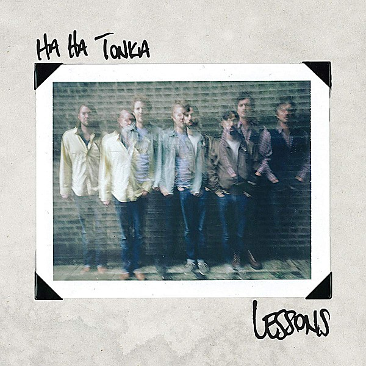

# Lessons

By **Ha Ha Tonka**

## Album Data

- **Catalog:** Beets
- **Format:** Digital, Album
- **Album:** Lessons
- **Artist:** Ha Ha Tonka
- **Albumartist:** Ha Ha Tonka
- **Genre:** Indie Rock
- **MusicBrainz Album Artist ID:** [4a0ac130-e0cb-4f4d-b6b7-ef6a7da48b24](https://musicbrainz.org/artist/4a0ac130-e0cb-4f4d-b6b7-ef6a7da48b24)
- **MusicBrainz Album ID:** [4755c2d2-9bef-4c0c-a661-b16fede71390](https://musicbrainz.org/release/4755c2d2-9bef-4c0c-a661-b16fede71390)
- **MusicBrainz Release Group ID:** [91dc100b-6071-4175-b504-eaab2cdf8cd4](https://musicbrainz.org/release-group/91dc100b-6071-4175-b504-eaab2cdf8cd4)
- **Year:** 2013
- **Catalog #:** BS 207
- **Label:** Bloodshot Records
- **Total Tracks:** 14

## Album Tracks

### Track 01 - Dead to the World

- **Artist:** Ha Ha Tonka
- **Format:** ALAC
- **Genre:** Indie Rock
- **Length:** 4:20
- **MusicBrainz Track ID:** [fdc6eb4e-416d-408f-bd6b-d1cd653fc5cc](https://musicbrainz.org/recording/fdc6eb4e-416d-408f-bd6b-d1cd653fc5cc)
- **Title:** Dead to the World
- **Track:** 01
- **Year:** 2013

### Track 02 - Colorful Kids

- **Artist:** Ha Ha Tonka
- **Format:** ALAC
- **Genre:** Indie Rock
- **Length:** 4:09
- **MusicBrainz Track ID:** [3c9c114c-6857-4dd0-94cd-c058ae463643](https://musicbrainz.org/recording/3c9c114c-6857-4dd0-94cd-c058ae463643)
- **Title:** Colorful Kids
- **Track:** 02
- **Year:** 2013

### Track 03 - Staring at the End

- **Artist:** Ha Ha Tonka
- **Format:** ALAC
- **Genre:** Indie Rock
- **Length:** 4:33
- **MusicBrainz Track ID:** [ff74fc46-541f-4fb4-802a-653083a89b28](https://musicbrainz.org/recording/ff74fc46-541f-4fb4-802a-653083a89b28)
- **Title:** Staring at the End
- **Track:** 03
- **Year:** 2013

### Track 04 - Synthetic Love

- **Artist:** Ha Ha Tonka
- **Format:** ALAC
- **Genre:** Indie Rock
- **Length:** 0:30
- **MusicBrainz Track ID:** [9d0f4096-7047-437e-ae11-51c86f3cc4b3](https://musicbrainz.org/recording/9d0f4096-7047-437e-ae11-51c86f3cc4b3)
- **Title:** Synthetic Love
- **Track:** 04
- **Year:** 2013

### Track 05 - Arabella

- **Artist:** Ha Ha Tonka
- **Format:** ALAC
- **Genre:** Indie Rock
- **Length:** 4:12
- **MusicBrainz Track ID:** [1d5f28ef-53fb-4ea7-9699-58c9748e9575](https://musicbrainz.org/recording/1d5f28ef-53fb-4ea7-9699-58c9748e9575)
- **Title:** Arabella
- **Track:** 05
- **Year:** 2013

### Track 06 - Lessons

- **Artist:** Ha Ha Tonka
- **Format:** ALAC
- **Genre:** Indie Rock
- **Length:** 5:05
- **MusicBrainz Track ID:** [c2487b77-baea-4e46-a70d-b5335ac25154](https://musicbrainz.org/recording/c2487b77-baea-4e46-a70d-b5335ac25154)
- **Title:** Lessons
- **Track:** 06
- **Year:** 2013

### Track 07 - American Ambition

- **Artist:** Ha Ha Tonka
- **Format:** ALAC
- **Genre:** Indie Rock
- **Length:** 4:12
- **MusicBrainz Track ID:** [f4e1d37c-0e94-42a5-99ee-7f33d8ca39cb](https://musicbrainz.org/recording/f4e1d37c-0e94-42a5-99ee-7f33d8ca39cb)
- **Title:** American Ambition
- **Track:** 07
- **Year:** 2013

### Track 08 - Synthetic Hearts

- **Artist:** Ha Ha Tonka
- **Format:** ALAC
- **Genre:** Indie Rock
- **Length:** 1:00
- **MusicBrainz Track ID:** [3f6d5bec-af53-497f-8480-c8690cce6e56](https://musicbrainz.org/recording/3f6d5bec-af53-497f-8480-c8690cce6e56)
- **Title:** Synthetic Hearts
- **Track:** 08
- **Year:** 2013

### Track 09 - Rewrite Our Lives

- **Artist:** Ha Ha Tonka
- **Format:** ALAC
- **Genre:** Indie Rock
- **Length:** 3:45
- **MusicBrainz Track ID:** [aae021cc-ba2e-457b-ac20-7c38e34ba84b](https://musicbrainz.org/recording/aae021cc-ba2e-457b-ac20-7c38e34ba84b)
- **Title:** Rewrite Our Lives
- **Track:** 09
- **Year:** 2013

### Track 10 - Cold Forgiver

- **Artist:** Ha Ha Tonka
- **Format:** ALAC
- **Genre:** Indie Rock
- **Length:** 3:41
- **MusicBrainz Track ID:** [92bf4b65-64f4-4516-97b2-8473799a6179](https://musicbrainz.org/recording/92bf4b65-64f4-4516-97b2-8473799a6179)
- **Title:** Cold Forgiver
- **Track:** 10
- **Year:** 2013

### Track 11 - Pied Pipers

- **Artist:** Ha Ha Tonka
- **Format:** ALAC
- **Genre:** Indie Rock
- **Length:** 3:13
- **MusicBrainz Track ID:** [dbf62b9f-19a9-441c-84da-f95ba2def0d1](https://musicbrainz.org/recording/dbf62b9f-19a9-441c-84da-f95ba2def0d1)
- **Title:** Pied Pipers
- **Track:** 11
- **Year:** 2013

### Track 12 - The Past Has Arms

- **Artist:** Ha Ha Tonka
- **Format:** ALAC
- **Genre:** Indie Rock
- **Length:** 4:11
- **MusicBrainz Track ID:** [190c6766-bdf1-46ee-a86f-38e75dd7d876](https://musicbrainz.org/recording/190c6766-bdf1-46ee-a86f-38e75dd7d876)
- **Title:** The Past Has Arms
- **Track:** 12
- **Year:** 2013

### Track 13 - Terrible Tomorrow

- **Artist:** Ha Ha Tonka
- **Format:** ALAC
- **Genre:** Indie Rock
- **Length:** 4:02
- **MusicBrainz Track ID:** [cbdc5a48-1074-4db6-977a-f4163cd03a5c](https://musicbrainz.org/recording/cbdc5a48-1074-4db6-977a-f4163cd03a5c)
- **Title:** Terrible Tomorrow
- **Track:** 13
- **Year:** 2013

### Track 14 - Prove the World Wrong

- **Artist:** Ha Ha Tonka
- **Format:** ALAC
- **Genre:** Indie Rock
- **Length:** 3:10
- **MusicBrainz Track ID:** [1ed09123-5dd7-41c1-8eaf-7ba56f337290](https://musicbrainz.org/recording/1ed09123-5dd7-41c1-8eaf-7ba56f337290)
- **Title:** Prove the World Wrong
- **Track:** 14
- **Year:** 2013

