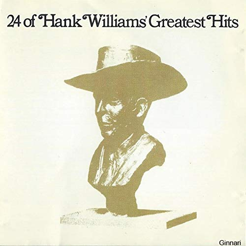

# 24 Greatest Hits

By **Hank Williams**

## Album Data

- **Catalog:** Beets
- **Format:** Digital, Album
- **Album:** 24 Greatest Hits
- **Artist:** Hank Williams
- **Albumartist:** Hank Williams
- **Genre:** Honky Tonk
- **MusicBrainz Album Artist ID:** [906bddec-bc73-49f8-ac1e-eaee691c6cf9](https://musicbrainz.org/artist/906bddec-bc73-49f8-ac1e-eaee691c6cf9)
- **MusicBrainz Album ID:** [931b783f-ded7-47a4-a5fc-ffdcb886f5b3](https://musicbrainz.org/release/931b783f-ded7-47a4-a5fc-ffdcb886f5b3)
- **MusicBrainz Release Group ID:** [c9d99258-524b-3c45-9331-61aebdf69fe2](https://musicbrainz.org/release-group/c9d99258-524b-3c45-9331-61aebdf69fe2)
- **Year:** 1976
- **Catalog #:** 
- **Label:** Mercury Nashville
- **Total Tracks:** 24

## Album Tracks

### Track 01 - Your Cheatin' Heart

- **Artist:** Hank Williams
- **Format:** ALAC
- **Genre:** Classic Country
- **Length:** 2:44
- **MusicBrainz Track ID:** [88144380-0937-4387-aeee-f5cbbea73ff5](https://musicbrainz.org/recording/88144380-0937-4387-aeee-f5cbbea73ff5)
- **Title:** Your Cheatin' Heart
- **Track:** 01
- **Year:** 1976

### Track 02 - Move It on Over

- **Artist:** Hank Williams
- **Format:** ALAC
- **Genre:** Honky Tonk
- **Length:** 2:46
- **MusicBrainz Track ID:** [29564e46-f660-4bf0-afae-91e3ebf9f9f3](https://musicbrainz.org/recording/29564e46-f660-4bf0-afae-91e3ebf9f9f3)
- **Title:** Move It on Over
- **Track:** 02
- **Year:** 1976

### Track 03 - I'm So Lonesome I Could Cry

- **Artist:** Hank Williams
- **Format:** ALAC
- **Genre:** Classic Country
- **Length:** 2:49
- **MusicBrainz Track ID:** [c208a0e5-b2fb-45bd-8966-1dcc082df3d4](https://musicbrainz.org/recording/c208a0e5-b2fb-45bd-8966-1dcc082df3d4)
- **Title:** I'm So Lonesome I Could Cry
- **Track:** 03
- **Year:** 1976

### Track 04 - Ramblin' Man

- **Artist:** Hank Williams
- **Format:** ALAC
- **Genre:** Honky Tonk
- **Length:** 3:04
- **MusicBrainz Track ID:** [d528b7ce-ae6a-4a64-84e3-032b57e61b6e](https://musicbrainz.org/recording/d528b7ce-ae6a-4a64-84e3-032b57e61b6e)
- **Title:** Ramblin' Man
- **Track:** 04
- **Year:** 1976

### Track 05 - My Heart Would Know

- **Artist:** Hank Williams
- **Format:** ALAC
- **Genre:** Classic Country
- **Length:** 2:28
- **MusicBrainz Track ID:** [0beb1bc2-1e85-428e-a6b8-e95bf15591ca](https://musicbrainz.org/recording/0beb1bc2-1e85-428e-a6b8-e95bf15591ca)
- **Title:** My Heart Would Know
- **Track:** 05
- **Year:** 1976

### Track 06 - Kaw-Liga

- **Artist:** Hank Williams
- **Format:** ALAC
- **Genre:** Classic Country
- **Length:** 2:36
- **MusicBrainz Track ID:** [0c52b481-d5c3-4088-8356-9735136d9c34](https://musicbrainz.org/recording/0c52b481-d5c3-4088-8356-9735136d9c34)
- **Title:** Kaw-Liga
- **Track:** 06
- **Year:** 1976

### Track 07 - Cold, Cold Heart

- **Artist:** Hank Williams
- **Format:** ALAC
- **Genre:** Classic Country
- **Length:** 2:45
- **MusicBrainz Track ID:** [2391a9a6-5807-4a86-a24e-f752ea0689a0](https://musicbrainz.org/recording/2391a9a6-5807-4a86-a24e-f752ea0689a0)
- **Title:** Cold, Cold Heart
- **Track:** 07
- **Year:** 1976

### Track 08 - Lovesick Blues

- **Artist:** Hank Williams
- **Format:** ALAC
- **Genre:** Classic Country
- **Length:** 2:46
- **MusicBrainz Track ID:** [77614810-82e5-4c33-b702-1c4d61a7baca](https://musicbrainz.org/recording/77614810-82e5-4c33-b702-1c4d61a7baca)
- **Title:** Lovesick Blues
- **Track:** 08
- **Year:** 1976

### Track 09 - Honky Tonk Blues

- **Artist:** Hank Williams
- **Format:** ALAC
- **Genre:** Honky Tonk
- **Length:** 2:14
- **MusicBrainz Track ID:** [57379f3c-7ed6-467f-a92f-3897d970c8c6](https://musicbrainz.org/recording/57379f3c-7ed6-467f-a92f-3897d970c8c6)
- **Title:** Honky Tonk Blues
- **Track:** 09
- **Year:** 1976

### Track 10 - Honky Tonkin'

- **Artist:** Hank Williams
- **Format:** ALAC
- **Genre:** Honky Tonk
- **Length:** 2:45
- **MusicBrainz Track ID:** [021c4004-0e66-48c5-8273-756c2f59087d](https://musicbrainz.org/recording/021c4004-0e66-48c5-8273-756c2f59087d)
- **Title:** Honky Tonkin'
- **Track:** 10
- **Year:** 1976

### Track 11 - There'll Be No Teardrops Tonight

- **Artist:** Hank Williams
- **Format:** ALAC
- **Genre:** Honky Tonk
- **Length:** 2:50
- **MusicBrainz Track ID:** [af54fa3c-5b3c-47e3-b1eb-a2a8d9461a64](https://musicbrainz.org/recording/af54fa3c-5b3c-47e3-b1eb-a2a8d9461a64)
- **Title:** There'll Be No Teardrops Tonight
- **Track:** 11
- **Year:** 1976

### Track 12 - Mind Your Own Business

- **Artist:** Hank Williams
- **Format:** ALAC
- **Genre:** Classic Country
- **Length:** 2:58
- **MusicBrainz Track ID:** [081c5aa4-cde3-4774-8206-b203ec629bc4](https://musicbrainz.org/recording/081c5aa4-cde3-4774-8206-b203ec629bc4)
- **Title:** Mind Your Own Business
- **Track:** 12
- **Year:** 1976

### Track 13 - Jambalaya (On the Bayou)

- **Artist:** Hank Williams
- **Format:** ALAC
- **Genre:** Honky Tonk
- **Length:** 2:55
- **MusicBrainz Track ID:** [0a9085e4-5a4e-4fc3-b8b8-a1b35f4e191c](https://musicbrainz.org/recording/0a9085e4-5a4e-4fc3-b8b8-a1b35f4e191c)
- **Title:** Jambalaya (On the Bayou)
- **Track:** 13
- **Year:** 1976

### Track 14 - Wedding Bells

- **Artist:** Hank Williams
- **Format:** ALAC
- **Genre:** Classic Country
- **Length:** 2:56
- **MusicBrainz Track ID:** [6a5cc318-1714-4583-b3fe-572455385f3c](https://musicbrainz.org/recording/6a5cc318-1714-4583-b3fe-572455385f3c)
- **Title:** Wedding Bells
- **Track:** 14
- **Year:** 1976

### Track 15 - Hey, Good Lookin'

- **Artist:** Hank Williams
- **Format:** ALAC
- **Genre:** Honky Tonk
- **Length:** 2:57
- **MusicBrainz Track ID:** [414f598f-5d00-46a9-803f-351a8cf7ef83](https://musicbrainz.org/recording/414f598f-5d00-46a9-803f-351a8cf7ef83)
- **Title:** Hey, Good Lookin'
- **Track:** 15
- **Year:** 1976

### Track 16 - Window Shopping

- **Artist:** Hank Williams
- **Format:** ALAC
- **Genre:** Classic Country
- **Length:** 2:35
- **MusicBrainz Track ID:** [bd3fef09-47c3-4a04-9c56-1c37010cad89](https://musicbrainz.org/recording/bd3fef09-47c3-4a04-9c56-1c37010cad89)
- **Title:** Window Shopping
- **Track:** 16
- **Year:** 1976

### Track 17 - Settin' the Woods on Fire

- **Artist:** Hank Williams
- **Format:** ALAC
- **Genre:** Classic Country
- **Length:** 2:38
- **MusicBrainz Track ID:** [54478449-ba97-48fa-848f-4d64bd93d17f](https://musicbrainz.org/recording/54478449-ba97-48fa-848f-4d64bd93d17f)
- **Title:** Settin' the Woods on Fire
- **Track:** 17
- **Year:** 1976

### Track 18 - I Can't Help It (If I'm Still in Love With You)

- **Artist:** Hank Williams
- **Format:** ALAC
- **Genre:** Classic Country
- **Length:** 2:26
- **MusicBrainz Track ID:** [f062e0da-5d92-48d2-8856-b69de4c27598](https://musicbrainz.org/recording/f062e0da-5d92-48d2-8856-b69de4c27598)
- **Title:** I Can't Help It (If I'm Still in Love With You)
- **Track:** 18
- **Year:** 1976

### Track 19 - Half as Much

- **Artist:** Hank Williams
- **Format:** ALAC
- **Genre:** Honky Tonk
- **Length:** 2:45
- **MusicBrainz Track ID:** [5b491b3b-3f57-4b21-b142-cb032e1121db](https://musicbrainz.org/recording/5b491b3b-3f57-4b21-b142-cb032e1121db)
- **Title:** Half as Much
- **Track:** 19
- **Year:** 1976

### Track 20 - Why Don't You Love Me

- **Artist:** Hank Williams
- **Format:** ALAC
- **Genre:** Classic Country
- **Length:** 2:25
- **MusicBrainz Track ID:** [485a631a-5fd2-4a76-9add-bd23f5a5c759](https://musicbrainz.org/recording/485a631a-5fd2-4a76-9add-bd23f5a5c759)
- **Title:** Why Don't You Love Me
- **Track:** 20
- **Year:** 1976

### Track 21 - You Win Again

- **Artist:** Hank Williams
- **Format:** ALAC
- **Genre:** Classic Country
- **Length:** 2:38
- **MusicBrainz Track ID:** [bee934dd-8363-4557-a7b4-1a6482b1cb29](https://musicbrainz.org/recording/bee934dd-8363-4557-a7b4-1a6482b1cb29)
- **Title:** You Win Again
- **Track:** 21
- **Year:** 1976

### Track 22 - May You Never Be Alone

- **Artist:** Hank Williams
- **Format:** ALAC
- **Genre:** Country
- **Length:** 2:51
- **MusicBrainz Track ID:** [046877d4-4647-4efb-8ed8-2e5333342676](https://musicbrainz.org/recording/046877d4-4647-4efb-8ed8-2e5333342676)
- **Title:** May You Never Be Alone
- **Track:** 22
- **Year:** 1976

### Track 23 - Baby, We're Really in Love

- **Artist:** Hank Williams
- **Format:** ALAC
- **Genre:** Honky Tonk
- **Length:** 2:35
- **MusicBrainz Track ID:** [6c264b6a-7023-4b60-8093-2f3c0f5f0103](https://musicbrainz.org/recording/6c264b6a-7023-4b60-8093-2f3c0f5f0103)
- **Title:** Baby, We're Really in Love
- **Track:** 23
- **Year:** 1976

### Track 24 - Take These Chains From My Heart

- **Artist:** Hank Williams
- **Format:** ALAC
- **Genre:** Classic Country
- **Length:** 2:37
- **MusicBrainz Track ID:** [acd5aa45-104c-4249-b939-8889224dd220](https://musicbrainz.org/recording/acd5aa45-104c-4249-b939-8889224dd220)
- **Title:** Take These Chains From My Heart
- **Track:** 24
- **Year:** 1976

## See also

- [Roon: 40 Greatest Hits](../../Roon/Hank_Williams/40_Greatest_Hits.md)
- [Roon: The Garden Spot Programs, 1950](../../Roon/Hank_Williams/The_Garden_Spot_Programs__1950.md)
