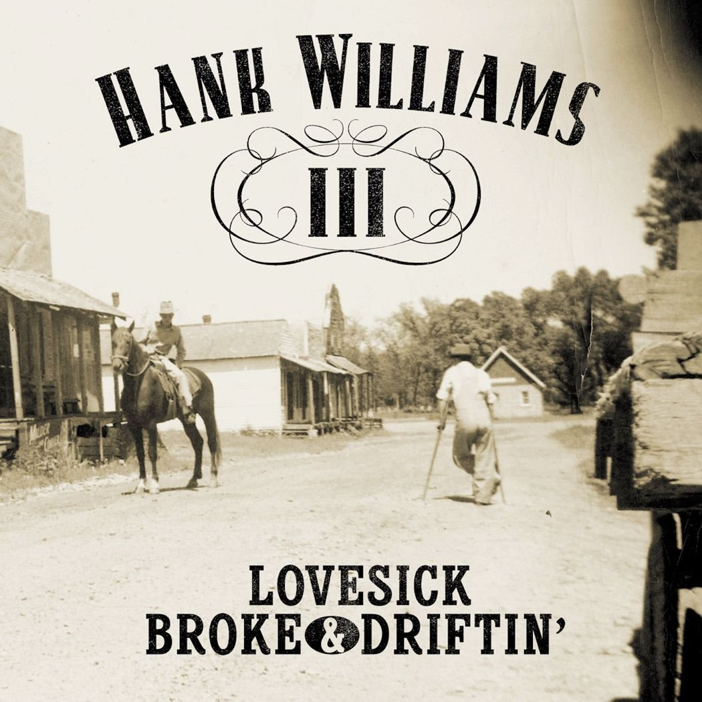

# Lovesick, Broke & Driftin’

By **Hank Williams III**

## Album Data

- **Catalog:** Beets
- **Format:** Digital, Album
- **Album:** Lovesick, Broke & Driftin’
- **Artist:** Hank Williams Iii
- **Albumartist:** Hank Williams III
- **Genre:** Psychobilly
- **MusicBrainz Album Artist ID:** [1b764e7a-ded1-42bc-8c85-85703b6d72a5](https://musicbrainz.org/artist/1b764e7a-ded1-42bc-8c85-85703b6d72a5)
- **MusicBrainz Album ID:** [be9d7ae0-6604-43cf-930c-3648a919f4fc](https://musicbrainz.org/release/be9d7ae0-6604-43cf-930c-3648a919f4fc)
- **MusicBrainz Release Group ID:** [0dbfe82e-9d17-33b0-ae6c-2b3d6efd9451](https://musicbrainz.org/release-group/0dbfe82e-9d17-33b0-ae6c-2b3d6efd9451)
- **Year:** 2002
- **Catalog #:** D2-77949
- **Label:** Curb Records
- **Total Tracks:** 13

## Album Tracks

### Track 01 - I Don't Know

- **Artist:** Hank Williams III
- **Format:** AAC
- **Genre:** Psychobilly
- **Length:** 3:23
- **MusicBrainz Track ID:** [658abdf3-5a3d-46c1-8340-7d1dbb386e97](https://musicbrainz.org/recording/658abdf3-5a3d-46c1-8340-7d1dbb386e97)
- **Title:** I Don't Know
- **Track:** 01
- **Year:** 1999

### Track 02 - You're the Reason

- **Artist:** Hank Williams III
- **Format:** AAC
- **Genre:** Psychobilly
- **Length:** 2:49
- **MusicBrainz Track ID:** [fb31960a-4e62-4c19-8326-f6d7e2233184](https://musicbrainz.org/recording/fb31960a-4e62-4c19-8326-f6d7e2233184)
- **Title:** You're the Reason
- **Track:** 02
- **Year:** 1999

### Track 03 - If the Shoe Fits

- **Artist:** Hank Williams III
- **Format:** AAC
- **Genre:** Psychobilly
- **Length:** 2:54
- **MusicBrainz Track ID:** [924f39aa-9715-4f75-b220-8f096f9df772](https://musicbrainz.org/recording/924f39aa-9715-4f75-b220-8f096f9df772)
- **Title:** If the Shoe Fits
- **Track:** 03
- **Year:** 1999

### Track 04 - 87 Southbound

- **Artist:** Hank Williams III
- **Format:** AAC
- **Genre:** Psychobilly
- **Length:** 2:52
- **MusicBrainz Track ID:** [bdc8de9c-1c73-4e8e-a9c4-be06fbe223bb](https://musicbrainz.org/recording/bdc8de9c-1c73-4e8e-a9c4-be06fbe223bb)
- **Title:** 87 Southbound
- **Track:** 04
- **Year:** 1999

### Track 05 - Lonesome for You

- **Artist:** Hank Williams III
- **Format:** AAC
- **Genre:** Cowpunk
- **Length:** 3:17
- **MusicBrainz Track ID:** [d839507c-4724-48de-be2b-8c200fd88ae6](https://musicbrainz.org/recording/d839507c-4724-48de-be2b-8c200fd88ae6)
- **Title:** Lonesome for You
- **Track:** 05
- **Year:** 1999

### Track 06 - What Did Love Ever Do to You

- **Artist:** Hank Williams III
- **Format:** MP3
- **Genre:** Psychobilly
- **Length:** 3:01
- **MusicBrainz Track ID:** [11c2e6bb-4477-4394-992a-6979a478fcf1](https://musicbrainz.org/recording/11c2e6bb-4477-4394-992a-6979a478fcf1)
- **Title:** What Did Love Ever Do to You
- **Track:** 06
- **Year:** 1999

### Track 07 - On My Own

- **Artist:** Hank Williams III
- **Format:** AAC
- **Genre:** Psychobilly
- **Length:** 2:55
- **MusicBrainz Track ID:** [4221f832-e17f-409e-aa10-45f084180226](https://musicbrainz.org/recording/4221f832-e17f-409e-aa10-45f084180226)
- **Title:** On My Own
- **Track:** 07
- **Year:** 1999

### Track 08 - Honky Tonk Girls

- **Artist:** Hank Williams III
- **Format:** AAC
- **Genre:** Psychobilly
- **Length:** 2:42
- **MusicBrainz Track ID:** [f026677d-600d-4bc5-9028-c8b6c9bf098a](https://musicbrainz.org/recording/f026677d-600d-4bc5-9028-c8b6c9bf098a)
- **Title:** Honky Tonk Girls
- **Track:** 08
- **Year:** 1999

### Track 09 - Devil's Daughter

- **Artist:** Hank Williams III
- **Format:** MP3
- **Genre:** Psychobilly
- **Length:** 3:17
- **MusicBrainz Track ID:** [8e227382-570a-4558-8edd-09c3f091964c](https://musicbrainz.org/recording/8e227382-570a-4558-8edd-09c3f091964c)
- **Title:** Devil's Daughter
- **Track:** 09
- **Year:** 1999

### Track 10 - Cocaine Blues

- **Artist:** Hank Williams III
- **Format:** AAC
- **Genre:** Psychobilly
- **Length:** 3:53
- **MusicBrainz Track ID:** [212756b8-c882-421d-a53c-3dd6b92ccd31](https://musicbrainz.org/recording/212756b8-c882-421d-a53c-3dd6b92ccd31)
- **Title:** Cocaine Blues
- **Track:** 10
- **Year:** 1999

### Track 11 - Thunderstorms & Neon Signs

- **Artist:** Hank Williams III
- **Format:** AAC
- **Genre:** Rockabilly
- **Length:** 4:21
- **MusicBrainz Track ID:** [b16a84d3-c8c9-4f22-bcc5-dc3a94aca3f3](https://musicbrainz.org/recording/b16a84d3-c8c9-4f22-bcc5-dc3a94aca3f3)
- **Title:** Thunderstorms & Neon Signs
- **Track:** 11
- **Year:** 1999

### Track 12 - Why Don't You Leave Me Alone

- **Artist:** Hank Williams III
- **Format:** AAC
- **Genre:** Outlaw Country
- **Length:** 5:03
- **MusicBrainz Track ID:** [f1284087-7da7-479e-8ea6-8f6d880c74f2](https://musicbrainz.org/recording/f1284087-7da7-479e-8ea6-8f6d880c74f2)
- **Title:** Why Don't You Leave Me Alone
- **Track:** 12
- **Year:** 1999

### Track 13 - Blue Devil

- **Artist:** Hank Williams III
- **Format:** MP3
- **Genre:** Psychobilly
- **Length:** 3:19
- **MusicBrainz Track ID:** [f3140d17-f0a8-4124-8ec3-3a7bf7ce6460](https://musicbrainz.org/recording/f3140d17-f0a8-4124-8ec3-3a7bf7ce6460)
- **Title:** Blue Devil
- **Track:** 13
- **Year:** 1999

## See also

- [Risin' Outlaw](Risin_Outlaw.md)
- [Straight To Hell [Disc 2]](Straight_To_Hell_[Disc_2].md)
- [Straight To Hell - Explicit](Straight_To_Hell_-_Explicit.md)
- [Straight to Hell](Straight_to_Hell.md)
