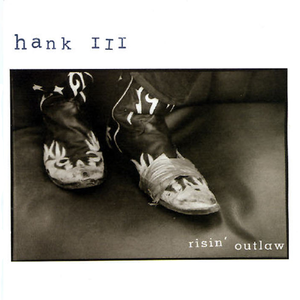

# Risin' Outlaw

By **Hank Williams III**

## Album Data

- **Catalog:** Beets
- **Format:** Digital, Album
- **Album:** Risin' Outlaw
- **Artist:** Hank Williams Iii
- **Albumartist:** Hank Williams III
- **Genre:** Psychobilly
- **MusicBrainz Album Artist ID:** [1b764e7a-ded1-42bc-8c85-85703b6d72a5](https://musicbrainz.org/artist/1b764e7a-ded1-42bc-8c85-85703b6d72a5)
- **MusicBrainz Album ID:** [493d677c-992b-444f-8fab-88e83e5a016a](https://musicbrainz.org/release/493d677c-992b-444f-8fab-88e83e5a016a)
- **MusicBrainz Release Group ID:** [78b1acba-999e-3587-9f88-f7a08e15f231](https://musicbrainz.org/release-group/78b1acba-999e-3587-9f88-f7a08e15f231)
- **Year:** 1999
- **Catalog #:** D2-78869
- **Label:** Bruc Records
- **Total Tracks:** 15

## Album Tracks

### Track 01 - Satan Is Real / Straight to Hell (medley)

- **Artist:** Hank Williams III
- **Format:** ALAC
- **Genre:** Outlaw Country
- **Length:** 3:08
- **MusicBrainz Track ID:** [1235436b-c387-4da7-90a0-0ae0a065affa](https://musicbrainz.org/recording/1235436b-c387-4da7-90a0-0ae0a065affa)
- **Title:** Satan Is Real / Straight to Hell (medley)
- **Track:** 01
- **Year:** 2006

### Track 02 - Thrown Out of the Bar

- **Artist:** Hank Williams III
- **Format:** ALAC
- **Genre:** Psychobilly
- **Length:** 2:07
- **MusicBrainz Track ID:** [72a21253-0f5a-43d0-8505-43be9213e841](https://musicbrainz.org/recording/72a21253-0f5a-43d0-8505-43be9213e841)
- **Title:** Thrown Out of the Bar
- **Track:** 02
- **Year:** 2006

### Track 03 - Things You Do to Me

- **Artist:** Hank Williams III
- **Format:** ALAC
- **Genre:** Outlaw Country
- **Length:** 2:22
- **MusicBrainz Track ID:** [be3dd5f3-8a45-4ffe-be63-020109fe3039](https://musicbrainz.org/recording/be3dd5f3-8a45-4ffe-be63-020109fe3039)
- **Title:** Things You Do to Me
- **Track:** 03
- **Year:** 2006

### Track 04 - Country Heroes

- **Artist:** Hank Williams III
- **Format:** ALAC
- **Genre:** Cowpunk
- **Length:** 3:29
- **MusicBrainz Track ID:** [244c702b-61fb-44b6-ad21-fb3ab7ab8834](https://musicbrainz.org/recording/244c702b-61fb-44b6-ad21-fb3ab7ab8834)
- **Title:** Country Heroes
- **Track:** 04
- **Year:** 2006

### Track 05 - D Ray White

- **Artist:** Hank Williams III
- **Format:** ALAC
- **Genre:** Cowpunk
- **Length:** 3:47
- **MusicBrainz Track ID:** [2ac4ef8f-985d-413f-86c5-ee8c52f3d6ca](https://musicbrainz.org/recording/2ac4ef8f-985d-413f-86c5-ee8c52f3d6ca)
- **Title:** D Ray White
- **Track:** 05
- **Year:** 2006

### Track 06 - Low Down

- **Artist:** Hank Williams III
- **Format:** ALAC
- **Genre:** Cowpunk
- **Length:** 3:24
- **MusicBrainz Track ID:** [01b8020f-fc5b-4429-ba06-1e2faf4f638a](https://musicbrainz.org/recording/01b8020f-fc5b-4429-ba06-1e2faf4f638a)
- **Title:** Low Down
- **Track:** 06
- **Year:** 2006

### Track 07 - Pills I Took

- **Artist:** Hank Williams III
- **Format:** ALAC
- **Genre:** Cowpunk
- **Length:** 2:31
- **MusicBrainz Track ID:** [5c60cdd1-6f4f-4773-a146-48f8120b8a4b](https://musicbrainz.org/recording/5c60cdd1-6f4f-4773-a146-48f8120b8a4b)
- **Title:** Pills I Took
- **Track:** 07
- **Year:** 2006

### Track 08 - Smoke & Wine

- **Artist:** Hank Williams III
- **Format:** ALAC
- **Genre:** Cowpunk
- **Length:** 2:36
- **MusicBrainz Track ID:** [70cea959-315a-4fc8-b3d3-3562122a16db](https://musicbrainz.org/recording/70cea959-315a-4fc8-b3d3-3562122a16db)
- **Title:** Smoke & Wine
- **Track:** 08
- **Year:** 2006

### Track 09 - My Drinkin’ Problem

- **Artist:** Hank Williams III
- **Format:** ALAC
- **Genre:** Cowpunk
- **Length:** 2:42
- **MusicBrainz Track ID:** [d3a40aec-1fb0-484b-847c-d3674f95c789](https://musicbrainz.org/recording/d3a40aec-1fb0-484b-847c-d3674f95c789)
- **Title:** My Drinkin’ Problem
- **Track:** 09
- **Year:** 2006

### Track 10 - Crazed Country Rebel

- **Artist:** Hank Williams III
- **Format:** ALAC
- **Genre:** Cowpunk
- **Length:** 3:08
- **MusicBrainz Track ID:** [2984778d-a0b6-4909-95a1-903cc044d1a6](https://musicbrainz.org/recording/2984778d-a0b6-4909-95a1-903cc044d1a6)
- **Title:** Crazed Country Rebel
- **Track:** 10
- **Year:** 2006

### Track 11 - Dick in Dixie

- **Artist:** Hank Williams III
- **Format:** ALAC
- **Genre:** Outlaw Country
- **Length:** 2:37
- **MusicBrainz Track ID:** [2ca4c9d3-008e-40fb-8902-840f7d6a6db5](https://musicbrainz.org/recording/2ca4c9d3-008e-40fb-8902-840f7d6a6db5)
- **Title:** Dick in Dixie
- **Track:** 11
- **Year:** 2006

### Track 12 - Not Everybody Likes Us

- **Artist:** Hank Williams III
- **Format:** ALAC
- **Genre:** Cowpunk
- **Length:** 4:30
- **MusicBrainz Track ID:** [ba278849-db07-405d-be0e-70dd2efb7ea6](https://musicbrainz.org/recording/ba278849-db07-405d-be0e-70dd2efb7ea6)
- **Title:** Not Everybody Likes Us
- **Track:** 12
- **Year:** 2006

### Track 13 - Angel of Sin

- **Artist:** Hank Williams III
- **Format:** ALAC
- **Genre:** Cowpunk
- **Length:** 6:07
- **MusicBrainz Track ID:** [86606afe-f681-4935-b6d1-d3be4d0ee1ac](https://musicbrainz.org/recording/86606afe-f681-4935-b6d1-d3be4d0ee1ac)
- **Title:** Angel of Sin
- **Track:** 13
- **Year:** 2006

## See also

- [Lovesick, Broke & Driftin’](Lovesick__Broke_and_Driftin’.md)
- [Straight To Hell [Disc 2]](Straight_To_Hell_[Disc_2].md)
- [Straight To Hell - Explicit](Straight_To_Hell_-_Explicit.md)
- [Straight to Hell](Straight_to_Hell.md)
