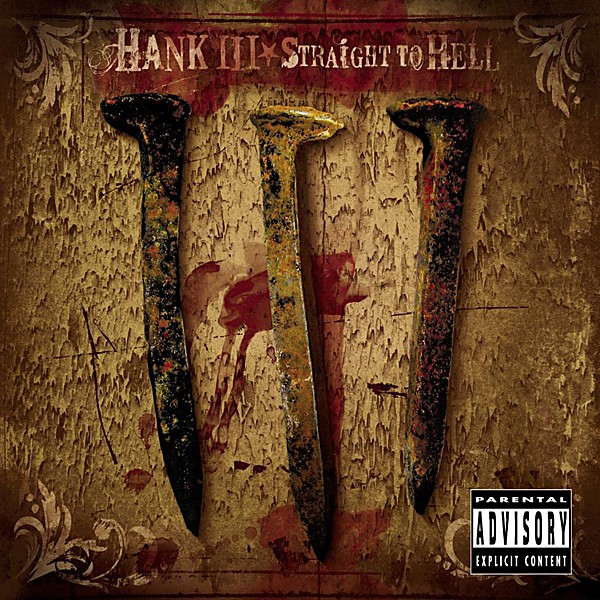

# Straight To Hell - Explicit

By **Hank Williams III**

## Album Data

- **Catalog:** Beets
- **Format:** Digital, Album
- **Album:** Straight To Hell - Explicit
- **Artist:** Hank Williams Iii
- **Albumartist:** Hank Williams III
- **Genre:** Cowpunk
- **MusicBrainz Album Artist ID:** 
- **MusicBrainz Album ID:** 
- **MusicBrainz Release Group ID:** 
- **Year:** 1969
- **Catalog #:** 
- **Label:** 
- **Total Tracks:** 02

## Album Tracks

### Track 01 - Louisiana Stripes

- **Artist:** Hank Williams III
- **Format:** ALAC
- **Genre:** Outlaw Country
- **Length:** 3:28
- **MusicBrainz Track ID:** 
- **Title:** Louisiana Stripes
- **Track:** 01
- **Year:** 2005

### Track 02 - Smoke & Wine/Alone & Dying/Back By My Side/What's His Name/Down In Hous

- **Artist:** Hank Williams III
- **Format:** ALAC
- **Genre:** Cowpunk
- **Length:** 42:00
- **MusicBrainz Track ID:** 
- **Title:** Smoke & Wine/Alone & Dying/Back By My Side/What's His Name/Down In Hous
- **Track:** 02
- **Year:** 2005

## See also

- [Lovesick, Broke & Driftin’](Lovesick__Broke_and_Driftin’.md)
- [Risin' Outlaw](Risin_Outlaw.md)
- [Straight To Hell [Disc 2]](Straight_To_Hell_[Disc_2].md)
- [Straight to Hell](Straight_to_Hell.md)
