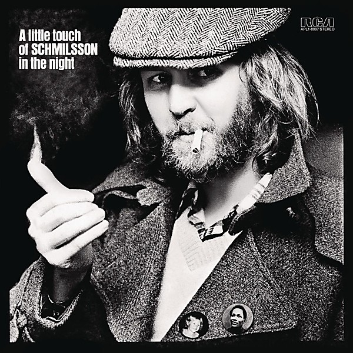

# A Little Touch Of Schmilsson In The Night

By **Harry Nilsson**

## Album Data

- **Catalog:** Beets
- **Format:** Digital, Album
- **Album:** A Little Touch Of Schmilsson In The Night
- **Artist:** Harry Nilsson
- **Albumartist:** Harry Nilsson
- **Genre:** Soft Rock
- **MusicBrainz Album Artist ID:** 
- **MusicBrainz Album ID:** 
- **MusicBrainz Release Group ID:** 
- **Year:** 1973
- **Catalog #:** 
- **Label:** 
- **Total Tracks:** 27

## Album Tracks

### Track 01 - Daddy's Song

- **Artist:** Harry Nilsson
- **Format:** ALAC
- **Genre:** Soft Rock
- **Length:** 2:41
- **MusicBrainz Track ID:** 
- **Title:** Daddy's Song
- **Track:** 01
- **Year:** 1968

### Track 02 - Good Old Desk

- **Artist:** Harry Nilsson
- **Format:** ALAC
- **Genre:** Rock
- **Length:** 2:21
- **MusicBrainz Track ID:** 
- **Title:** Good Old Desk
- **Track:** 02
- **Year:** 1968

### Track 03 - Don't Leave Me

- **Artist:** Harry Nilsson
- **Format:** ALAC
- **Genre:** Rock
- **Length:** 2:19
- **MusicBrainz Track ID:** 
- **Title:** Don't Leave Me
- **Track:** 03
- **Year:** 1968

### Track 04 - Mr. Richland's Favorite Song

- **Artist:** Harry Nilsson
- **Format:** ALAC
- **Genre:** Soft Rock
- **Length:** 2:15
- **MusicBrainz Track ID:** 
- **Title:** Mr. Richland's Favorite Song
- **Track:** 04
- **Year:** 1968

### Track 05 - Little Cowboy

- **Artist:** Harry Nilsson
- **Format:** ALAC
- **Genre:** Pop
- **Length:** 1:22
- **MusicBrainz Track ID:** 
- **Title:** Little Cowboy
- **Track:** 05
- **Year:** 1968

### Track 06 - Together

- **Artist:** Harry Nilsson
- **Format:** ALAC
- **Genre:** Pop
- **Length:** 2:11
- **MusicBrainz Track ID:** 
- **Title:** Together
- **Track:** 06
- **Year:** 1968

### Track 07 - Everybody's Talkin' (From "Midnight Cowboy")

- **Artist:** Harry Nilsson
- **Format:** ALAC
- **Genre:** Pop
- **Length:** 2:44
- **MusicBrainz Track ID:** 
- **Title:** Everybody's Talkin' (From "Midnight Cowboy")
- **Track:** 07
- **Year:** 1968

### Track 08 - I Said Goodbye to Me

- **Artist:** Harry Nilsson
- **Format:** ALAC
- **Genre:** Soft Rock
- **Length:** 2:16
- **MusicBrainz Track ID:** 
- **Title:** I Said Goodbye to Me
- **Track:** 08
- **Year:** 1968

### Track 09 - Little Cowboy (Reprise)

- **Artist:** Harry Nilsson
- **Format:** ALAC
- **Genre:** Soft Rock
- **Length:** 0:51
- **MusicBrainz Track ID:** 
- **Title:** Little Cowboy (Reprise)
- **Track:** 09
- **Year:** 1968

### Track 10 - Mr. Tinker

- **Artist:** Harry Nilsson
- **Format:** ALAC
- **Genre:** Soft Rock
- **Length:** 2:44
- **MusicBrainz Track ID:** 
- **Title:** Mr. Tinker
- **Track:** 10
- **Year:** 1968

### Track 11 - One

- **Artist:** Harry Nilsson
- **Format:** ALAC
- **Genre:** Pop
- **Length:** 2:54
- **MusicBrainz Track ID:** 
- **Title:** One
- **Track:** 11
- **Year:** 1968

### Track 12 - The Wailing of the Willow

- **Artist:** Harry Nilsson
- **Format:** ALAC
- **Genre:** Bossa Nova
- **Length:** 2:01
- **MusicBrainz Track ID:** 
- **Title:** The Wailing of the Willow
- **Track:** 12
- **Year:** 1968

### Track 13 - Bath

- **Artist:** Harry Nilsson
- **Format:** ALAC
- **Genre:** Soft Rock
- **Length:** 2:34
- **MusicBrainz Track ID:** 
- **Title:** Bath
- **Track:** 13
- **Year:** 1968

### Track 14 - Daddy's Song (Mono)

- **Artist:** Harry Nilsson
- **Format:** ALAC
- **Genre:** Soft Rock
- **Length:** 2:43
- **MusicBrainz Track ID:** 
- **Title:** Daddy's Song (Mono)
- **Track:** 14
- **Year:** 1968

### Track 15 - Good Old Desk (Mono)

- **Artist:** Harry Nilsson
- **Format:** ALAC
- **Genre:** Soft Rock
- **Length:** 2:20
- **MusicBrainz Track ID:** 
- **Title:** Good Old Desk (Mono)
- **Track:** 15
- **Year:** 1968

### Track 16 - Don't Leave Me (Mono)

- **Artist:** Harry Nilsson
- **Format:** ALAC
- **Genre:** Soft Rock
- **Length:** 2:20
- **MusicBrainz Track ID:** 
- **Title:** Don't Leave Me (Mono)
- **Track:** 16
- **Year:** 1968

### Track 17 - Mr. Richland's Favorite Song (Mono)

- **Artist:** Harry Nilsson
- **Format:** ALAC
- **Genre:** Soft Rock
- **Length:** 2:14
- **MusicBrainz Track ID:** 
- **Title:** Mr. Richland's Favorite Song (Mono)
- **Track:** 17
- **Year:** 1968

### Track 18 - Little Cowboy (Mono)

- **Artist:** Harry Nilsson
- **Format:** ALAC
- **Genre:** Soft Rock
- **Length:** 1:22
- **MusicBrainz Track ID:** 
- **Title:** Little Cowboy (Mono)
- **Track:** 18
- **Year:** 1968

### Track 19 - Together (Mono)

- **Artist:** Harry Nilsson
- **Format:** ALAC
- **Genre:** Soft Rock
- **Length:** 2:09
- **MusicBrainz Track ID:** 
- **Title:** Together (Mono)
- **Track:** 19
- **Year:** 1968

### Track 20 - Everybody's Talkin' (From "Midnight Cowboy") (Mono)

- **Artist:** Harry Nilsson
- **Format:** ALAC
- **Genre:** Soft Rock
- **Length:** 2:47
- **MusicBrainz Track ID:** 
- **Title:** Everybody's Talkin' (From "Midnight Cowboy") (Mono)
- **Track:** 20
- **Year:** 1968

### Track 21 - I Said Goodbye to Me (Mono)

- **Artist:** Harry Nilsson
- **Format:** ALAC
- **Genre:** Soft Rock
- **Length:** 2:16
- **MusicBrainz Track ID:** 
- **Title:** I Said Goodbye to Me (Mono)
- **Track:** 21
- **Year:** 1968

### Track 22 - Little Cowboy (Reprise - Mono)

- **Artist:** Harry Nilsson
- **Format:** ALAC
- **Genre:** Soft Rock
- **Length:** 0:51
- **MusicBrainz Track ID:** 
- **Title:** Little Cowboy (Reprise - Mono)
- **Track:** 22
- **Year:** 1968

### Track 23 - Mr. Tinker (Mono)

- **Artist:** Harry Nilsson
- **Format:** ALAC
- **Genre:** Soft Rock
- **Length:** 2:44
- **MusicBrainz Track ID:** 
- **Title:** Mr. Tinker (Mono)
- **Track:** 23
- **Year:** 1968

### Track 24 - One (Mono)

- **Artist:** Harry Nilsson
- **Format:** ALAC
- **Genre:** Soft Rock
- **Length:** 2:54
- **MusicBrainz Track ID:** 
- **Title:** One (Mono)
- **Track:** 24
- **Year:** 1968

### Track 25 - The Wailing of the Willow (Mono)

- **Artist:** Harry Nilsson
- **Format:** ALAC
- **Genre:** Soft Rock
- **Length:** 2:00
- **MusicBrainz Track ID:** 
- **Title:** The Wailing of the Willow (Mono)
- **Track:** 25
- **Year:** 1968

### Track 26 - Bath (Mono)

- **Artist:** Harry Nilsson
- **Format:** ALAC
- **Genre:** Soft Rock
- **Length:** 2:25
- **MusicBrainz Track ID:** 
- **Title:** Bath (Mono)
- **Track:** 26
- **Year:** 1968

### Track 27 - Aerial Ballet Radio Spot

- **Artist:** Harry Nilsson
- **Format:** ALAC
- **Genre:** Soft Rock
- **Length:** 1:00
- **MusicBrainz Track ID:** 
- **Title:** Aerial Ballet Radio Spot
- **Track:** 27
- **Year:** 1968

