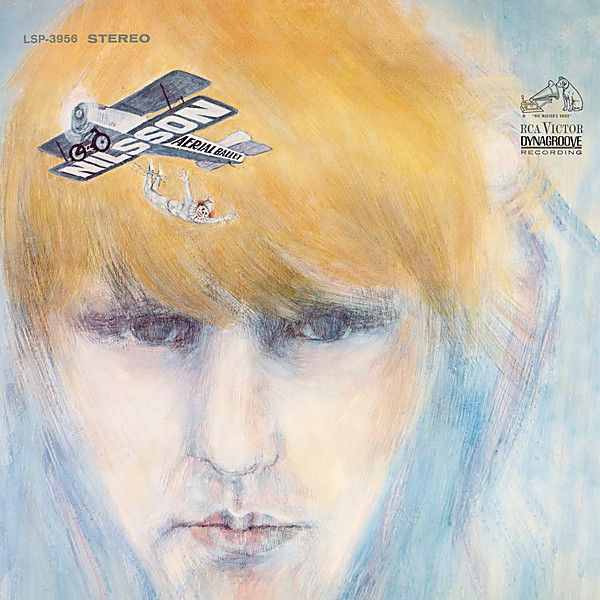

# Aerial Ballet [stereo - mono]

By **Harry Nilsson**

## Album Data

- **Catalog:** Beets
- **Format:** Digital, Album
- **Album:** Aerial Ballet [stereo - mono]
- **Artist:** Harry Nilsson
- **Albumartist:** Harry Nilsson
- **Genre:** Soft Rock
- **MusicBrainz Album Artist ID:** 
- **MusicBrainz Album ID:** 
- **MusicBrainz Release Group ID:** 
- **Year:** 1968
- **Catalog #:** 
- **Label:** 
- **Total Tracks:** 20

## Album Tracks

### Track 01 - The Puppy Song

- **Artist:** Harry Nilsson
- **Format:** ALAC
- **Genre:** Pop
- **Length:** 2:41
- **MusicBrainz Track ID:** 
- **Title:** The Puppy Song
- **Track:** 01
- **Year:** 1969

### Track 02 - Nobody Cares About The Railroads Anymore

- **Artist:** Harry Nilsson
- **Format:** ALAC
- **Genre:** Jazz
- **Length:** 2:44
- **MusicBrainz Track ID:** 
- **Title:** Nobody Cares About The Railroads Anymore
- **Track:** 02
- **Year:** 1969

### Track 03 - Open Your Window

- **Artist:** Harry Nilsson
- **Format:** ALAC
- **Genre:** Sunshine Pop
- **Length:** 2:07
- **MusicBrainz Track ID:** 
- **Title:** Open Your Window
- **Track:** 03
- **Year:** 1969

### Track 04 - Mother Nature's Son

- **Artist:** Harry Nilsson
- **Format:** ALAC
- **Genre:** Sunshine Pop
- **Length:** 2:43
- **MusicBrainz Track ID:** 
- **Title:** Mother Nature's Son
- **Track:** 04
- **Year:** 1969

### Track 05 - Fairfax Rag

- **Artist:** Harry Nilsson
- **Format:** ALAC
- **Genre:** Soft Rock
- **Length:** 2:15
- **MusicBrainz Track ID:** 
- **Title:** Fairfax Rag
- **Track:** 05
- **Year:** 1969

### Track 06 - City Life

- **Artist:** Harry Nilsson
- **Format:** ALAC
- **Genre:** Soft Rock
- **Length:** 2:30
- **MusicBrainz Track ID:** 
- **Title:** City Life
- **Track:** 06
- **Year:** 1969

### Track 07 - Mournin' Glory Story

- **Artist:** Harry Nilsson
- **Format:** ALAC
- **Genre:** Progressive Rock
- **Length:** 2:14
- **MusicBrainz Track ID:** 
- **Title:** Mournin' Glory Story
- **Track:** 07
- **Year:** 1969

### Track 08 - Maybe

- **Artist:** Harry Nilsson
- **Format:** ALAC
- **Genre:** Downtempo
- **Length:** 3:08
- **MusicBrainz Track ID:** 
- **Title:** Maybe
- **Track:** 08
- **Year:** 1969

### Track 09 - Marchin' Down Broadway

- **Artist:** Harry Nilsson
- **Format:** ALAC
- **Genre:** Soft Rock
- **Length:** 1:01
- **MusicBrainz Track ID:** 
- **Title:** Marchin' Down Broadway
- **Track:** 09
- **Year:** 1969

### Track 10 - I Guess The Lord Must Be In New York City

- **Artist:** Harry Nilsson
- **Format:** ALAC
- **Genre:** Americana
- **Length:** 2:43
- **MusicBrainz Track ID:** 
- **Title:** I Guess The Lord Must Be In New York City
- **Track:** 10
- **Year:** 1969

### Track 11 - Rainmaker

- **Artist:** Harry Nilsson
- **Format:** ALAC
- **Genre:** Easy Listening
- **Length:** 2:47
- **MusicBrainz Track ID:** 
- **Title:** Rainmaker
- **Track:** 11
- **Year:** 1969

### Track 12 - Mr. Bojangles

- **Artist:** Harry Nilsson
- **Format:** ALAC
- **Genre:** Folk Rock
- **Length:** 3:55
- **MusicBrainz Track ID:** 
- **Title:** Mr. Bojangles
- **Track:** 12
- **Year:** 1969

### Track 13 - Simon Smith And His Amazing Dancing Bear

- **Artist:** Harry Nilsson
- **Format:** ALAC
- **Genre:** Soft Rock
- **Length:** 2:50
- **MusicBrainz Track ID:** 
- **Title:** Simon Smith And His Amazing Dancing Bear
- **Track:** 13
- **Year:** 1969

### Track 14 - I Will Take You There [single mix]

- **Artist:** Harry Nilsson
- **Format:** ALAC
- **Genre:** Soft Rock
- **Length:** 2:42
- **MusicBrainz Track ID:** 
- **Title:** I Will Take You There [single mix]
- **Track:** 14
- **Year:** 1969

### Track 15 - Waiting [from the motion picture JENNY]

- **Artist:** Harry Nilsson
- **Format:** ALAC
- **Genre:** Soft Rock
- **Length:** 2:23
- **MusicBrainz Track ID:** 
- **Title:** Waiting [from the motion picture JENNY]
- **Track:** 15
- **Year:** 1969

### Track 16 - Rainmaker [single mix]

- **Artist:** Harry Nilsson
- **Format:** ALAC
- **Genre:** Soft Rock
- **Length:** 2:26
- **MusicBrainz Track ID:** 
- **Title:** Rainmaker [single mix]
- **Track:** 16
- **Year:** 1969

### Track 17 - Mourning Glory [single mix]

- **Artist:** Harry Nilsson
- **Format:** ALAC
- **Genre:** Soft Rock
- **Length:** 2:15
- **MusicBrainz Track ID:** 
- **Title:** Mourning Glory [single mix]
- **Track:** 17
- **Year:** 1969

### Track 18 - Garbage Can Ballet [alternate version]

- **Artist:** Harry Nilsson
- **Format:** ALAC
- **Genre:** Soft Rock
- **Length:** 2:29
- **MusicBrainz Track ID:** 
- **Title:** Garbage Can Ballet [alternate version]
- **Track:** 18
- **Year:** 1969

### Track 19 - HARRY radio spot

- **Artist:** Harry Nilsson
- **Format:** ALAC
- **Genre:** Soft Rock
- **Length:** 1:03
- **MusicBrainz Track ID:** 
- **Title:** HARRY radio spot
- **Track:** 19
- **Year:** 1969

### Track 20 - Voices Of Vista radio spots [June 1969]

- **Artist:** Harry Nilsson
- **Format:** ALAC
- **Genre:** Soft Rock
- **Length:** 2:52
- **MusicBrainz Track ID:** 
- **Title:** Voices Of Vista radio spots [June 1969]
- **Track:** 20
- **Year:** 1969

## See also

- [Aerial Pandemonium Ballet](Aerial_Pandemonium_Ballet.md)
- [A Little Touch Of Schmilsson In The Night](A_Little_Touch_Of_Schmilsson_In_The_Night.md)
- [Duit on Mon Dei](Duit_on_Mon_Dei.md)
- [Flash Harry](Flash_Harry.md)
- [Harry](Harry.md)
- [Harry Nilsson - Anthology - Personal Best - CD1](Harry_Nilsson_-_Anthology_-_Personal_Best_-_CD1.md)
- [KNNILLSSONN](KNNILLSSONN.md)
- [Nilsson Schmilsson](Nilsson_Schmilsson.md)
- [Nilsson Sessions 1967–1968](Nilsson_Sessions_1967–1968.md)
- [Nilsson Sessions 1968-1971](Nilsson_Sessions_1968-1971.md)
- [Nilsson Sessions 1971–1974](Nilsson_Sessions_1971–1974.md)
- [Nilsson Sings Newman](Nilsson_Sings_Newman.md)
- [Pandemonium Shadow Show](Pandemonium_Shadow_Show.md)
- [Pussy Cats](Pussy_Cats.md)
- [Sandman](Sandman.md)
- [Son of Schmilsson](Son_of_Schmilsson.md)
- [Son Of Schmilsson](Son_Of_Schmilsson.md)
- [...That's The Way It Is](Thats_The_Way_It_Is.md)
- [The Point!](The_Point!.md)
- [CD: Aerial Ballet](../../CD/Harry_Nilsson/Aerial_Ballet.md)
- [CD: Aerial Pandemonium Ballet](../../CD/Harry_Nilsson/Aerial_Pandemonium_Ballet.md)
- [CD: A Little Touch Of Schmilsson In The Night](../../CD/Harry_Nilsson/A_Little_Touch_Of_Schmilsson_In_The_Night.md)
- [CD: Duit On Mon Dei](../../CD/Harry_Nilsson/Duit_On_Mon_Dei.md)
- [CD: Harry](../../CD/Harry_Nilsson/Harry.md)
- [CD: ](../../CD/Harry_Nilsson/Harry_Nilsson.md)
- [CD: Knnillsson](../../CD/Harry_Nilsson/Knnillsson.md)
- [CD: Nilsson Schmilsson](../../CD/Harry_Nilsson/Nilsson_Schmilsson.md)
- [CD: Nilsson Sessions 1967-1968](../../CD/Harry_Nilsson/Nilsson_Sessions_1967-1968.md)
- [CD: Nilsson Sessions 1968-1971](../../CD/Harry_Nilsson/Nilsson_Sessions_1968-1971.md)
- [CD: Nilsson Sessions 1971-1974](../../CD/Harry_Nilsson/Nilsson_Sessions_1971-1974.md)
- [CD: Nilsson Sings Newman (Remastered + Expanded)](../../CD/Harry_Nilsson/Nilsson_Sings_Newman_Remastered_+_Expanded.md)
- [CD: Pandemonium Shadow Show](../../CD/Harry_Nilsson/Pandemonium_Shadow_Show.md)
- [CD: Pussy Cats](../../CD/Harry_Nilsson/Pussy_Cats.md)
- [CD: Sandman](../../CD/Harry_Nilsson/Sandman.md)
- [CD: Son Of Schmilsson](../../CD/Harry_Nilsson/Son_Of_Schmilsson.md)
- [CD: ...That's The Way It Is](../../CD/Harry_Nilsson/Thats_The_Way_It_Is.md)
- [CD: The Point!](../../CD/Harry_Nilsson/The_Point!.md)
- [Roon: Aerial Pandemonium Ballet](../../Roon/Harry_Nilsson/Aerial_Pandemonium_Ballet.md)
- [Roon: A Little Touch of Schmilsson in the Night](../../Roon/Harry_Nilsson/A_Little_Touch_of_Schmilsson_in_the_Night.md)
- [Roon: Duit On Mon Dei](../../Roon/Harry_Nilsson/Duit_On_Mon_Dei.md)
- [Roon: Flash Harry](../../Roon/Harry_Nilsson/Flash_Harry.md)
- [Roon: Harry](../../Roon/Harry_Nilsson/Harry.md)
- [Roon: Knnillssonn](../../Roon/Harry_Nilsson/Knnillssonn.md)
- [Roon: Nilsson Schmilsson](../../Roon/Harry_Nilsson/Nilsson_Schmilsson.md)
- [Roon: Nilsson Sings Newman](../../Roon/Harry_Nilsson/Nilsson_Sings_Newman.md)
- [Roon: Pandemonium Shadow Show](../../Roon/Harry_Nilsson/Pandemonium_Shadow_Show.md)
- [Roon: Popeye (Music From The Motion Picture / The Deluxe Edition)](../../Roon/Harry_Nilsson/Popeye_Music_From_The_Motion_Picture_-_The_Deluxe_Edition.md)
- [Roon: Pussy Cats](../../Roon/Harry_Nilsson/Pussy_Cats.md)
- [Roon: Sandman](../../Roon/Harry_Nilsson/Sandman.md)
- [Roon: Son Of Schmilsson](../../Roon/Harry_Nilsson/Son_Of_Schmilsson.md)
- [Roon: Spotlight On Nilsson](../../Roon/Harry_Nilsson/Spotlight_On_Nilsson.md)
- [Roon: That's the Way It Is](../../Roon/Harry_Nilsson/Thats_the_Way_It_Is.md)
- [Roon: The Point!](../../Roon/Harry_Nilsson/The_Point!.md)
- [Vinyl: Everybody's Talkin'](../../Vinyl/Harry_Nilsson/Everybodys_Talkin.md)
- [Vinyl: ](../../Vinyl/Harry_Nilsson/Harry_Nilsson.md)
- [Vinyl: Nilsson Schmilsson](../../Vinyl/Harry_Nilsson/Nilsson_Schmilsson.md)
- [Vinyl: Son Of Schmilsson](../../Vinyl/Harry_Nilsson/Son_Of_Schmilsson.md)
