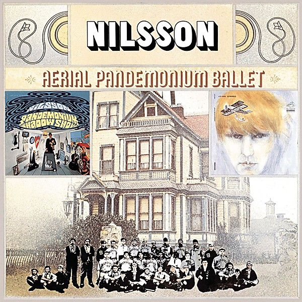

# Aerial Pandemonium Ballet

By **Harry Nilsson**

## Album Data

- **Catalog:** Beets
- **Format:** Digital, Album
- **Album:** Aerial Pandemonium Ballet
- **Artist:** Harry Nilsson
- **Albumartist:** Harry Nilsson
- **Genre:** Easy Listening
- **MusicBrainz Album Artist ID:** [e5963d26-01fa-40f5-b200-e0127f410a45](https://musicbrainz.org/artist/e5963d26-01fa-40f5-b200-e0127f410a45)
- **MusicBrainz Album ID:** [12d7564e-bd74-408e-929c-e4c4116fd6b8](https://musicbrainz.org/release/12d7564e-bd74-408e-929c-e4c4116fd6b8)
- **MusicBrainz Release Group ID:** [c44761fd-5bba-4644-b3c6-25cf9c1e8324](https://musicbrainz.org/release-group/c44761fd-5bba-4644-b3c6-25cf9c1e8324)
- **Year:** 1971
- **Catalog #:** BVCM-35125
- **Label:** RCA
- **Total Tracks:** 12

## Album Tracks

### Track 01 - Jesus Christ You're Tall

- **Artist:** Harry Nilsson
- **Format:** ALAC
- **Genre:** Humor
- **Length:** 1:26
- **MusicBrainz Track ID:** [c2bc3db9-d1d5-48d5-abce-91619c7d1c75](https://musicbrainz.org/recording/c2bc3db9-d1d5-48d5-abce-91619c7d1c75)
- **Title:** Jesus Christ You're Tall
- **Track:** 01
- **Year:** 2007

### Track 02 - It's a Jungle Out There

- **Artist:** Harry Nilsson
- **Format:** ALAC
- **Genre:** Soft Rock
- **Length:** 3:53
- **MusicBrainz Track ID:** [acbc1c34-856d-4b4b-8631-f6f745eca644](https://musicbrainz.org/recording/acbc1c34-856d-4b4b-8631-f6f745eca644)
- **Title:** It's a Jungle Out There
- **Track:** 02
- **Year:** 2007

### Track 03 - Down by the Sea

- **Artist:** Harry Nilsson
- **Format:** ALAC
- **Genre:** Soft Rock
- **Length:** 2:31
- **MusicBrainz Track ID:** [b5e50719-4dfe-441c-9677-6588f07ff751](https://musicbrainz.org/recording/b5e50719-4dfe-441c-9677-6588f07ff751)
- **Title:** Down by the Sea
- **Track:** 03
- **Year:** 2007

### Track 04 - Kojak Columbo

- **Artist:** Harry Nilsson
- **Format:** ALAC
- **Genre:** Pop Rock
- **Length:** 3:13
- **MusicBrainz Track ID:** [eb17c112-39f3-44db-898b-d660d49fa168](https://musicbrainz.org/recording/eb17c112-39f3-44db-898b-d660d49fa168)
- **Title:** Kojak Columbo
- **Track:** 04
- **Year:** 2007

### Track 05 - Easier for Me

- **Artist:** Harry Nilsson
- **Format:** ALAC
- **Genre:** Soft Rock
- **Length:** 2:31
- **MusicBrainz Track ID:** [ff44b22b-85c9-4c80-971e-a11663b2d9f3](https://musicbrainz.org/recording/ff44b22b-85c9-4c80-971e-a11663b2d9f3)
- **Title:** Easier for Me
- **Track:** 05
- **Year:** 2007

### Track 06 - Turn Out the Light

- **Artist:** Harry Nilsson
- **Format:** ALAC
- **Genre:** Soft Rock
- **Length:** 2:32
- **MusicBrainz Track ID:** [164863de-4600-4627-af3b-71f5dc7b1db5](https://musicbrainz.org/recording/164863de-4600-4627-af3b-71f5dc7b1db5)
- **Title:** Turn Out the Light
- **Track:** 06
- **Year:** 2007

### Track 07 - Salmon Falls

- **Artist:** Harry Nilsson
- **Format:** ALAC
- **Genre:** Soft Rock
- **Length:** 4:14
- **MusicBrainz Track ID:** [6adecb52-82b5-4ebe-8b9a-f185e9a4109d](https://musicbrainz.org/recording/6adecb52-82b5-4ebe-8b9a-f185e9a4109d)
- **Title:** Salmon Falls
- **Track:** 07
- **Year:** 2007

### Track 08 - Puget Sound

- **Artist:** Harry Nilsson
- **Format:** ALAC
- **Genre:** Soft Rock
- **Length:** 2:25
- **MusicBrainz Track ID:** [38a00009-0861-4ef0-a347-57ba95578b51](https://musicbrainz.org/recording/38a00009-0861-4ef0-a347-57ba95578b51)
- **Title:** Puget Sound
- **Track:** 08
- **Year:** 2007

### Track 09 - What's Your Sign

- **Artist:** Harry Nilsson
- **Format:** ALAC
- **Genre:** Soft Rock
- **Length:** 2:52
- **MusicBrainz Track ID:** [2575ef2f-50dd-4081-8a5f-9b6370e11729](https://musicbrainz.org/recording/2575ef2f-50dd-4081-8a5f-9b6370e11729)
- **Title:** What's Your Sign
- **Track:** 09
- **Year:** 2007

### Track 10 - Home

- **Artist:** Harry Nilsson
- **Format:** ALAC
- **Genre:** Soft Rock
- **Length:** 3:37
- **MusicBrainz Track ID:** [b644d99b-15b9-49d6-9a4d-68d4b2790c1d](https://musicbrainz.org/recording/b644d99b-15b9-49d6-9a4d-68d4b2790c1d)
- **Title:** Home
- **Track:** 10
- **Year:** 2007

### Track 11 - Good for God

- **Artist:** Harry Nilsson
- **Format:** ALAC
- **Genre:** Soft Rock
- **Length:** 3:35
- **MusicBrainz Track ID:** [d3cd40a9-f6df-4b8f-b64f-316c27741d62](https://musicbrainz.org/recording/d3cd40a9-f6df-4b8f-b64f-316c27741d62)
- **Title:** Good for God
- **Track:** 11
- **Year:** 2007

### Track 12 - Turn Out the Light (demo)

- **Artist:** Harry Nilsson
- **Format:** ALAC
- **Genre:** Soft Rock
- **Length:** 3:46
- **MusicBrainz Track ID:** [e4987a61-bf14-4bb5-90a0-7d92a916ca23](https://musicbrainz.org/recording/e4987a61-bf14-4bb5-90a0-7d92a916ca23)
- **Title:** Turn Out the Light (demo)
- **Track:** 12
- **Year:** 2007

## See also

- [Aerial Ballet [stereo - mono]](Aerial_Ballet_[stereo_-_mono].md)
- [A Little Touch Of Schmilsson In The Night](A_Little_Touch_Of_Schmilsson_In_The_Night.md)
- [Duit on Mon Dei](Duit_on_Mon_Dei.md)
- [Flash Harry](Flash_Harry.md)
- [Harry](Harry.md)
- [Harry Nilsson - Anthology - Personal Best - CD1](Harry_Nilsson_-_Anthology_-_Personal_Best_-_CD1.md)
- [KNNILLSSONN](KNNILLSSONN.md)
- [Nilsson Schmilsson](Nilsson_Schmilsson.md)
- [Nilsson Sessions 1967–1968](Nilsson_Sessions_1967–1968.md)
- [Nilsson Sessions 1968-1971](Nilsson_Sessions_1968-1971.md)
- [Nilsson Sessions 1971–1974](Nilsson_Sessions_1971–1974.md)
- [Nilsson Sings Newman](Nilsson_Sings_Newman.md)
- [Pandemonium Shadow Show](Pandemonium_Shadow_Show.md)
- [Pussy Cats](Pussy_Cats.md)
- [Sandman](Sandman.md)
- [Son of Schmilsson](Son_of_Schmilsson.md)
- [Son Of Schmilsson](Son_Of_Schmilsson.md)
- [...That's The Way It Is](Thats_The_Way_It_Is.md)
- [The Point!](The_Point!.md)
- [CD: Aerial Ballet](../../CD/Harry_Nilsson/Aerial_Ballet.md)
- [CD: Aerial Pandemonium Ballet](../../CD/Harry_Nilsson/Aerial_Pandemonium_Ballet.md)
- [CD: A Little Touch Of Schmilsson In The Night](../../CD/Harry_Nilsson/A_Little_Touch_Of_Schmilsson_In_The_Night.md)
- [CD: Duit On Mon Dei](../../CD/Harry_Nilsson/Duit_On_Mon_Dei.md)
- [CD: Harry](../../CD/Harry_Nilsson/Harry.md)
- [CD: ](../../CD/Harry_Nilsson/Harry_Nilsson.md)
- [CD: Knnillsson](../../CD/Harry_Nilsson/Knnillsson.md)
- [CD: Nilsson Schmilsson](../../CD/Harry_Nilsson/Nilsson_Schmilsson.md)
- [CD: Nilsson Sessions 1967-1968](../../CD/Harry_Nilsson/Nilsson_Sessions_1967-1968.md)
- [CD: Nilsson Sessions 1968-1971](../../CD/Harry_Nilsson/Nilsson_Sessions_1968-1971.md)
- [CD: Nilsson Sessions 1971-1974](../../CD/Harry_Nilsson/Nilsson_Sessions_1971-1974.md)
- [CD: Nilsson Sings Newman (Remastered + Expanded)](../../CD/Harry_Nilsson/Nilsson_Sings_Newman_Remastered_+_Expanded.md)
- [CD: Pandemonium Shadow Show](../../CD/Harry_Nilsson/Pandemonium_Shadow_Show.md)
- [CD: Pussy Cats](../../CD/Harry_Nilsson/Pussy_Cats.md)
- [CD: Sandman](../../CD/Harry_Nilsson/Sandman.md)
- [CD: Son Of Schmilsson](../../CD/Harry_Nilsson/Son_Of_Schmilsson.md)
- [CD: ...That's The Way It Is](../../CD/Harry_Nilsson/Thats_The_Way_It_Is.md)
- [CD: The Point!](../../CD/Harry_Nilsson/The_Point!.md)
- [Roon: Aerial Pandemonium Ballet](../../Roon/Harry_Nilsson/Aerial_Pandemonium_Ballet.md)
- [Roon: A Little Touch of Schmilsson in the Night](../../Roon/Harry_Nilsson/A_Little_Touch_of_Schmilsson_in_the_Night.md)
- [Roon: Duit On Mon Dei](../../Roon/Harry_Nilsson/Duit_On_Mon_Dei.md)
- [Roon: Flash Harry](../../Roon/Harry_Nilsson/Flash_Harry.md)
- [Roon: Harry](../../Roon/Harry_Nilsson/Harry.md)
- [Roon: Knnillssonn](../../Roon/Harry_Nilsson/Knnillssonn.md)
- [Roon: Nilsson Schmilsson](../../Roon/Harry_Nilsson/Nilsson_Schmilsson.md)
- [Roon: Nilsson Sings Newman](../../Roon/Harry_Nilsson/Nilsson_Sings_Newman.md)
- [Roon: Pandemonium Shadow Show](../../Roon/Harry_Nilsson/Pandemonium_Shadow_Show.md)
- [Roon: Popeye (Music From The Motion Picture / The Deluxe Edition)](../../Roon/Harry_Nilsson/Popeye_Music_From_The_Motion_Picture_-_The_Deluxe_Edition.md)
- [Roon: Pussy Cats](../../Roon/Harry_Nilsson/Pussy_Cats.md)
- [Roon: Sandman](../../Roon/Harry_Nilsson/Sandman.md)
- [Roon: Son Of Schmilsson](../../Roon/Harry_Nilsson/Son_Of_Schmilsson.md)
- [Roon: Spotlight On Nilsson](../../Roon/Harry_Nilsson/Spotlight_On_Nilsson.md)
- [Roon: That's the Way It Is](../../Roon/Harry_Nilsson/Thats_the_Way_It_Is.md)
- [Roon: The Point!](../../Roon/Harry_Nilsson/The_Point!.md)
- [Vinyl: Everybody's Talkin'](../../Vinyl/Harry_Nilsson/Everybodys_Talkin.md)
- [Vinyl: ](../../Vinyl/Harry_Nilsson/Harry_Nilsson.md)
- [Vinyl: Nilsson Schmilsson](../../Vinyl/Harry_Nilsson/Nilsson_Schmilsson.md)
- [Vinyl: Son Of Schmilsson](../../Vinyl/Harry_Nilsson/Son_Of_Schmilsson.md)
