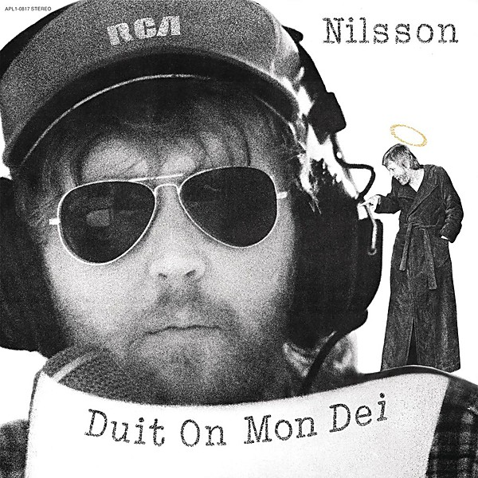

# Duit on Mon Dei

By **Harry Nilsson**

## Album Data

- **Catalog:** Beets
- **Format:** Digital, Album
- **Album:** Duit on Mon Dei
- **Artist:** Harry Nilsson
- **Albumartist:** Harry Nilsson
- **Genre:** Soft Rock
- **MusicBrainz Album Artist ID:** [e5963d26-01fa-40f5-b200-e0127f410a45](https://musicbrainz.org/artist/e5963d26-01fa-40f5-b200-e0127f410a45)
- **MusicBrainz Album ID:** [68803409-d353-464a-96fd-b9c9f2f85ba8](https://musicbrainz.org/release/68803409-d353-464a-96fd-b9c9f2f85ba8)
- **MusicBrainz Release Group ID:** [33d0ebb3-5bd0-3805-bb41-61fa99fa4169](https://musicbrainz.org/release-group/33d0ebb3-5bd0-3805-bb41-61fa99fa4169)
- **Year:** 2007
- **Catalog #:** VSD-7195
- **Label:** Varèse Vintage Records
- **Total Tracks:** 14

## Album Tracks

### Track 01 - Harry

- **Artist:** Eric Idle & Charlie Dore
- **Format:** AAC
- **Genre:** Soft Rock
- **Length:** 2:17
- **MusicBrainz Track ID:** [92f00e04-e239-40e1-9608-9dee592428ae](https://musicbrainz.org/recording/92f00e04-e239-40e1-9608-9dee592428ae)
- **Title:** Harry
- **Track:** 01
- **Year:** 2013

### Track 02 - Cheek to Cheek

- **Artist:** Harry Nilsson
- **Format:** MP3
- **Genre:** Soft Rock
- **Length:** 2:29
- **MusicBrainz Track ID:** [da1e567c-4009-4bc0-b8da-f957250451b4](https://musicbrainz.org/recording/da1e567c-4009-4bc0-b8da-f957250451b4)
- **Title:** Cheek to Cheek
- **Track:** 02
- **Year:** 2013

### Track 03 - Best Move

- **Artist:** Harry Nilsson
- **Format:** MP3
- **Genre:** Soft Rock
- **Length:** 4:03
- **MusicBrainz Track ID:** [bb94b993-e54d-4675-b3bc-cc5418dcf024](https://musicbrainz.org/recording/bb94b993-e54d-4675-b3bc-cc5418dcf024)
- **Title:** Best Move
- **Track:** 03
- **Year:** 2013

### Track 04 - Old Dirt Road

- **Artist:** Harry Nilsson
- **Format:** MP3
- **Genre:** Soul
- **Length:** 4:24
- **MusicBrainz Track ID:** [4a99992c-ec48-4bd3-aa51-cba5b178c017](https://musicbrainz.org/recording/4a99992c-ec48-4bd3-aa51-cba5b178c017)
- **Title:** Old Dirt Road
- **Track:** 04
- **Year:** 2013

### Track 05 - I Don't Need You

- **Artist:** Harry Nilsson
- **Format:** AAC
- **Genre:** Soft Rock
- **Length:** 3:51
- **MusicBrainz Track ID:** [e023df8b-4253-4913-80dc-66e82cefea7f](https://musicbrainz.org/recording/e023df8b-4253-4913-80dc-66e82cefea7f)
- **Title:** I Don't Need You
- **Track:** 05
- **Year:** 2013

### Track 06 - Rain

- **Artist:** Harry Nilsson
- **Format:** MP3
- **Genre:** Soft Rock
- **Length:** 3:49
- **MusicBrainz Track ID:** [14e3b7de-08f4-4637-a443-b7de75da633b](https://musicbrainz.org/recording/14e3b7de-08f4-4637-a443-b7de75da633b)
- **Title:** Rain
- **Track:** 06
- **Year:** 2013

### Track 07 - I've Got It!

- **Artist:** Harry Nilsson
- **Format:** MP3
- **Genre:** Soft Rock
- **Length:** 3:41
- **MusicBrainz Track ID:** [934dbd8f-1801-4e24-99ca-19bffc809267](https://musicbrainz.org/recording/934dbd8f-1801-4e24-99ca-19bffc809267)
- **Title:** I've Got It!
- **Track:** 07
- **Year:** 2013

### Track 08 - It's So Easy

- **Artist:** Harry Nilsson
- **Format:** AAC
- **Genre:** Soft Rock
- **Length:** 4:42
- **MusicBrainz Track ID:** [7d09e8f7-dd15-4ddd-bd15-96e0f47ff9b3](https://musicbrainz.org/recording/7d09e8f7-dd15-4ddd-bd15-96e0f47ff9b3)
- **Title:** It's So Easy
- **Track:** 08
- **Year:** 2013

### Track 09 - How Long Can Disco On

- **Artist:** Harry Nilsson
- **Format:** MP3
- **Genre:** Soft Rock
- **Length:** 2:58
- **MusicBrainz Track ID:** [ce624b74-41af-43a8-96dd-04d614ca4315](https://musicbrainz.org/recording/ce624b74-41af-43a8-96dd-04d614ca4315)
- **Title:** How Long Can Disco On
- **Track:** 09
- **Year:** 2013

### Track 10 - Bright Side of Life

- **Artist:** Harry Nilsson
- **Format:** AAC
- **Genre:** Soft Rock
- **Length:** 4:16
- **MusicBrainz Track ID:** [7abf962e-88d0-4e88-82b5-0a861e7aed1f](https://musicbrainz.org/recording/7abf962e-88d0-4e88-82b5-0a861e7aed1f)
- **Title:** Bright Side of Life
- **Track:** 10
- **Year:** 2013

### Track 11 - Old Dirt Road (alternate version)

- **Artist:** Harry Nilsson
- **Format:** AAC
- **Genre:** Soft Rock
- **Length:** 4:05
- **MusicBrainz Track ID:** [6052a2d0-ce64-4d3f-b218-6ad833c749a0](https://musicbrainz.org/recording/6052a2d0-ce64-4d3f-b218-6ad833c749a0)
- **Title:** Old Dirt Road (alternate version)
- **Track:** 11
- **Year:** 2013

### Track 12 - Feet

- **Artist:** Harry Nilsson
- **Format:** MP3
- **Genre:** Soft Rock
- **Length:** 2:34
- **MusicBrainz Track ID:** [e0079336-44fb-41e7-a385-9b915c224b82](https://musicbrainz.org/recording/e0079336-44fb-41e7-a385-9b915c224b82)
- **Title:** Feet
- **Track:** 12
- **Year:** 2013

### Track 13 - Leave the Rest to Molly

- **Artist:** Harry Nilsson
- **Format:** MP3
- **Genre:** Soft Rock
- **Length:** 5:14
- **MusicBrainz Track ID:** [994ee0b7-7ed0-4579-b3b5-b21a6915d942](https://musicbrainz.org/recording/994ee0b7-7ed0-4579-b3b5-b21a6915d942)
- **Title:** Leave the Rest to Molly
- **Track:** 13
- **Year:** 2013

### Track 14 - She Drifted Away

- **Artist:** Harry Nilsson
- **Format:** MP3
- **Genre:** Soft Rock
- **Length:** 3:32
- **MusicBrainz Track ID:** [fac859fb-e402-4924-8010-d5f7716df8d3](https://musicbrainz.org/recording/fac859fb-e402-4924-8010-d5f7716df8d3)
- **Title:** She Drifted Away
- **Track:** 14
- **Year:** 2013

## See also

- [Aerial Ballet [stereo - mono]](Aerial_Ballet_[stereo_-_mono].md)
- [Aerial Pandemonium Ballet](Aerial_Pandemonium_Ballet.md)
- [A Little Touch Of Schmilsson In The Night](A_Little_Touch_Of_Schmilsson_In_The_Night.md)
- [Flash Harry](Flash_Harry.md)
- [Harry](Harry.md)
- [Harry Nilsson - Anthology - Personal Best - CD1](Harry_Nilsson_-_Anthology_-_Personal_Best_-_CD1.md)
- [KNNILLSSONN](KNNILLSSONN.md)
- [Nilsson Schmilsson](Nilsson_Schmilsson.md)
- [Nilsson Sessions 1967–1968](Nilsson_Sessions_1967–1968.md)
- [Nilsson Sessions 1968-1971](Nilsson_Sessions_1968-1971.md)
- [Nilsson Sessions 1971–1974](Nilsson_Sessions_1971–1974.md)
- [Nilsson Sings Newman](Nilsson_Sings_Newman.md)
- [Pandemonium Shadow Show](Pandemonium_Shadow_Show.md)
- [Pussy Cats](Pussy_Cats.md)
- [Sandman](Sandman.md)
- [Son of Schmilsson](Son_of_Schmilsson.md)
- [Son Of Schmilsson](Son_Of_Schmilsson.md)
- [...That's The Way It Is](Thats_The_Way_It_Is.md)
- [The Point!](The_Point!.md)
- [CD: Aerial Ballet](../../CD/Harry_Nilsson/Aerial_Ballet.md)
- [CD: Aerial Pandemonium Ballet](../../CD/Harry_Nilsson/Aerial_Pandemonium_Ballet.md)
- [CD: A Little Touch Of Schmilsson In The Night](../../CD/Harry_Nilsson/A_Little_Touch_Of_Schmilsson_In_The_Night.md)
- [CD: Duit On Mon Dei](../../CD/Harry_Nilsson/Duit_On_Mon_Dei.md)
- [CD: Harry](../../CD/Harry_Nilsson/Harry.md)
- [CD: ](../../CD/Harry_Nilsson/Harry_Nilsson.md)
- [CD: Knnillsson](../../CD/Harry_Nilsson/Knnillsson.md)
- [CD: Nilsson Schmilsson](../../CD/Harry_Nilsson/Nilsson_Schmilsson.md)
- [CD: Nilsson Sessions 1967-1968](../../CD/Harry_Nilsson/Nilsson_Sessions_1967-1968.md)
- [CD: Nilsson Sessions 1968-1971](../../CD/Harry_Nilsson/Nilsson_Sessions_1968-1971.md)
- [CD: Nilsson Sessions 1971-1974](../../CD/Harry_Nilsson/Nilsson_Sessions_1971-1974.md)
- [CD: Nilsson Sings Newman (Remastered + Expanded)](../../CD/Harry_Nilsson/Nilsson_Sings_Newman_Remastered_+_Expanded.md)
- [CD: Pandemonium Shadow Show](../../CD/Harry_Nilsson/Pandemonium_Shadow_Show.md)
- [CD: Pussy Cats](../../CD/Harry_Nilsson/Pussy_Cats.md)
- [CD: Sandman](../../CD/Harry_Nilsson/Sandman.md)
- [CD: Son Of Schmilsson](../../CD/Harry_Nilsson/Son_Of_Schmilsson.md)
- [CD: ...That's The Way It Is](../../CD/Harry_Nilsson/Thats_The_Way_It_Is.md)
- [CD: The Point!](../../CD/Harry_Nilsson/The_Point!.md)
- [Roon: Aerial Pandemonium Ballet](../../Roon/Harry_Nilsson/Aerial_Pandemonium_Ballet.md)
- [Roon: A Little Touch of Schmilsson in the Night](../../Roon/Harry_Nilsson/A_Little_Touch_of_Schmilsson_in_the_Night.md)
- [Roon: Duit On Mon Dei](../../Roon/Harry_Nilsson/Duit_On_Mon_Dei.md)
- [Roon: Flash Harry](../../Roon/Harry_Nilsson/Flash_Harry.md)
- [Roon: Harry](../../Roon/Harry_Nilsson/Harry.md)
- [Roon: Knnillssonn](../../Roon/Harry_Nilsson/Knnillssonn.md)
- [Roon: Nilsson Schmilsson](../../Roon/Harry_Nilsson/Nilsson_Schmilsson.md)
- [Roon: Nilsson Sings Newman](../../Roon/Harry_Nilsson/Nilsson_Sings_Newman.md)
- [Roon: Pandemonium Shadow Show](../../Roon/Harry_Nilsson/Pandemonium_Shadow_Show.md)
- [Roon: Popeye (Music From The Motion Picture / The Deluxe Edition)](../../Roon/Harry_Nilsson/Popeye_Music_From_The_Motion_Picture_-_The_Deluxe_Edition.md)
- [Roon: Pussy Cats](../../Roon/Harry_Nilsson/Pussy_Cats.md)
- [Roon: Sandman](../../Roon/Harry_Nilsson/Sandman.md)
- [Roon: Son Of Schmilsson](../../Roon/Harry_Nilsson/Son_Of_Schmilsson.md)
- [Roon: Spotlight On Nilsson](../../Roon/Harry_Nilsson/Spotlight_On_Nilsson.md)
- [Roon: That's the Way It Is](../../Roon/Harry_Nilsson/Thats_the_Way_It_Is.md)
- [Roon: The Point!](../../Roon/Harry_Nilsson/The_Point!.md)
- [Vinyl: Everybody's Talkin'](../../Vinyl/Harry_Nilsson/Everybodys_Talkin.md)
- [Vinyl: ](../../Vinyl/Harry_Nilsson/Harry_Nilsson.md)
- [Vinyl: Nilsson Schmilsson](../../Vinyl/Harry_Nilsson/Nilsson_Schmilsson.md)
- [Vinyl: Son Of Schmilsson](../../Vinyl/Harry_Nilsson/Son_Of_Schmilsson.md)
