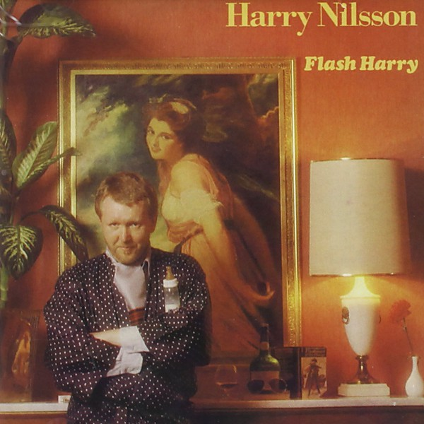

# Flash Harry

By **Harry Nilsson**

## Album Data

- **Catalog:** Beets
- **Format:** Digital, Album
- **Album:** Flash Harry
- **Artist:** Harry Nilsson
- **Albumartist:** Harry Nilsson
- **Genre:** Soft Rock
- **MusicBrainz Album Artist ID:** [e5963d26-01fa-40f5-b200-e0127f410a45](https://musicbrainz.org/artist/e5963d26-01fa-40f5-b200-e0127f410a45)
- **MusicBrainz Album ID:** [734c4e2b-af2a-401a-bed2-b3e60487fa61](https://musicbrainz.org/release/734c4e2b-af2a-401a-bed2-b3e60487fa61)
- **MusicBrainz Release Group ID:** [d7875eee-131c-30ea-8e2f-5d861d2a4599](https://musicbrainz.org/release-group/d7875eee-131c-30ea-8e2f-5d861d2a4599)
- **Year:** 2013
- **Catalog #:** 07863 66599-2
- **Label:** BMG
- **Total Tracks:** 10

## Album Tracks

### Track 01 - Gotta Get Up

- **Artist:** Harry Nilsson
- **Format:** ALAC
- **Genre:** Soft Rock
- **Length:** 2:24
- **MusicBrainz Track ID:** [caa0dbc2-9e20-4c15-85f1-a1b1811db19f](https://musicbrainz.org/recording/caa0dbc2-9e20-4c15-85f1-a1b1811db19f)
- **Title:** Gotta Get Up
- **Track:** 01
- **Year:** 1995

### Track 02 - Driving Along

- **Artist:** Harry Nilsson
- **Format:** ALAC
- **Genre:** Soft Rock
- **Length:** 2:03
- **MusicBrainz Track ID:** [aa91bdbc-dab2-41c3-b664-82db5b9c48f9](https://musicbrainz.org/recording/aa91bdbc-dab2-41c3-b664-82db5b9c48f9)
- **Title:** Driving Along
- **Track:** 02
- **Year:** 1995

### Track 03 - Early in the Morning

- **Artist:** Harry Nilsson
- **Format:** ALAC
- **Genre:** Soul
- **Length:** 2:50
- **MusicBrainz Track ID:** [a7a5b1ff-2cce-48a4-b4f9-a0efa1ecaf49](https://musicbrainz.org/recording/a7a5b1ff-2cce-48a4-b4f9-a0efa1ecaf49)
- **Title:** Early in the Morning
- **Track:** 03
- **Year:** 1995

### Track 04 - The Moonbeam Song

- **Artist:** Harry Nilsson
- **Format:** ALAC
- **Genre:** Sunshine Pop
- **Length:** 3:22
- **MusicBrainz Track ID:** [2810e85e-efb3-4198-adb4-4744b34410fd](https://musicbrainz.org/recording/2810e85e-efb3-4198-adb4-4744b34410fd)
- **Title:** The Moonbeam Song
- **Track:** 04
- **Year:** 1995

### Track 05 - Down

- **Artist:** Harry Nilsson
- **Format:** ALAC
- **Genre:** Space Rock
- **Length:** 3:27
- **MusicBrainz Track ID:** [16215cf8-cced-4e93-b182-a2c091f23131](https://musicbrainz.org/recording/16215cf8-cced-4e93-b182-a2c091f23131)
- **Title:** Down
- **Track:** 05
- **Year:** 1995

### Track 06 - Without You

- **Artist:** Harry Nilsson
- **Format:** ALAC
- **Genre:** Soft Rock
- **Length:** 3:21
- **MusicBrainz Track ID:** [6c04bc3a-1cd5-4653-92af-1bb2a554f8ec](https://musicbrainz.org/recording/6c04bc3a-1cd5-4653-92af-1bb2a554f8ec)
- **Title:** Without You
- **Track:** 06
- **Year:** 1995

### Track 07 - Coconut

- **Artist:** Harry Nilsson
- **Format:** ALAC
- **Genre:** Rock
- **Length:** 3:51
- **MusicBrainz Track ID:** [5f0ce963-90bc-4bb1-a50f-302db8fba4fd](https://musicbrainz.org/recording/5f0ce963-90bc-4bb1-a50f-302db8fba4fd)
- **Title:** Coconut
- **Track:** 07
- **Year:** 1995

### Track 08 - Let the Good Times Roll

- **Artist:** Harry Nilsson
- **Format:** ALAC
- **Genre:** Baroque Pop
- **Length:** 2:43
- **MusicBrainz Track ID:** [ba86454a-9c46-44d9-9eb7-cf29add38827](https://musicbrainz.org/recording/ba86454a-9c46-44d9-9eb7-cf29add38827)
- **Title:** Let the Good Times Roll
- **Track:** 08
- **Year:** 1995

### Track 09 - Jump Into the Fire

- **Artist:** Harry Nilsson
- **Format:** ALAC
- **Genre:** Soft Rock
- **Length:** 7:02
- **MusicBrainz Track ID:** [807a5f60-099d-41dd-abe4-a5b1b087232d](https://musicbrainz.org/recording/807a5f60-099d-41dd-abe4-a5b1b087232d)
- **Title:** Jump Into the Fire
- **Track:** 09
- **Year:** 1995

### Track 10 - I’ll Never Leave You

- **Artist:** Harry Nilsson
- **Format:** ALAC
- **Genre:** Soft Rock
- **Length:** 4:16
- **MusicBrainz Track ID:** [af7ced4f-0c1d-4715-8d2c-db08a7cda9f2](https://musicbrainz.org/recording/af7ced4f-0c1d-4715-8d2c-db08a7cda9f2)
- **Title:** I’ll Never Leave You
- **Track:** 10
- **Year:** 1995

## See also

- [Aerial Ballet [stereo - mono]](Aerial_Ballet_[stereo_-_mono].md)
- [Aerial Pandemonium Ballet](Aerial_Pandemonium_Ballet.md)
- [A Little Touch Of Schmilsson In The Night](A_Little_Touch_Of_Schmilsson_In_The_Night.md)
- [Duit on Mon Dei](Duit_on_Mon_Dei.md)
- [Harry](Harry.md)
- [Harry Nilsson - Anthology - Personal Best - CD1](Harry_Nilsson_-_Anthology_-_Personal_Best_-_CD1.md)
- [KNNILLSSONN](KNNILLSSONN.md)
- [Nilsson Schmilsson](Nilsson_Schmilsson.md)
- [Nilsson Sessions 1967–1968](Nilsson_Sessions_1967–1968.md)
- [Nilsson Sessions 1968-1971](Nilsson_Sessions_1968-1971.md)
- [Nilsson Sessions 1971–1974](Nilsson_Sessions_1971–1974.md)
- [Nilsson Sings Newman](Nilsson_Sings_Newman.md)
- [Pandemonium Shadow Show](Pandemonium_Shadow_Show.md)
- [Pussy Cats](Pussy_Cats.md)
- [Sandman](Sandman.md)
- [Son of Schmilsson](Son_of_Schmilsson.md)
- [Son Of Schmilsson](Son_Of_Schmilsson.md)
- [...That's The Way It Is](Thats_The_Way_It_Is.md)
- [The Point!](The_Point!.md)
- [CD: Aerial Ballet](../../CD/Harry_Nilsson/Aerial_Ballet.md)
- [CD: Aerial Pandemonium Ballet](../../CD/Harry_Nilsson/Aerial_Pandemonium_Ballet.md)
- [CD: A Little Touch Of Schmilsson In The Night](../../CD/Harry_Nilsson/A_Little_Touch_Of_Schmilsson_In_The_Night.md)
- [CD: Duit On Mon Dei](../../CD/Harry_Nilsson/Duit_On_Mon_Dei.md)
- [CD: Harry](../../CD/Harry_Nilsson/Harry.md)
- [CD: ](../../CD/Harry_Nilsson/Harry_Nilsson.md)
- [CD: Knnillsson](../../CD/Harry_Nilsson/Knnillsson.md)
- [CD: Nilsson Schmilsson](../../CD/Harry_Nilsson/Nilsson_Schmilsson.md)
- [CD: Nilsson Sessions 1967-1968](../../CD/Harry_Nilsson/Nilsson_Sessions_1967-1968.md)
- [CD: Nilsson Sessions 1968-1971](../../CD/Harry_Nilsson/Nilsson_Sessions_1968-1971.md)
- [CD: Nilsson Sessions 1971-1974](../../CD/Harry_Nilsson/Nilsson_Sessions_1971-1974.md)
- [CD: Nilsson Sings Newman (Remastered + Expanded)](../../CD/Harry_Nilsson/Nilsson_Sings_Newman_Remastered_+_Expanded.md)
- [CD: Pandemonium Shadow Show](../../CD/Harry_Nilsson/Pandemonium_Shadow_Show.md)
- [CD: Pussy Cats](../../CD/Harry_Nilsson/Pussy_Cats.md)
- [CD: Sandman](../../CD/Harry_Nilsson/Sandman.md)
- [CD: Son Of Schmilsson](../../CD/Harry_Nilsson/Son_Of_Schmilsson.md)
- [CD: ...That's The Way It Is](../../CD/Harry_Nilsson/Thats_The_Way_It_Is.md)
- [CD: The Point!](../../CD/Harry_Nilsson/The_Point!.md)
- [Roon: Aerial Pandemonium Ballet](../../Roon/Harry_Nilsson/Aerial_Pandemonium_Ballet.md)
- [Roon: A Little Touch of Schmilsson in the Night](../../Roon/Harry_Nilsson/A_Little_Touch_of_Schmilsson_in_the_Night.md)
- [Roon: Duit On Mon Dei](../../Roon/Harry_Nilsson/Duit_On_Mon_Dei.md)
- [Roon: Flash Harry](../../Roon/Harry_Nilsson/Flash_Harry.md)
- [Roon: Harry](../../Roon/Harry_Nilsson/Harry.md)
- [Roon: Knnillssonn](../../Roon/Harry_Nilsson/Knnillssonn.md)
- [Roon: Nilsson Schmilsson](../../Roon/Harry_Nilsson/Nilsson_Schmilsson.md)
- [Roon: Nilsson Sings Newman](../../Roon/Harry_Nilsson/Nilsson_Sings_Newman.md)
- [Roon: Pandemonium Shadow Show](../../Roon/Harry_Nilsson/Pandemonium_Shadow_Show.md)
- [Roon: Popeye (Music From The Motion Picture / The Deluxe Edition)](../../Roon/Harry_Nilsson/Popeye_Music_From_The_Motion_Picture_-_The_Deluxe_Edition.md)
- [Roon: Pussy Cats](../../Roon/Harry_Nilsson/Pussy_Cats.md)
- [Roon: Sandman](../../Roon/Harry_Nilsson/Sandman.md)
- [Roon: Son Of Schmilsson](../../Roon/Harry_Nilsson/Son_Of_Schmilsson.md)
- [Roon: Spotlight On Nilsson](../../Roon/Harry_Nilsson/Spotlight_On_Nilsson.md)
- [Roon: That's the Way It Is](../../Roon/Harry_Nilsson/Thats_the_Way_It_Is.md)
- [Roon: The Point!](../../Roon/Harry_Nilsson/The_Point!.md)
- [Vinyl: Everybody's Talkin'](../../Vinyl/Harry_Nilsson/Everybodys_Talkin.md)
- [Vinyl: ](../../Vinyl/Harry_Nilsson/Harry_Nilsson.md)
- [Vinyl: Nilsson Schmilsson](../../Vinyl/Harry_Nilsson/Nilsson_Schmilsson.md)
- [Vinyl: Son Of Schmilsson](../../Vinyl/Harry_Nilsson/Son_Of_Schmilsson.md)
