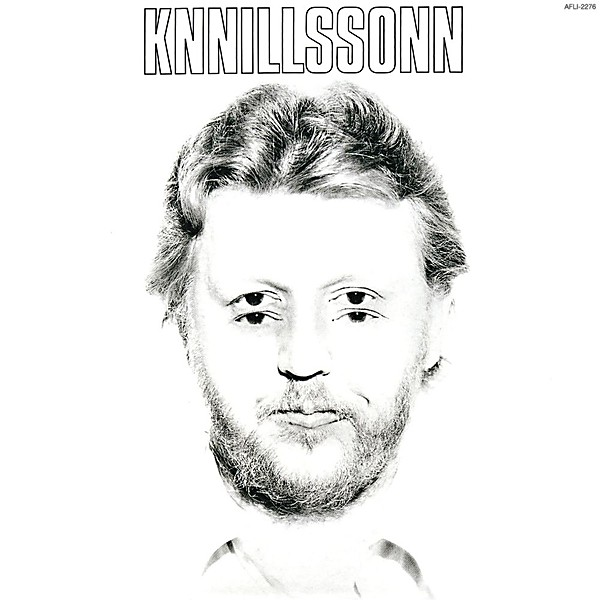

# KNNILLSSONN

By **Harry Nilsson**

## Album Data

- **Catalog:** Beets
- **Format:** Digital, Album
- **Album:** KNNILLSSONN
- **Artist:** Harry Nilsson
- **Albumartist:** Harry Nilsson
- **Genre:** Soft Rock
- **MusicBrainz Album Artist ID:** 
- **MusicBrainz Album ID:** 
- **MusicBrainz Release Group ID:** 
- **Year:** 0000
- **Catalog #:** 
- **Label:** 
- **Total Tracks:** 20

## Album Tracks

### Track 01 - You Are Here

- **Artist:** Harry Nilsson
- **Format:** ALAC
- **Genre:** Soft Rock
- **Length:** 3:22
- **MusicBrainz Track ID:** 
- **Title:** You Are Here
- **Track:** 01
- **Year:** 1968

### Track 02 - The Cast And Crew [from the motion picture SKIDOO]

- **Artist:** Harry Nilsson
- **Format:** ALAC
- **Genre:** Soft Rock
- **Length:** 3:53
- **MusicBrainz Track ID:** 
- **Title:** The Cast And Crew [from the motion picture SKIDOO]
- **Track:** 02
- **Year:** 1968

### Track 03 - Garbage Can Ballet [from the motion picture SKIDOO]

- **Artist:** Harry Nilsson
- **Format:** ALAC
- **Genre:** Soft Rock
- **Length:** 2:04
- **MusicBrainz Track ID:** 
- **Title:** Garbage Can Ballet [from the motion picture SKIDOO]
- **Track:** 03
- **Year:** 1968

### Track 04 - I Will Take You There [from the motion picture SKIDOO]

- **Artist:** Harry Nilsson
- **Format:** ALAC
- **Genre:** Soft Rock
- **Length:** 2:32
- **MusicBrainz Track ID:** 
- **Title:** I Will Take You There [from the motion picture SKIDOO]
- **Track:** 04
- **Year:** 1968

### Track 05 - Girlfriend

- **Artist:** Harry Nilsson
- **Format:** ALAC
- **Genre:** Soft Rock
- **Length:** 2:44
- **MusicBrainz Track ID:** 
- **Title:** Girlfriend
- **Track:** 05
- **Year:** 1968

### Track 06 - Wasting My Time [alternate mix]

- **Artist:** Harry Nilsson
- **Format:** ALAC
- **Genre:** Soft Rock
- **Length:** 3:49
- **MusicBrainz Track ID:** 
- **Title:** Wasting My Time [alternate mix]
- **Track:** 06
- **Year:** 1968

### Track 07 - Rainmaker [alternate version]

- **Artist:** Harry Nilsson
- **Format:** ALAC
- **Genre:** Soft Rock
- **Length:** 2:40
- **MusicBrainz Track ID:** 
- **Title:** Rainmaker [alternate version]
- **Track:** 07
- **Year:** 1968

### Track 08 - Open Your Window [alternate take]

- **Artist:** Harry Nilsson
- **Format:** ALAC
- **Genre:** Soft Rock
- **Length:** 2:11
- **MusicBrainz Track ID:** 
- **Title:** Open Your Window [alternate take]
- **Track:** 08
- **Year:** 1968

### Track 09 - Postcard

- **Artist:** Harry Nilsson
- **Format:** ALAC
- **Genre:** Soft Rock
- **Length:** 3:18
- **MusicBrainz Track ID:** 
- **Title:** Postcard
- **Track:** 09
- **Year:** 1969

### Track 10 - Think About Your Troubles [alternate version]

- **Artist:** Harry Nilsson
- **Format:** ALAC
- **Genre:** Soft Rock
- **Length:** 3:03
- **MusicBrainz Track ID:** 
- **Title:** Think About Your Troubles [alternate version]
- **Track:** 10
- **Year:** 1969

### Track 11 - Marry Me A Little

- **Artist:** Harry Nilsson
- **Format:** ALAC
- **Genre:** Soft Rock
- **Length:** 5:00
- **MusicBrainz Track ID:** 
- **Title:** Marry Me A Little
- **Track:** 11
- **Year:** 1969

### Track 12 - Ballin' The Jack [1970 version]

- **Artist:** Harry Nilsson
- **Format:** ALAC
- **Genre:** Soft Rock
- **Length:** 2:26
- **MusicBrainz Track ID:** 
- **Title:** Ballin' The Jack [1970 version]
- **Track:** 12
- **Year:** 1970

### Track 13 - Gotta Get Up [1970 demo]

- **Artist:** Harry Nilsson
- **Format:** ALAC
- **Genre:** Soft Rock
- **Length:** 1:53
- **MusicBrainz Track ID:** 
- **Title:** Gotta Get Up [1970 demo]
- **Track:** 13
- **Year:** 1970

### Track 14 - Down To The Valley [single mix]

- **Artist:** Harry Nilsson
- **Format:** ALAC
- **Genre:** Soft Rock
- **Length:** 2:12
- **MusicBrainz Track ID:** 
- **Title:** Down To The Valley [single mix]
- **Track:** 14
- **Year:** 1970

### Track 15 - Buy My Album [single mix]

- **Artist:** Harry Nilsson
- **Format:** ALAC
- **Genre:** Soft Rock
- **Length:** 1:33
- **MusicBrainz Track ID:** 
- **Title:** Buy My Album [single mix]
- **Track:** 15
- **Year:** 1970

### Track 16 - Joy [alternate version]

- **Artist:** Harry Nilsson
- **Format:** ALAC
- **Genre:** Soft Rock
- **Length:** 2:32
- **MusicBrainz Track ID:** 
- **Title:** Joy [alternate version]
- **Track:** 16
- **Year:** 1970

### Track 17 - Blackbird

- **Artist:** Harry Nilsson
- **Format:** ALAC
- **Genre:** Soft Rock
- **Length:** 2:28
- **MusicBrainz Track ID:** 
- **Title:** Blackbird
- **Track:** 17
- **Year:** 1970

### Track 18 - Paradise

- **Artist:** Harry Nilsson
- **Format:** ALAC
- **Genre:** Soft Rock
- **Length:** 4:54
- **MusicBrainz Track ID:** 
- **Title:** Paradise
- **Track:** 18
- **Year:** 1971

### Track 19 - Lucille

- **Artist:** Harry Nilsson
- **Format:** ALAC
- **Genre:** Soft Rock
- **Length:** 2:28
- **MusicBrainz Track ID:** 
- **Title:** Lucille
- **Track:** 19
- **Year:** 1971

### Track 20 - Early In The Morning [alternate version]

- **Artist:** Harry Nilsson
- **Format:** ALAC
- **Genre:** Soft Rock
- **Length:** 2:17
- **MusicBrainz Track ID:** 
- **Title:** Early In The Morning [alternate version]
- **Track:** 20
- **Year:** 1971

