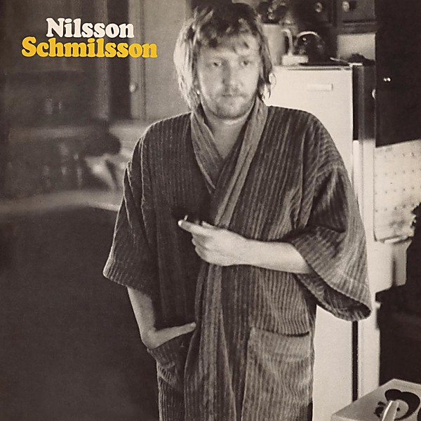

# Nilsson Schmilsson

By **Harry Nilsson**

## Album Data

- **Catalog:** Beets
- **Format:** Digital, Album
- **Album:** Nilsson Schmilsson
- **Artist:** Harry Nilsson
- **Albumartist:** Harry Nilsson
- **Genre:** Soft Rock
- **MusicBrainz Album Artist ID:** [e5963d26-01fa-40f5-b200-e0127f410a45](https://musicbrainz.org/artist/e5963d26-01fa-40f5-b200-e0127f410a45)
- **MusicBrainz Album ID:** [25f2a0f1-eac1-4c57-bf5c-5dd6413fa371](https://musicbrainz.org/release/25f2a0f1-eac1-4c57-bf5c-5dd6413fa371)
- **MusicBrainz Release Group ID:** [19a185f4-f683-3d00-9571-7378ea276068](https://musicbrainz.org/release-group/19a185f4-f683-3d00-9571-7378ea276068)
- **Year:** 1995
- **Catalog #:** 
- **Label:** Legacy
- **Total Tracks:** 18

## Album Tracks

### Track 01 - 1941 (demo)

- **Artist:** Harry Nilsson
- **Format:** ALAC
- **Genre:** Soft Rock
- **Length:** 2:32
- **MusicBrainz Track ID:** [4eb2d8b5-3b30-406e-b371-ef7244ca868f](https://musicbrainz.org/recording/4eb2d8b5-3b30-406e-b371-ef7244ca868f)
- **Title:** 1941 (demo)
- **Track:** 01
- **Year:** 2013

### Track 02 - World (demo)

- **Artist:** Harry Nilsson
- **Format:** ALAC
- **Genre:** Soft Rock
- **Length:** 2:01
- **MusicBrainz Track ID:** [b9f4cb8a-40aa-4603-8c17-cd6fa42587e3](https://musicbrainz.org/recording/b9f4cb8a-40aa-4603-8c17-cd6fa42587e3)
- **Title:** World (demo)
- **Track:** 02
- **Year:** 2013

### Track 03 - Signs (demo)

- **Artist:** Harry Nilsson
- **Format:** ALAC
- **Genre:** Soft Rock
- **Length:** 2:36
- **MusicBrainz Track ID:** [072fa217-b549-4711-ad6b-526d897e3317](https://musicbrainz.org/recording/072fa217-b549-4711-ad6b-526d897e3317)
- **Title:** Signs (demo)
- **Track:** 03
- **Year:** 2013

### Track 04 - Cuddly Toy (demo)

- **Artist:** Harry Nilsson
- **Format:** ALAC
- **Genre:** Soft Rock
- **Length:** 2:50
- **MusicBrainz Track ID:** [9e8c6b8b-3b80-448a-af21-112608b65418](https://musicbrainz.org/recording/9e8c6b8b-3b80-448a-af21-112608b65418)
- **Title:** Cuddly Toy (demo)
- **Track:** 04
- **Year:** 2013

### Track 05 - This Could Be the Night (demo)

- **Artist:** Harry Nilsson
- **Format:** ALAC
- **Genre:** Soft Rock
- **Length:** 2:13
- **MusicBrainz Track ID:** [61fa2935-e1a1-451d-835a-75dab12b8e0f](https://musicbrainz.org/recording/61fa2935-e1a1-451d-835a-75dab12b8e0f)
- **Title:** This Could Be the Night (demo)
- **Track:** 05
- **Year:** 2013

### Track 06 - As I Wander Lonely

- **Artist:** Harry Nilsson
- **Format:** ALAC
- **Genre:** Soft Rock
- **Length:** 2:00
- **MusicBrainz Track ID:** [c1710aef-5420-47c3-a84b-58eeecfb29cd](https://musicbrainz.org/recording/c1710aef-5420-47c3-a84b-58eeecfb29cd)
- **Title:** As I Wander Lonely
- **Track:** 06
- **Year:** 2013

### Track 07 - The Family

- **Artist:** Harry Nilsson
- **Format:** ALAC
- **Genre:** Soft Rock
- **Length:** 2:29
- **MusicBrainz Track ID:** [aa008ce7-bb2e-40b2-a16b-7384c58773df](https://musicbrainz.org/recording/aa008ce7-bb2e-40b2-a16b-7384c58773df)
- **Title:** The Family
- **Track:** 07
- **Year:** 2013

### Track 08 - Miss Butter’s Lament

- **Artist:** Harry Nilsson
- **Format:** ALAC
- **Genre:** Soft Rock
- **Length:** 2:20
- **MusicBrainz Track ID:** [e35bad93-1fc4-4b2a-857d-f5c6638f0e63](https://musicbrainz.org/recording/e35bad93-1fc4-4b2a-857d-f5c6638f0e63)
- **Title:** Miss Butter’s Lament
- **Track:** 08
- **Year:** 2013

### Track 09 - Mr. Tinker (alternate version)

- **Artist:** Harry Nilsson
- **Format:** ALAC
- **Genre:** Soft Rock
- **Length:** 2:39
- **MusicBrainz Track ID:** [3f10c688-19be-4e0e-9148-2c6b818a5035](https://musicbrainz.org/recording/3f10c688-19be-4e0e-9148-2c6b818a5035)
- **Title:** Mr. Tinker (alternate version)
- **Track:** 09
- **Year:** 2013

### Track 10 - Leggenda

- **Artist:** Harry Nilsson
- **Format:** ALAC
- **Genre:** Soft Rock
- **Length:** 2:53
- **MusicBrainz Track ID:** [efd3c2f5-d058-4f1b-99f7-436cdc46e4a6](https://musicbrainz.org/recording/efd3c2f5-d058-4f1b-99f7-436cdc46e4a6)
- **Title:** Leggenda
- **Track:** 10
- **Year:** 2013

### Track 11 - Sister Marie (stereo remix)

- **Artist:** Harry Nilsson
- **Format:** ALAC
- **Genre:** Soft Rock
- **Length:** 3:18
- **MusicBrainz Track ID:** [f6e541c4-8d4c-4bcb-b62f-b3118b447059](https://musicbrainz.org/recording/f6e541c4-8d4c-4bcb-b62f-b3118b447059)
- **Title:** Sister Marie (stereo remix)
- **Track:** 11
- **Year:** 2013

### Track 12 - She Wandered Through the Garden Fence

- **Artist:** Harry Nilsson
- **Format:** ALAC
- **Genre:** Soft Rock
- **Length:** 2:49
- **MusicBrainz Track ID:** [9f01c459-c7e8-47c4-bf3d-c44c01f3b51b](https://musicbrainz.org/recording/9f01c459-c7e8-47c4-bf3d-c44c01f3b51b)
- **Title:** She Wandered Through the Garden Fence
- **Track:** 12
- **Year:** 2013

### Track 13 - One (alternate version)

- **Artist:** Harry Nilsson
- **Format:** ALAC
- **Genre:** Soft Rock
- **Length:** 2:23
- **MusicBrainz Track ID:** [bd153ef5-bcff-4bb0-b3d9-081e691749e1](https://musicbrainz.org/recording/bd153ef5-bcff-4bb0-b3d9-081e691749e1)
- **Title:** One (alternate version)
- **Track:** 13
- **Year:** 2013

### Track 14 - I Said Goodbye to Me (alternate version)

- **Artist:** Harry Nilsson
- **Format:** ALAC
- **Genre:** Soft Rock
- **Length:** 2:12
- **MusicBrainz Track ID:** [da8088ee-8473-4ce8-aedd-4d8fd8391075](https://musicbrainz.org/recording/da8088ee-8473-4ce8-aedd-4d8fd8391075)
- **Title:** I Said Goodbye to Me (alternate version)
- **Track:** 14
- **Year:** 2013

### Track 15 - Searchin’

- **Artist:** Harry Nilsson
- **Format:** ALAC
- **Genre:** Soft Rock
- **Length:** 3:12
- **MusicBrainz Track ID:** [9b19ac41-1f07-45c6-bf55-8ed48ae35227](https://musicbrainz.org/recording/9b19ac41-1f07-45c6-bf55-8ed48ae35227)
- **Title:** Searchin’
- **Track:** 15
- **Year:** 2013

### Track 16 - She’s Just Laughing at Me

- **Artist:** Harry Nilsson
- **Format:** ALAC
- **Genre:** Soft Rock
- **Length:** 2:05
- **MusicBrainz Track ID:** [d36bcfa9-7d19-4b46-8954-6e7166c7e890](https://musicbrainz.org/recording/d36bcfa9-7d19-4b46-8954-6e7166c7e890)
- **Title:** She’s Just Laughing at Me
- **Track:** 16
- **Year:** 2013

### Track 17 - Together (alternate version)

- **Artist:** Harry Nilsson
- **Format:** ALAC
- **Genre:** Soft Rock
- **Length:** 2:26
- **MusicBrainz Track ID:** [f4e94213-6a92-499a-8d32-8e124d69e060](https://musicbrainz.org/recording/f4e94213-6a92-499a-8d32-8e124d69e060)
- **Title:** Together (alternate version)
- **Track:** 17
- **Year:** 2013

### Track 18 - Bath (alternate version)

- **Artist:** Harry Nilsson
- **Format:** ALAC
- **Genre:** Soft Rock
- **Length:** 2:42
- **MusicBrainz Track ID:** [c8bb1b11-b550-4c8f-9b94-62c0c008726d](https://musicbrainz.org/recording/c8bb1b11-b550-4c8f-9b94-62c0c008726d)
- **Title:** Bath (alternate version)
- **Track:** 18
- **Year:** 2013

