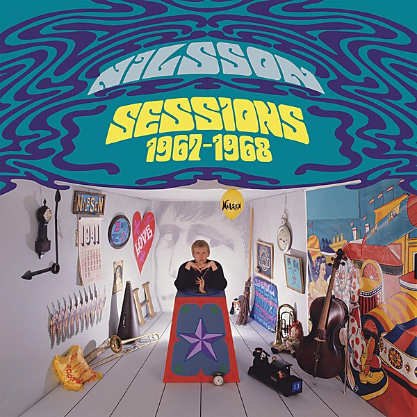

# Nilsson Sessions 1967–1968

By **Harry Nilsson**

## Album Data

- **Catalog:** Beets
- **Format:** Digital, Album
- **Album:** Nilsson Sessions 1967–1968
- **Artist:** Harry Nilsson
- **Albumartist:** Harry Nilsson
- **Genre:** Soft Rock
- **MusicBrainz Album Artist ID:** [e5963d26-01fa-40f5-b200-e0127f410a45](https://musicbrainz.org/artist/e5963d26-01fa-40f5-b200-e0127f410a45)
- **MusicBrainz Album ID:** [229fefd4-81ac-416a-84f7-b42c76f974ff](https://musicbrainz.org/release/229fefd4-81ac-416a-84f7-b42c76f974ff)
- **MusicBrainz Release Group ID:** [ed013434-2574-4b15-bc48-eb9a76dbc2fb](https://musicbrainz.org/release-group/ed013434-2574-4b15-bc48-eb9a76dbc2fb)
- **Year:** 2013
- **Catalog #:** 
- **Label:** Legacy
- **Total Tracks:** 20

## Album Tracks

### Track 01 - Walk Right Back

- **Artist:** Harry Nilsson
- **Format:** ALAC
- **Genre:** Soft Rock
- **Length:** 2:31
- **MusicBrainz Track ID:** [f13b7297-37a3-4b44-9681-8cd687838838](https://musicbrainz.org/recording/f13b7297-37a3-4b44-9681-8cd687838838)
- **Title:** Walk Right Back
- **Track:** 01
- **Year:** 2013

### Track 02 - Jump Into the Fire (alternate version)

- **Artist:** Harry Nilsson
- **Format:** ALAC
- **Genre:** Soft Rock
- **Length:** 3:08
- **MusicBrainz Track ID:** [27eb9112-9268-4afe-a66d-426e63a0b326](https://musicbrainz.org/recording/27eb9112-9268-4afe-a66d-426e63a0b326)
- **Title:** Jump Into the Fire (alternate version)
- **Track:** 02
- **Year:** 2013

### Track 03 - Isolation

- **Artist:** Harry Nilsson
- **Format:** ALAC
- **Genre:** Soft Rock
- **Length:** 3:00
- **MusicBrainz Track ID:** [36b79bcd-c659-4ed1-a6ec-38de008ef78b](https://musicbrainz.org/recording/36b79bcd-c659-4ed1-a6ec-38de008ef78b)
- **Title:** Isolation
- **Track:** 03
- **Year:** 2013

### Track 04 - Without You (demo)

- **Artist:** Harry Nilsson
- **Format:** ALAC
- **Genre:** Soft Rock
- **Length:** 3:55
- **MusicBrainz Track ID:** [7e48d7f7-065e-493e-a551-4fc56694c623](https://musicbrainz.org/recording/7e48d7f7-065e-493e-a551-4fc56694c623)
- **Title:** Without You (demo)
- **Track:** 04
- **Year:** 2013

### Track 05 - Driving Along (demo)

- **Artist:** Harry Nilsson
- **Format:** ALAC
- **Genre:** Soft Rock
- **Length:** 0:56
- **MusicBrainz Track ID:** [fd4677b2-2ff8-4350-a946-f67a4e121344](https://musicbrainz.org/recording/fd4677b2-2ff8-4350-a946-f67a4e121344)
- **Title:** Driving Along (demo)
- **Track:** 05
- **Year:** 2013

### Track 06 - Gotta Get Up (demo)

- **Artist:** Harry Nilsson
- **Format:** ALAC
- **Genre:** Soft Rock
- **Length:** 1:53
- **MusicBrainz Track ID:** [eccde5c2-fd23-4620-8f90-b08c5f9828a0](https://musicbrainz.org/recording/eccde5c2-fd23-4620-8f90-b08c5f9828a0)
- **Title:** Gotta Get Up (demo)
- **Track:** 06
- **Year:** 2013

### Track 07 - Coconut (demo)

- **Artist:** Harry Nilsson
- **Format:** ALAC
- **Genre:** Soft Rock
- **Length:** 4:02
- **MusicBrainz Track ID:** [4c074d46-c733-4bc7-bfe8-ff563bb1426f](https://musicbrainz.org/recording/4c074d46-c733-4bc7-bfe8-ff563bb1426f)
- **Title:** Coconut (demo)
- **Track:** 07
- **Year:** 2013

### Track 08 - Old Forgotten Soldier (alternate demo)

- **Artist:** Harry Nilsson
- **Format:** ALAC
- **Genre:** Soft Rock
- **Length:** 3:10
- **MusicBrainz Track ID:** [6905d86e-d9b6-4873-be01-754943f59fbb](https://musicbrainz.org/recording/6905d86e-d9b6-4873-be01-754943f59fbb)
- **Title:** Old Forgotten Soldier (alternate demo)
- **Track:** 08
- **Year:** 2013

### Track 09 - Down (demo)

- **Artist:** Harry Nilsson
- **Format:** ALAC
- **Genre:** Soft Rock
- **Length:** 4:01
- **MusicBrainz Track ID:** [ecb44456-c686-4414-a4ad-4036476a9768](https://musicbrainz.org/recording/ecb44456-c686-4414-a4ad-4036476a9768)
- **Title:** Down (demo)
- **Track:** 09
- **Year:** 2013

### Track 10 - The Moonbeam Song (demo)

- **Artist:** Harry Nilsson
- **Format:** ALAC
- **Genre:** Soft Rock
- **Length:** 1:49
- **MusicBrainz Track ID:** [4c8cb79c-b512-4caa-97b7-d1aa836baf03](https://musicbrainz.org/recording/4c8cb79c-b512-4caa-97b7-d1aa836baf03)
- **Title:** The Moonbeam Song (demo)
- **Track:** 10
- **Year:** 2013

### Track 11 - Jump Into the Fire (single version)

- **Artist:** Harry Nilsson
- **Format:** ALAC
- **Genre:** Soft Rock
- **Length:** 3:34
- **MusicBrainz Track ID:** [183cffd2-c888-47ee-9cd1-b2f25bf4da6e](https://musicbrainz.org/recording/183cffd2-c888-47ee-9cd1-b2f25bf4da6e)
- **Title:** Jump Into the Fire (single version)
- **Track:** 11
- **Year:** 2013

### Track 12 - Per chi (Italian version “Without You”)

- **Artist:** Harry Nilsson
- **Format:** ALAC
- **Genre:** Soft Rock
- **Length:** 3:15
- **MusicBrainz Track ID:** [ca41e8f9-f568-4347-b86d-1946f9dda499](https://musicbrainz.org/recording/ca41e8f9-f568-4347-b86d-1946f9dda499)
- **Title:** Per chi (Italian version “Without You”)
- **Track:** 12
- **Year:** 2013

### Track 13 - Joy (guitar version demo)

- **Artist:** Harry Nilsson
- **Format:** ALAC
- **Genre:** Soft Rock
- **Length:** 1:55
- **MusicBrainz Track ID:** [69ea8782-a1b8-44a4-91e9-a4302b593804](https://musicbrainz.org/recording/69ea8782-a1b8-44a4-91e9-a4302b593804)
- **Title:** Joy (guitar version demo)
- **Track:** 13
- **Year:** 2013

### Track 14 - Joy (piano version demo)

- **Artist:** Harry Nilsson
- **Format:** ALAC
- **Genre:** Soft Rock
- **Length:** 0:57
- **MusicBrainz Track ID:** [55124727-dabc-4c99-acf2-0910f892ebb7](https://musicbrainz.org/recording/55124727-dabc-4c99-acf2-0910f892ebb7)
- **Title:** Joy (piano version demo)
- **Track:** 14
- **Year:** 2013

### Track 15 - You Made Me Love You

- **Artist:** Harry Nilsson
- **Format:** ALAC
- **Genre:** Easy Listening
- **Length:** 2:29
- **MusicBrainz Track ID:** [6b5db7fd-8326-41b5-9498-43b21ef59106](https://musicbrainz.org/recording/6b5db7fd-8326-41b5-9498-43b21ef59106)
- **Title:** You Made Me Love You
- **Track:** 15
- **Year:** 2013

### Track 16 - Lullaby in Ragtime

- **Artist:** Harry Nilsson
- **Format:** ALAC
- **Genre:** Easy Listening
- **Length:** 3:49
- **MusicBrainz Track ID:** [d6307468-932a-4674-92a7-981a7104a435](https://musicbrainz.org/recording/d6307468-932a-4674-92a7-981a7104a435)
- **Title:** Lullaby in Ragtime
- **Track:** 16
- **Year:** 2013

### Track 17 - Always

- **Artist:** Harry Nilsson
- **Format:** ALAC
- **Genre:** Soft Rock
- **Length:** 1:48
- **MusicBrainz Track ID:** [6ad613ba-2453-45ed-a10a-070dab876806](https://musicbrainz.org/recording/6ad613ba-2453-45ed-a10a-070dab876806)
- **Title:** Always
- **Track:** 17
- **Year:** 2013

### Track 18 - It Had to Be You

- **Artist:** Harry Nilsson
- **Format:** ALAC
- **Genre:** Swing
- **Length:** 2:40
- **MusicBrainz Track ID:** [9a99f8b8-7204-4f00-8e8a-280f7d0ea250](https://musicbrainz.org/recording/9a99f8b8-7204-4f00-8e8a-280f7d0ea250)
- **Title:** It Had to Be You
- **Track:** 18
- **Year:** 2013

### Track 19 - I Want You to Sit on My Face

- **Artist:** Harry Nilsson
- **Format:** ALAC
- **Genre:** Soft Rock
- **Length:** 2:53
- **MusicBrainz Track ID:** [538997fb-2c08-4631-b784-bde3cb0bf56b](https://musicbrainz.org/recording/538997fb-2c08-4631-b784-bde3cb0bf56b)
- **Title:** I Want You to Sit on My Face
- **Track:** 19
- **Year:** 2013

### Track 20 - A Souvenir (Also Sprach Schmilsson Schmixon)

- **Artist:** Harry Nilsson
- **Format:** ALAC
- **Genre:** Soft Rock
- **Length:** 1:10
- **MusicBrainz Track ID:** [01f589d5-daa1-49a4-9004-20f9d2fee825](https://musicbrainz.org/recording/01f589d5-daa1-49a4-9004-20f9d2fee825)
- **Title:** A Souvenir (Also Sprach Schmilsson Schmixon)
- **Track:** 20
- **Year:** 2013

