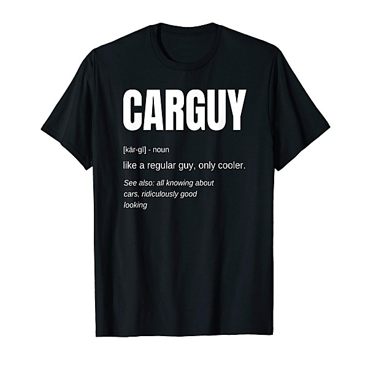

# Nilsson Sessions 1968-1971

By **Harry Nilsson**

## Album Data

- **Catalog:** Beets
- **Format:** Digital, Album
- **Album:** Nilsson Sessions 1968-1971
- **Artist:** Harry Nilsson
- **Albumartist:** Harry Nilsson
- **Genre:** Soft Rock
- **MusicBrainz Album Artist ID:** 
- **MusicBrainz Album ID:** 
- **MusicBrainz Release Group ID:** 
- **Year:** 1968
- **Catalog #:** 
- **Label:** 
- **Total Tracks:** 15

## Album Tracks

### Track 12 - What’s Your Sign?

- **Artist:** Harry Nilsson
- **Format:** ALAC
- **Genre:** Rock
- **Length:** 3:05
- **MusicBrainz Track ID:** [7fb2a521-e425-439c-a2d7-f3b2ac641e39](https://musicbrainz.org/recording/7fb2a521-e425-439c-a2d7-f3b2ac641e39)
- **Title:** What’s Your Sign?
- **Track:** 12
- **Year:** 1972

### Track 13 - Take 54 (alternate take)

- **Artist:** Harry Nilsson
- **Format:** ALAC
- **Genre:** Rock
- **Length:** 3:39
- **MusicBrainz Track ID:** [d5a97fdd-1d62-4d03-913e-eafab8d18f0a](https://musicbrainz.org/recording/d5a97fdd-1d62-4d03-913e-eafab8d18f0a)
- **Title:** Take 54 (alternate take)
- **Track:** 13
- **Year:** 1972

### Track 14 - Campo de Encino

- **Artist:** Harry Nilsson
- **Format:** ALAC
- **Genre:** Comedy
- **Length:** 4:54
- **MusicBrainz Track ID:** [63d7b68d-313d-4172-bfce-a74305111ded](https://musicbrainz.org/recording/63d7b68d-313d-4172-bfce-a74305111ded)
- **Title:** Campo de Encino
- **Track:** 14
- **Year:** 1972

