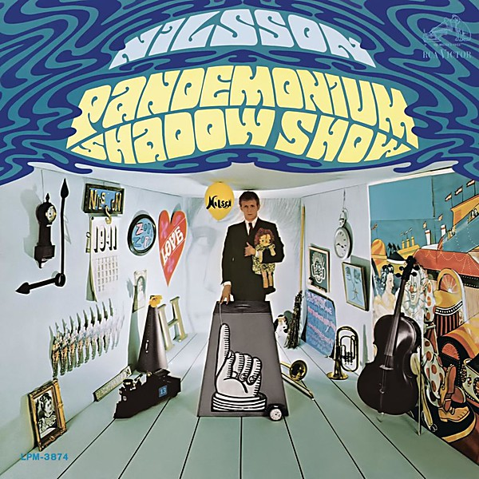

# Pandemonium Shadow Show

By **Harry Nilsson**

## Album Data

- **Catalog:** Beets
- **Format:** Digital, Album
- **Album:** Pandemonium Shadow Show
- **Artist:** Harry Nilsson
- **Albumartist:** Harry Nilsson
- **Genre:** Psychedelic Pop
- **MusicBrainz Album Artist ID:** [e5963d26-01fa-40f5-b200-e0127f410a45](https://musicbrainz.org/artist/e5963d26-01fa-40f5-b200-e0127f410a45)
- **MusicBrainz Album ID:** [1bdf6f0c-a563-4b6b-aa2d-e856019f405b](https://musicbrainz.org/release/1bdf6f0c-a563-4b6b-aa2d-e856019f405b)
- **MusicBrainz Release Group ID:** [f782009a-02f6-35f3-8940-6f1d53989ad1](https://musicbrainz.org/release-group/f782009a-02f6-35f3-8940-6f1d53989ad1)
- **Year:** 1967
- **Catalog #:** BVCM-35124
- **Label:** BMG Japan
- **Total Tracks:** 15

## Album Tracks

### Track 01 - Many Rivers to Cross

- **Artist:** Harry Nilsson
- **Format:** MP3
- **Genre:** Soft Rock
- **Length:** 4:59
- **MusicBrainz Track ID:** [63f94f80-6f15-4ffe-a05e-ef0fa6d84500](https://musicbrainz.org/recording/63f94f80-6f15-4ffe-a05e-ef0fa6d84500)
- **Title:** Many Rivers to Cross
- **Track:** 01
- **Year:** 2007

### Track 02 - Subterranean Homesick Blues

- **Artist:** Harry Nilsson
- **Format:** MP3
- **Genre:** Glam Rock
- **Length:** 3:19
- **MusicBrainz Track ID:** [17d5eef7-2c19-4cd7-b5eb-b52dc915017a](https://musicbrainz.org/recording/17d5eef7-2c19-4cd7-b5eb-b52dc915017a)
- **Title:** Subterranean Homesick Blues
- **Track:** 02
- **Year:** 2007

### Track 03 - Don't Forget Me

- **Artist:** Harry Nilsson
- **Format:** AAC
- **Genre:** Soft Rock
- **Length:** 3:38
- **MusicBrainz Track ID:** [a58f791b-e4a8-4e76-a2fe-ab602da905f0](https://musicbrainz.org/recording/a58f791b-e4a8-4e76-a2fe-ab602da905f0)
- **Title:** Don't Forget Me
- **Track:** 03
- **Year:** 2007

### Track 04 - All My Life

- **Artist:** Harry Nilsson
- **Format:** MP3
- **Genre:** Rock
- **Length:** 3:12
- **MusicBrainz Track ID:** [8197d18e-326a-4969-82c8-705f6dc60407](https://musicbrainz.org/recording/8197d18e-326a-4969-82c8-705f6dc60407)
- **Title:** All My Life
- **Track:** 04
- **Year:** 2007

### Track 05 - Old Forgotten Soldier

- **Artist:** Harry Nilsson
- **Format:** AAC
- **Genre:** Easy Listening
- **Length:** 4:15
- **MusicBrainz Track ID:** [eec00c2c-4626-4ba4-be69-63e41926be8f](https://musicbrainz.org/recording/eec00c2c-4626-4ba4-be69-63e41926be8f)
- **Title:** Old Forgotten Soldier
- **Track:** 05
- **Year:** 2007

### Track 06 - Save the Last Dance for Me

- **Artist:** Harry Nilsson
- **Format:** MP3
- **Genre:** Soft Rock
- **Length:** 4:30
- **MusicBrainz Track ID:** [dd54b039-28a9-4216-921e-b87c0121892c](https://musicbrainz.org/recording/dd54b039-28a9-4216-921e-b87c0121892c)
- **Title:** Save the Last Dance for Me
- **Track:** 06
- **Year:** 2007

### Track 07 - Mucho Mungo / Mt. Elga

- **Artist:** Harry Nilsson
- **Format:** MP3
- **Genre:** Rock
- **Length:** 3:45
- **MusicBrainz Track ID:** [3bf61950-0fc5-40b8-b778-94bf6d8fa46f](https://musicbrainz.org/recording/3bf61950-0fc5-40b8-b778-94bf6d8fa46f)
- **Title:** Mucho Mungo / Mt. Elga
- **Track:** 07
- **Year:** 2007

### Track 08 - Loop de Loop

- **Artist:** Harry Nilsson
- **Format:** MP3
- **Genre:** Rock
- **Length:** 2:43
- **MusicBrainz Track ID:** [f568223b-cc93-42de-8412-7e8e837baa84](https://musicbrainz.org/recording/f568223b-cc93-42de-8412-7e8e837baa84)
- **Title:** Loop de Loop
- **Track:** 08
- **Year:** 2007

### Track 09 - Black Sails

- **Artist:** Harry Nilsson
- **Format:** AAC
- **Genre:** Rock
- **Length:** 3:17
- **MusicBrainz Track ID:** [bbdd0815-718d-4035-a041-99f8e22442bb](https://musicbrainz.org/recording/bbdd0815-718d-4035-a041-99f8e22442bb)
- **Title:** Black Sails
- **Track:** 09
- **Year:** 2007

### Track 10 - Rock Around the Clock

- **Artist:** Harry Nilsson
- **Format:** MP3
- **Genre:** Rock
- **Length:** 3:12
- **MusicBrainz Track ID:** [10d79546-01ac-4758-a590-e12395677a4d](https://musicbrainz.org/recording/10d79546-01ac-4758-a590-e12395677a4d)
- **Title:** Rock Around the Clock
- **Track:** 10
- **Year:** 2007

### Track 11 - Down by the Sea (alternate version)

- **Artist:** Harry Nilsson
- **Format:** MP3
- **Genre:** Rock
- **Length:** 5:37
- **MusicBrainz Track ID:** [b16c145b-34d9-4638-892b-3ce90da14371](https://musicbrainz.org/recording/b16c145b-34d9-4638-892b-3ce90da14371)
- **Title:** Down by the Sea (alternate version)
- **Track:** 11
- **Year:** 2007

### Track 12 - The Flying Saucer Song (alternate version)

- **Artist:** Harry Nilsson
- **Format:** MP3
- **Genre:** Rock
- **Length:** 6:28
- **MusicBrainz Track ID:** [547cc421-a8cd-4b5d-b562-311c1f8d74c1](https://musicbrainz.org/recording/547cc421-a8cd-4b5d-b562-311c1f8d74c1)
- **Title:** The Flying Saucer Song (alternate version)
- **Track:** 12
- **Year:** 2007

### Track 13 - Save the Last Dance for Me (alternate version)

- **Artist:** Harry Nilsson
- **Format:** AAC
- **Genre:** Rock
- **Length:** 4:27
- **MusicBrainz Track ID:** [e740b640-1463-4b8b-aa01-1f7845aea880](https://musicbrainz.org/recording/e740b640-1463-4b8b-aa01-1f7845aea880)
- **Title:** Save the Last Dance for Me (alternate version)
- **Track:** 13
- **Year:** 2007

### Track 14 - Old Forgotten Soldier (demo 1)

- **Artist:** Harry Nilsson
- **Format:** AAC
- **Genre:** Rock
- **Length:** 3:07
- **MusicBrainz Track ID:** [1274af41-3a39-492b-b720-7dc866727673](https://musicbrainz.org/recording/1274af41-3a39-492b-b720-7dc866727673)
- **Title:** Old Forgotten Soldier (demo 1)
- **Track:** 14
- **Year:** 2007

### Track 15 - Old Forgotten Soldier (demo 2)

- **Artist:** Harry Nilsson
- **Format:** MP3
- **Genre:** Rock
- **Length:** 2:43
- **MusicBrainz Track ID:** [c8365e02-a8ad-4266-8dfd-f45eab67a367](https://musicbrainz.org/recording/c8365e02-a8ad-4266-8dfd-f45eab67a367)
- **Title:** Old Forgotten Soldier (demo 2)
- **Track:** 15
- **Year:** 2007

