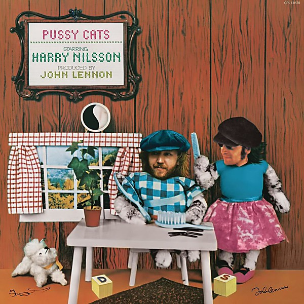

# Pussy Cats

By **Harry Nilsson**

## Album Data

- **Catalog:** Beets
- **Format:** Digital, Album
- **Album:** Pussy Cats
- **Artist:** Harry Nilsson
- **Albumartist:** Harry Nilsson
- **Genre:** Rock
- **MusicBrainz Album Artist ID:** [e5963d26-01fa-40f5-b200-e0127f410a45](https://musicbrainz.org/artist/e5963d26-01fa-40f5-b200-e0127f410a45)
- **MusicBrainz Album ID:** [a85060eb-59e7-4ed7-95a6-501b7c813a2d](https://musicbrainz.org/release/a85060eb-59e7-4ed7-95a6-501b7c813a2d)
- **MusicBrainz Release Group ID:** [2b9db00f-a718-30ca-8cff-17a268f10a8b](https://musicbrainz.org/release-group/2b9db00f-a718-30ca-8cff-17a268f10a8b)
- **Year:** 2007
- **Catalog #:** 
- **Label:** Legacy
- **Total Tracks:** 09

## Album Tracks

### Track 01 - I’ll Take a Tango

- **Artist:** Harry Nilsson
- **Format:** ALAC
- **Genre:** Soft Rock
- **Length:** 3:07
- **MusicBrainz Track ID:** [bfcc675c-7096-41e4-9c14-c8daea07373f](https://musicbrainz.org/recording/bfcc675c-7096-41e4-9c14-c8daea07373f)
- **Title:** I’ll Take a Tango
- **Track:** 01
- **Year:** 1976

### Track 02 - Something True

- **Artist:** Harry Nilsson
- **Format:** ALAC
- **Genre:** Soft Rock
- **Length:** 2:56
- **MusicBrainz Track ID:** [ac115a5d-581a-4ad0-971d-16dd85cf7654](https://musicbrainz.org/recording/ac115a5d-581a-4ad0-971d-16dd85cf7654)
- **Title:** Something True
- **Track:** 02
- **Year:** 1976

### Track 03 - Pretty Soon There’ll Be Nothing Left for Everybody

- **Artist:** Harry Nilsson
- **Format:** ALAC
- **Genre:** Soft Rock
- **Length:** 2:54
- **MusicBrainz Track ID:** [edcfbe51-d621-4628-a49f-b36a33127c50](https://musicbrainz.org/recording/edcfbe51-d621-4628-a49f-b36a33127c50)
- **Title:** Pretty Soon There’ll Be Nothing Left for Everybody
- **Track:** 03
- **Year:** 1976

### Track 04 - The Ivy Covered Walls

- **Artist:** Harry Nilsson
- **Format:** ALAC
- **Genre:** Soft Rock
- **Length:** 3:18
- **MusicBrainz Track ID:** [b6d06634-c559-400c-be00-2701fb422307](https://musicbrainz.org/recording/b6d06634-c559-400c-be00-2701fb422307)
- **Title:** The Ivy Covered Walls
- **Track:** 04
- **Year:** 1976

### Track 05 - (Thursday) Here’s Why I Did Not Go to Work Today

- **Artist:** Harry Nilsson
- **Format:** ALAC
- **Genre:** Soft Rock
- **Length:** 4:22
- **MusicBrainz Track ID:** [33d5a580-99ce-43f3-bae0-2f010a35cf0d](https://musicbrainz.org/recording/33d5a580-99ce-43f3-bae0-2f010a35cf0d)
- **Title:** (Thursday) Here’s Why I Did Not Go to Work Today
- **Track:** 05
- **Year:** 1976

### Track 06 - The Flying Saucer Song

- **Artist:** Harry Nilsson
- **Format:** ALAC
- **Genre:** Soft Rock
- **Length:** 6:49
- **MusicBrainz Track ID:** [1b79134f-00a3-4b7c-a282-d2405e1e6871](https://musicbrainz.org/recording/1b79134f-00a3-4b7c-a282-d2405e1e6871)
- **Title:** The Flying Saucer Song
- **Track:** 06
- **Year:** 1976

### Track 07 - How to Write a Song

- **Artist:** Harry Nilsson
- **Format:** ALAC
- **Genre:** Soft Rock
- **Length:** 3:14
- **MusicBrainz Track ID:** [467fe5d7-9809-4a4d-8b20-58a6181ae917](https://musicbrainz.org/recording/467fe5d7-9809-4a4d-8b20-58a6181ae917)
- **Title:** How to Write a Song
- **Track:** 07
- **Year:** 1976

### Track 08 - Jesus Christ You’re Tall

- **Artist:** Harry Nilsson
- **Format:** ALAC
- **Genre:** Soft Rock
- **Length:** 4:14
- **MusicBrainz Track ID:** [f22ea36f-710c-4864-bfa2-affef1c8348f](https://musicbrainz.org/recording/f22ea36f-710c-4864-bfa2-affef1c8348f)
- **Title:** Jesus Christ You’re Tall
- **Track:** 08
- **Year:** 1976

### Track 09 - Will She Miss Me

- **Artist:** Harry Nilsson
- **Format:** ALAC
- **Genre:** Sunshine Pop
- **Length:** 4:48
- **MusicBrainz Track ID:** [100bc311-b93c-4e93-933f-adeb03ea8a0e](https://musicbrainz.org/recording/100bc311-b93c-4e93-933f-adeb03ea8a0e)
- **Title:** Will She Miss Me
- **Track:** 09
- **Year:** 1976

