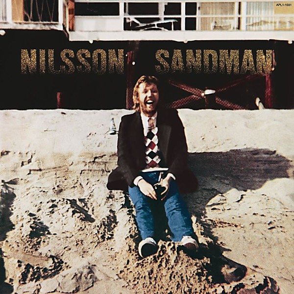

# Sandman

By **Harry Nilsson**

## Album Data

- **Catalog:** Beets
- **Format:** Digital, Album
- **Album:** Sandman
- **Artist:** Harry Nilsson
- **Albumartist:** Harry Nilsson
- **Genre:** Soft Rock
- **MusicBrainz Album Artist ID:** [e5963d26-01fa-40f5-b200-e0127f410a45](https://musicbrainz.org/artist/e5963d26-01fa-40f5-b200-e0127f410a45)
- **MusicBrainz Album ID:** [9130088c-f859-4ac1-94eb-17beb1b8a7e9](https://musicbrainz.org/release/9130088c-f859-4ac1-94eb-17beb1b8a7e9)
- **MusicBrainz Release Group ID:** [a53b13f0-9b2a-34ae-b01e-85cc3bd9a38a](https://musicbrainz.org/release-group/a53b13f0-9b2a-34ae-b01e-85cc3bd9a38a)
- **Year:** 1976
- **Catalog #:** 
- **Label:** Legacy
- **Total Tracks:** 09

## Album Tracks

### Track 01 - I’ll Take a Tango

- **Artist:** Harry Nilsson
- **Format:** ALAC
- **Genre:** Soft Rock
- **Length:** 3:07
- **MusicBrainz Track ID:** [bfcc675c-7096-41e4-9c14-c8daea07373f](https://musicbrainz.org/recording/bfcc675c-7096-41e4-9c14-c8daea07373f)
- **Title:** I’ll Take a Tango
- **Track:** 01
- **Year:** 1976

### Track 02 - Something True

- **Artist:** Harry Nilsson
- **Format:** ALAC
- **Genre:** Soft Rock
- **Length:** 2:56
- **MusicBrainz Track ID:** [ac115a5d-581a-4ad0-971d-16dd85cf7654](https://musicbrainz.org/recording/ac115a5d-581a-4ad0-971d-16dd85cf7654)
- **Title:** Something True
- **Track:** 02
- **Year:** 1976

### Track 03 - Pretty Soon There’ll Be Nothing Left for Everybody

- **Artist:** Harry Nilsson
- **Format:** ALAC
- **Genre:** Soft Rock
- **Length:** 2:54
- **MusicBrainz Track ID:** [edcfbe51-d621-4628-a49f-b36a33127c50](https://musicbrainz.org/recording/edcfbe51-d621-4628-a49f-b36a33127c50)
- **Title:** Pretty Soon There’ll Be Nothing Left for Everybody
- **Track:** 03
- **Year:** 1976

### Track 04 - The Ivy Covered Walls

- **Artist:** Harry Nilsson
- **Format:** ALAC
- **Genre:** Soft Rock
- **Length:** 3:18
- **MusicBrainz Track ID:** [b6d06634-c559-400c-be00-2701fb422307](https://musicbrainz.org/recording/b6d06634-c559-400c-be00-2701fb422307)
- **Title:** The Ivy Covered Walls
- **Track:** 04
- **Year:** 1976

### Track 05 - (Thursday) Here’s Why I Did Not Go to Work Today

- **Artist:** Harry Nilsson
- **Format:** ALAC
- **Genre:** Soft Rock
- **Length:** 4:22
- **MusicBrainz Track ID:** [33d5a580-99ce-43f3-bae0-2f010a35cf0d](https://musicbrainz.org/recording/33d5a580-99ce-43f3-bae0-2f010a35cf0d)
- **Title:** (Thursday) Here’s Why I Did Not Go to Work Today
- **Track:** 05
- **Year:** 1976

### Track 06 - The Flying Saucer Song

- **Artist:** Harry Nilsson
- **Format:** ALAC
- **Genre:** Soft Rock
- **Length:** 6:49
- **MusicBrainz Track ID:** [1b79134f-00a3-4b7c-a282-d2405e1e6871](https://musicbrainz.org/recording/1b79134f-00a3-4b7c-a282-d2405e1e6871)
- **Title:** The Flying Saucer Song
- **Track:** 06
- **Year:** 1976

### Track 07 - How to Write a Song

- **Artist:** Harry Nilsson
- **Format:** ALAC
- **Genre:** Soft Rock
- **Length:** 3:14
- **MusicBrainz Track ID:** [467fe5d7-9809-4a4d-8b20-58a6181ae917](https://musicbrainz.org/recording/467fe5d7-9809-4a4d-8b20-58a6181ae917)
- **Title:** How to Write a Song
- **Track:** 07
- **Year:** 1976

### Track 08 - Jesus Christ You’re Tall

- **Artist:** Harry Nilsson
- **Format:** ALAC
- **Genre:** Soft Rock
- **Length:** 4:14
- **MusicBrainz Track ID:** [f22ea36f-710c-4864-bfa2-affef1c8348f](https://musicbrainz.org/recording/f22ea36f-710c-4864-bfa2-affef1c8348f)
- **Title:** Jesus Christ You’re Tall
- **Track:** 08
- **Year:** 1976

### Track 09 - Will She Miss Me

- **Artist:** Harry Nilsson
- **Format:** ALAC
- **Genre:** Sunshine Pop
- **Length:** 4:48
- **MusicBrainz Track ID:** [100bc311-b93c-4e93-933f-adeb03ea8a0e](https://musicbrainz.org/recording/100bc311-b93c-4e93-933f-adeb03ea8a0e)
- **Title:** Will She Miss Me
- **Track:** 09
- **Year:** 1976

## See also

- [Aerial Ballet [stereo - mono]](Aerial_Ballet_[stereo_-_mono].md)
- [Aerial Pandemonium Ballet](Aerial_Pandemonium_Ballet.md)
- [A Little Touch Of Schmilsson In The Night](A_Little_Touch_Of_Schmilsson_In_The_Night.md)
- [Duit on Mon Dei](Duit_on_Mon_Dei.md)
- [Flash Harry](Flash_Harry.md)
- [Harry](Harry.md)
- [Harry Nilsson - Anthology - Personal Best - CD1](Harry_Nilsson_-_Anthology_-_Personal_Best_-_CD1.md)
- [KNNILLSSONN](KNNILLSSONN.md)
- [Nilsson Schmilsson](Nilsson_Schmilsson.md)
- [Nilsson Sessions 1967–1968](Nilsson_Sessions_1967–1968.md)
- [Nilsson Sessions 1968-1971](Nilsson_Sessions_1968-1971.md)
- [Nilsson Sessions 1971–1974](Nilsson_Sessions_1971–1974.md)
- [Nilsson Sings Newman](Nilsson_Sings_Newman.md)
- [Pandemonium Shadow Show](Pandemonium_Shadow_Show.md)
- [Pussy Cats](Pussy_Cats.md)
- [Son of Schmilsson](Son_of_Schmilsson.md)
- [Son Of Schmilsson](Son_Of_Schmilsson.md)
- [...That's The Way It Is](Thats_The_Way_It_Is.md)
- [The Point!](The_Point!.md)
- [CD: Aerial Ballet](../../CD/Harry_Nilsson/Aerial_Ballet.md)
- [CD: Aerial Pandemonium Ballet](../../CD/Harry_Nilsson/Aerial_Pandemonium_Ballet.md)
- [CD: A Little Touch Of Schmilsson In The Night](../../CD/Harry_Nilsson/A_Little_Touch_Of_Schmilsson_In_The_Night.md)
- [CD: Duit On Mon Dei](../../CD/Harry_Nilsson/Duit_On_Mon_Dei.md)
- [CD: Harry](../../CD/Harry_Nilsson/Harry.md)
- [CD: ](../../CD/Harry_Nilsson/Harry_Nilsson.md)
- [CD: Knnillsson](../../CD/Harry_Nilsson/Knnillsson.md)
- [CD: Nilsson Schmilsson](../../CD/Harry_Nilsson/Nilsson_Schmilsson.md)
- [CD: Nilsson Sessions 1967-1968](../../CD/Harry_Nilsson/Nilsson_Sessions_1967-1968.md)
- [CD: Nilsson Sessions 1968-1971](../../CD/Harry_Nilsson/Nilsson_Sessions_1968-1971.md)
- [CD: Nilsson Sessions 1971-1974](../../CD/Harry_Nilsson/Nilsson_Sessions_1971-1974.md)
- [CD: Nilsson Sings Newman (Remastered + Expanded)](../../CD/Harry_Nilsson/Nilsson_Sings_Newman_Remastered_+_Expanded.md)
- [CD: Pandemonium Shadow Show](../../CD/Harry_Nilsson/Pandemonium_Shadow_Show.md)
- [CD: Pussy Cats](../../CD/Harry_Nilsson/Pussy_Cats.md)
- [CD: Sandman](../../CD/Harry_Nilsson/Sandman.md)
- [CD: Son Of Schmilsson](../../CD/Harry_Nilsson/Son_Of_Schmilsson.md)
- [CD: ...That's The Way It Is](../../CD/Harry_Nilsson/Thats_The_Way_It_Is.md)
- [CD: The Point!](../../CD/Harry_Nilsson/The_Point!.md)
- [Roon: Aerial Pandemonium Ballet](../../Roon/Harry_Nilsson/Aerial_Pandemonium_Ballet.md)
- [Roon: A Little Touch of Schmilsson in the Night](../../Roon/Harry_Nilsson/A_Little_Touch_of_Schmilsson_in_the_Night.md)
- [Roon: Duit On Mon Dei](../../Roon/Harry_Nilsson/Duit_On_Mon_Dei.md)
- [Roon: Flash Harry](../../Roon/Harry_Nilsson/Flash_Harry.md)
- [Roon: Harry](../../Roon/Harry_Nilsson/Harry.md)
- [Roon: Knnillssonn](../../Roon/Harry_Nilsson/Knnillssonn.md)
- [Roon: Nilsson Schmilsson](../../Roon/Harry_Nilsson/Nilsson_Schmilsson.md)
- [Roon: Nilsson Sings Newman](../../Roon/Harry_Nilsson/Nilsson_Sings_Newman.md)
- [Roon: Pandemonium Shadow Show](../../Roon/Harry_Nilsson/Pandemonium_Shadow_Show.md)
- [Roon: Popeye (Music From The Motion Picture / The Deluxe Edition)](../../Roon/Harry_Nilsson/Popeye_Music_From_The_Motion_Picture_-_The_Deluxe_Edition.md)
- [Roon: Pussy Cats](../../Roon/Harry_Nilsson/Pussy_Cats.md)
- [Roon: Sandman](../../Roon/Harry_Nilsson/Sandman.md)
- [Roon: Son Of Schmilsson](../../Roon/Harry_Nilsson/Son_Of_Schmilsson.md)
- [Roon: Spotlight On Nilsson](../../Roon/Harry_Nilsson/Spotlight_On_Nilsson.md)
- [Roon: That's the Way It Is](../../Roon/Harry_Nilsson/Thats_the_Way_It_Is.md)
- [Roon: The Point!](../../Roon/Harry_Nilsson/The_Point!.md)
- [Vinyl: Everybody's Talkin'](../../Vinyl/Harry_Nilsson/Everybodys_Talkin.md)
- [Vinyl: ](../../Vinyl/Harry_Nilsson/Harry_Nilsson.md)
- [Vinyl: Nilsson Schmilsson](../../Vinyl/Harry_Nilsson/Nilsson_Schmilsson.md)
- [Vinyl: Son Of Schmilsson](../../Vinyl/Harry_Nilsson/Son_Of_Schmilsson.md)
