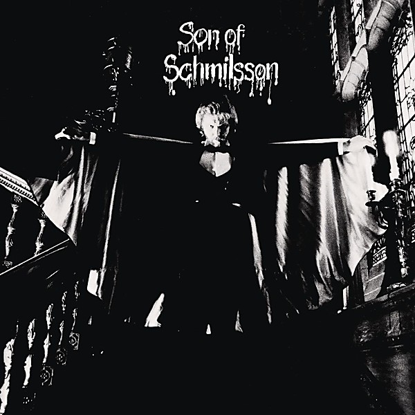

# Son Of Schmilsson

By **Harry Nilsson**

## Album Data

- **Catalog:** Beets
- **Format:** Digital, Album
- **Album:** Son Of Schmilsson
- **Artist:** Harry Nilsson
- **Albumartist:** Harry Nilsson
- **Genre:** Rock
- **MusicBrainz Album Artist ID:** 
- **MusicBrainz Album ID:** 
- **MusicBrainz Release Group ID:** 
- **Year:** 1972
- **Catalog #:** 
- **Label:** 
- **Total Tracks:** 17

## Album Tracks

### Track 17 - Down To The Valley

- **Artist:** Harry Nilsson
- **Format:** ALAC
- **Genre:** Soft Rock
- **Length:** 4:53
- **MusicBrainz Track ID:** 
- **Title:** Down To The Valley
- **Track:** 17
- **Year:** 2002

### Track 01 - Everything’s Got ’em

- **Artist:** Harry Nilsson
- **Format:** ALAC
- **Genre:** Soft Rock
- **Length:** 2:28
- **MusicBrainz Track ID:** [9cf7a7ea-a30d-44ed-bbd6-01b38992ecfe](https://musicbrainz.org/recording/9cf7a7ea-a30d-44ed-bbd6-01b38992ecfe)
- **Title:** Everything’s Got ’em
- **Track:** 01
- **Year:** 2002

### Track 02 - The Town (Narration)

- **Artist:** Harry Nilsson
- **Format:** ALAC
- **Genre:** Soft Rock
- **Length:** 1:29
- **MusicBrainz Track ID:** [486fa672-e023-4650-864a-2d0d1331bbe9](https://musicbrainz.org/recording/486fa672-e023-4650-864a-2d0d1331bbe9)
- **Title:** The Town (Narration)
- **Track:** 02
- **Year:** 2002

### Track 03 - Me And My Arrow

- **Artist:** Harry Nilsson
- **Format:** ALAC
- **Genre:** Rock
- **Length:** 2:05
- **MusicBrainz Track ID:** [5ea04888-9ea8-4f19-98fe-5764564d5476](https://musicbrainz.org/recording/5ea04888-9ea8-4f19-98fe-5764564d5476)
- **Title:** Me And My Arrow
- **Track:** 03
- **Year:** 2002

### Track 04 - The Game

- **Artist:** Harry Nilsson
- **Format:** ALAC
- **Genre:** Soft Rock
- **Length:** 1:51
- **MusicBrainz Track ID:** [fbce862a-c7dd-42e6-8370-09469db3af68](https://musicbrainz.org/recording/fbce862a-c7dd-42e6-8370-09469db3af68)
- **Title:** The Game
- **Track:** 04
- **Year:** 2002

### Track 05 - Poli High

- **Artist:** Harry Nilsson
- **Format:** ALAC
- **Genre:** Pop
- **Length:** 2:53
- **MusicBrainz Track ID:** [13ca75cf-2ccb-441a-9d1b-10be1da881f1](https://musicbrainz.org/recording/13ca75cf-2ccb-441a-9d1b-10be1da881f1)
- **Title:** Poli High
- **Track:** 05
- **Year:** 2002

### Track 06 - The Trial & Banishment

- **Artist:** Harry Nilsson
- **Format:** ALAC
- **Genre:** Soft Rock
- **Length:** 1:59
- **MusicBrainz Track ID:** [0f2ca304-afe1-41fc-a13c-01a6febdd8dc](https://musicbrainz.org/recording/0f2ca304-afe1-41fc-a13c-01a6febdd8dc)
- **Title:** The Trial & Banishment
- **Track:** 06
- **Year:** 2002

### Track 07 - Think About Your Troubles

- **Artist:** Harry Nilsson
- **Format:** ALAC
- **Genre:** Rock
- **Length:** 2:48
- **MusicBrainz Track ID:** [185c48e0-1f0b-44e7-90d4-c87c62ea4bc9](https://musicbrainz.org/recording/185c48e0-1f0b-44e7-90d4-c87c62ea4bc9)
- **Title:** Think About Your Troubles
- **Track:** 07
- **Year:** 2002

### Track 08 - The Pointed Man

- **Artist:** Harry Nilsson
- **Format:** ALAC
- **Genre:** Soft Rock
- **Length:** 2:43
- **MusicBrainz Track ID:** [8d2c1287-f96e-4e8d-b4c2-35eeab083a0e](https://musicbrainz.org/recording/8d2c1287-f96e-4e8d-b4c2-35eeab083a0e)
- **Title:** The Pointed Man
- **Track:** 08
- **Year:** 2002

### Track 09 - Life Line

- **Artist:** Harry Nilsson
- **Format:** ALAC
- **Genre:** Soft Rock
- **Length:** 2:21
- **MusicBrainz Track ID:** [c3a28251-94ab-49ab-a29a-1acfb2683026](https://musicbrainz.org/recording/c3a28251-94ab-49ab-a29a-1acfb2683026)
- **Title:** Life Line
- **Track:** 09
- **Year:** 2002

### Track 10 - The Birds

- **Artist:** Harry Nilsson
- **Format:** ALAC
- **Genre:** Soft Rock
- **Length:** 1:58
- **MusicBrainz Track ID:** [2e783488-2634-4b10-9e1b-c3aba3c9e3c5](https://musicbrainz.org/recording/2e783488-2634-4b10-9e1b-c3aba3c9e3c5)
- **Title:** The Birds
- **Track:** 10
- **Year:** 2002

### Track 11 - P.O.V. Waltz

- **Artist:** Harry Nilsson
- **Format:** ALAC
- **Genre:** Soft Rock
- **Length:** 2:12
- **MusicBrainz Track ID:** [70a8c32d-1cff-4ae0-affd-b6ff2f00ade5](https://musicbrainz.org/recording/70a8c32d-1cff-4ae0-affd-b6ff2f00ade5)
- **Title:** P.O.V. Waltz
- **Track:** 11
- **Year:** 2002

### Track 12 - The Clearing in the Woods

- **Artist:** Harry Nilsson
- **Format:** ALAC
- **Genre:** Soft Rock
- **Length:** 1:54
- **MusicBrainz Track ID:** [6f5fe7f7-d9ae-4978-9b53-caed1377a465](https://musicbrainz.org/recording/6f5fe7f7-d9ae-4978-9b53-caed1377a465)
- **Title:** The Clearing in the Woods
- **Track:** 12
- **Year:** 2002

### Track 13 - Are You Sleeping?

- **Artist:** Harry Nilsson
- **Format:** ALAC
- **Genre:** Easy Listening
- **Length:** 2:18
- **MusicBrainz Track ID:** [15ad8ff4-eef9-4067-862d-bf9970a91efd](https://musicbrainz.org/recording/15ad8ff4-eef9-4067-862d-bf9970a91efd)
- **Title:** Are You Sleeping?
- **Track:** 13
- **Year:** 2002

### Track 14 - Oblio’s Return

- **Artist:** Harry Nilsson
- **Format:** ALAC
- **Genre:** Soft Rock
- **Length:** 3:20
- **MusicBrainz Track ID:** [8ee5e350-ec7f-4f83-8db9-affb27632759](https://musicbrainz.org/recording/8ee5e350-ec7f-4f83-8db9-affb27632759)
- **Title:** Oblio’s Return
- **Track:** 14
- **Year:** 2002

## See also

- [Aerial Ballet [stereo - mono]](Aerial_Ballet_[stereo_-_mono].md)
- [Aerial Pandemonium Ballet](Aerial_Pandemonium_Ballet.md)
- [A Little Touch Of Schmilsson In The Night](A_Little_Touch_Of_Schmilsson_In_The_Night.md)
- [Duit on Mon Dei](Duit_on_Mon_Dei.md)
- [Flash Harry](Flash_Harry.md)
- [Harry](Harry.md)
- [Harry Nilsson - Anthology - Personal Best - CD1](Harry_Nilsson_-_Anthology_-_Personal_Best_-_CD1.md)
- [KNNILLSSONN](KNNILLSSONN.md)
- [Nilsson Schmilsson](Nilsson_Schmilsson.md)
- [Nilsson Sessions 1967–1968](Nilsson_Sessions_1967–1968.md)
- [Nilsson Sessions 1968-1971](Nilsson_Sessions_1968-1971.md)
- [Nilsson Sessions 1971–1974](Nilsson_Sessions_1971–1974.md)
- [Nilsson Sings Newman](Nilsson_Sings_Newman.md)
- [Pandemonium Shadow Show](Pandemonium_Shadow_Show.md)
- [Pussy Cats](Pussy_Cats.md)
- [Sandman](Sandman.md)
- [Son of Schmilsson](Son_of_Schmilsson.md)
- [...That's The Way It Is](Thats_The_Way_It_Is.md)
- [The Point!](The_Point!.md)
- [CD: Aerial Ballet](../../CD/Harry_Nilsson/Aerial_Ballet.md)
- [CD: Aerial Pandemonium Ballet](../../CD/Harry_Nilsson/Aerial_Pandemonium_Ballet.md)
- [CD: A Little Touch Of Schmilsson In The Night](../../CD/Harry_Nilsson/A_Little_Touch_Of_Schmilsson_In_The_Night.md)
- [CD: Duit On Mon Dei](../../CD/Harry_Nilsson/Duit_On_Mon_Dei.md)
- [CD: Harry](../../CD/Harry_Nilsson/Harry.md)
- [CD: ](../../CD/Harry_Nilsson/Harry_Nilsson.md)
- [CD: Knnillsson](../../CD/Harry_Nilsson/Knnillsson.md)
- [CD: Nilsson Schmilsson](../../CD/Harry_Nilsson/Nilsson_Schmilsson.md)
- [CD: Nilsson Sessions 1967-1968](../../CD/Harry_Nilsson/Nilsson_Sessions_1967-1968.md)
- [CD: Nilsson Sessions 1968-1971](../../CD/Harry_Nilsson/Nilsson_Sessions_1968-1971.md)
- [CD: Nilsson Sessions 1971-1974](../../CD/Harry_Nilsson/Nilsson_Sessions_1971-1974.md)
- [CD: Nilsson Sings Newman (Remastered + Expanded)](../../CD/Harry_Nilsson/Nilsson_Sings_Newman_Remastered_+_Expanded.md)
- [CD: Pandemonium Shadow Show](../../CD/Harry_Nilsson/Pandemonium_Shadow_Show.md)
- [CD: Pussy Cats](../../CD/Harry_Nilsson/Pussy_Cats.md)
- [CD: Sandman](../../CD/Harry_Nilsson/Sandman.md)
- [CD: Son Of Schmilsson](../../CD/Harry_Nilsson/Son_Of_Schmilsson.md)
- [CD: ...That's The Way It Is](../../CD/Harry_Nilsson/Thats_The_Way_It_Is.md)
- [CD: The Point!](../../CD/Harry_Nilsson/The_Point!.md)
- [Roon: Aerial Pandemonium Ballet](../../Roon/Harry_Nilsson/Aerial_Pandemonium_Ballet.md)
- [Roon: A Little Touch of Schmilsson in the Night](../../Roon/Harry_Nilsson/A_Little_Touch_of_Schmilsson_in_the_Night.md)
- [Roon: Duit On Mon Dei](../../Roon/Harry_Nilsson/Duit_On_Mon_Dei.md)
- [Roon: Flash Harry](../../Roon/Harry_Nilsson/Flash_Harry.md)
- [Roon: Harry](../../Roon/Harry_Nilsson/Harry.md)
- [Roon: Knnillssonn](../../Roon/Harry_Nilsson/Knnillssonn.md)
- [Roon: Nilsson Schmilsson](../../Roon/Harry_Nilsson/Nilsson_Schmilsson.md)
- [Roon: Nilsson Sings Newman](../../Roon/Harry_Nilsson/Nilsson_Sings_Newman.md)
- [Roon: Pandemonium Shadow Show](../../Roon/Harry_Nilsson/Pandemonium_Shadow_Show.md)
- [Roon: Popeye (Music From The Motion Picture / The Deluxe Edition)](../../Roon/Harry_Nilsson/Popeye_Music_From_The_Motion_Picture_-_The_Deluxe_Edition.md)
- [Roon: Pussy Cats](../../Roon/Harry_Nilsson/Pussy_Cats.md)
- [Roon: Sandman](../../Roon/Harry_Nilsson/Sandman.md)
- [Roon: Son Of Schmilsson](../../Roon/Harry_Nilsson/Son_Of_Schmilsson.md)
- [Roon: Spotlight On Nilsson](../../Roon/Harry_Nilsson/Spotlight_On_Nilsson.md)
- [Roon: That's the Way It Is](../../Roon/Harry_Nilsson/Thats_the_Way_It_Is.md)
- [Roon: The Point!](../../Roon/Harry_Nilsson/The_Point!.md)
- [Vinyl: Everybody's Talkin'](../../Vinyl/Harry_Nilsson/Everybodys_Talkin.md)
- [Vinyl: ](../../Vinyl/Harry_Nilsson/Harry_Nilsson.md)
- [Vinyl: Nilsson Schmilsson](../../Vinyl/Harry_Nilsson/Nilsson_Schmilsson.md)
- [Vinyl: Son Of Schmilsson](../../Vinyl/Harry_Nilsson/Son_Of_Schmilsson.md)
