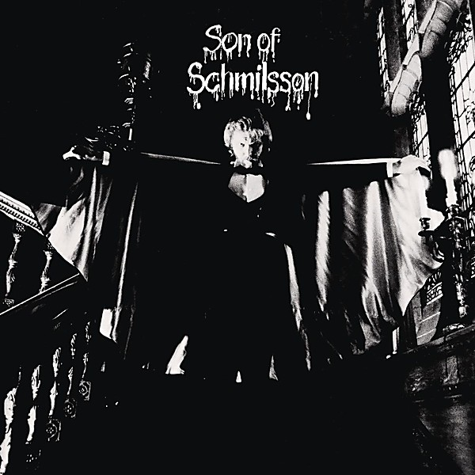

# Son of Schmilsson

By **Harry Nilsson**

## Album Data

- **Catalog:** Beets
- **Format:** Digital, Album
- **Album:** Son of Schmilsson
- **Artist:** Harry Nilsson
- **Albumartist:** Harry Nilsson
- **Genre:** Rock
- **MusicBrainz Album Artist ID:** 
- **MusicBrainz Album ID:** 
- **MusicBrainz Release Group ID:** 
- **Year:** 1972
- **Catalog #:** 
- **Label:** 
- **Total Tracks:** 11

## Album Tracks

### Track 01 - Take 54

- **Artist:** Harry Nilsson
- **Format:** ALAC
- **Genre:** Glam Rock
- **Length:** 4:18
- **MusicBrainz Track ID:** 
- **Title:** Take 54
- **Track:** 01
- **Year:** 1972

### Track 01 - Take 54

- **Artist:** Harry Nilsson
- **Format:** ALAC
- **Genre:** Glam Rock
- **Length:** 4:18
- **MusicBrainz Track ID:** 
- **Title:** Take 54
- **Track:** 01
- **Year:** 1972

### Track 02 - Remember (Christmas)

- **Artist:** Harry Nilsson
- **Format:** ALAC
- **Genre:** Easy Listening
- **Length:** 4:06
- **MusicBrainz Track ID:** 
- **Title:** Remember (Christmas)
- **Track:** 02
- **Year:** 1972

### Track 02 - Remember Christmas

- **Artist:** Harry Nilsson
- **Format:** ALAC
- **Genre:** Rock
- **Length:** 4:07
- **MusicBrainz Track ID:** 
- **Title:** Remember Christmas
- **Track:** 02
- **Year:** 1972

### Track 03 - Joy

- **Artist:** Harry Nilsson
- **Format:** ALAC
- **Genre:** Ambient
- **Length:** 3:43
- **MusicBrainz Track ID:** 
- **Title:** Joy
- **Track:** 03
- **Year:** 1972

### Track 03 - Joy

- **Artist:** Harry Nilsson
- **Format:** ALAC
- **Genre:** Ambient
- **Length:** 3:42
- **MusicBrainz Track ID:** 
- **Title:** Joy
- **Track:** 03
- **Year:** 1972

### Track 04 - Turn On Your Radio

- **Artist:** Harry Nilsson
- **Format:** ALAC
- **Genre:** Folk Rock
- **Length:** 2:39
- **MusicBrainz Track ID:** 
- **Title:** Turn On Your Radio
- **Track:** 04
- **Year:** 1972

### Track 04 - Turn on Your Radio

- **Artist:** Harry Nilsson
- **Format:** ALAC
- **Genre:** Folk Rock
- **Length:** 2:39
- **MusicBrainz Track ID:** 
- **Title:** Turn on Your Radio
- **Track:** 04
- **Year:** 1972

### Track 05 - You're Breakin' My Heart

- **Artist:** Harry Nilsson
- **Format:** ALAC
- **Genre:** Americana
- **Length:** 3:06
- **MusicBrainz Track ID:** 
- **Title:** You're Breakin' My Heart
- **Track:** 05
- **Year:** 1972

### Track 05 - You're Breakin' My Heart

- **Artist:** Harry Nilsson
- **Format:** ALAC
- **Genre:** Americana
- **Length:** 3:08
- **MusicBrainz Track ID:** 
- **Title:** You're Breakin' My Heart
- **Track:** 05
- **Year:** 1972

### Track 06 - Spaceman

- **Artist:** Harry Nilsson
- **Format:** ALAC
- **Genre:** Soft Rock
- **Length:** 3:34
- **MusicBrainz Track ID:** 
- **Title:** Spaceman
- **Track:** 06
- **Year:** 1972

### Track 06 - Spaceman

- **Artist:** Harry Nilsson
- **Format:** ALAC
- **Genre:** Soft Rock
- **Length:** 3:34
- **MusicBrainz Track ID:** 
- **Title:** Spaceman
- **Track:** 06
- **Year:** 1972

### Track 07 - The Lottery Song

- **Artist:** Harry Nilsson
- **Format:** ALAC
- **Genre:** Rock
- **Length:** 2:25
- **MusicBrainz Track ID:** 
- **Title:** The Lottery Song
- **Track:** 07
- **Year:** 1972

### Track 07 - The Lottery Song

- **Artist:** Harry Nilsson
- **Format:** ALAC
- **Genre:** Rock
- **Length:** 2:25
- **MusicBrainz Track ID:** 
- **Title:** The Lottery Song
- **Track:** 07
- **Year:** 1972

### Track 08 - At My Front Door

- **Artist:** Harry Nilsson
- **Format:** ALAC
- **Genre:** Rock
- **Length:** 3:00
- **MusicBrainz Track ID:** 
- **Title:** At My Front Door
- **Track:** 08
- **Year:** 1972

### Track 08 - At My Front Door

- **Artist:** Harry Nilsson
- **Format:** ALAC
- **Genre:** Rock
- **Length:** 3:00
- **MusicBrainz Track ID:** 
- **Title:** At My Front Door
- **Track:** 08
- **Year:** 1972

### Track 09 - Ambush

- **Artist:** Harry Nilsson
- **Format:** ALAC
- **Genre:** Rock
- **Length:** 5:22
- **MusicBrainz Track ID:** 
- **Title:** Ambush
- **Track:** 09
- **Year:** 1972

### Track 09 - Ambush

- **Artist:** Harry Nilsson
- **Format:** ALAC
- **Genre:** Rock
- **Length:** 5:21
- **MusicBrainz Track ID:** 
- **Title:** Ambush
- **Track:** 09
- **Year:** 1972

### Track 10 - I'd Rather Be Dead

- **Artist:** Harry Nilsson
- **Format:** ALAC
- **Genre:** Pop
- **Length:** 3:21
- **MusicBrainz Track ID:** 
- **Title:** I'd Rather Be Dead
- **Track:** 10
- **Year:** 1972

### Track 11 - The Most Beautiful World in the World

- **Artist:** Harry Nilsson
- **Format:** ALAC
- **Genre:** Rock
- **Length:** 3:39
- **MusicBrainz Track ID:** 
- **Title:** The Most Beautiful World in the World
- **Track:** 11
- **Year:** 1972

### Track 11 - The Most Beautiful World In The World

- **Artist:** Harry Nilsson
- **Format:** ALAC
- **Genre:** Rock
- **Length:** 3:34
- **MusicBrainz Track ID:** 
- **Title:** The Most Beautiful World In The World
- **Track:** 11
- **Year:** 1972

### Track 15 - Daybreak (single version)

- **Artist:** Harry Nilsson
- **Format:** ALAC
- **Genre:** Rock
- **Length:** 5:49
- **MusicBrainz Track ID:** 
- **Title:** Daybreak (single version)
- **Track:** 15
- **Year:** 1972

### Track 10 - I’d Rather Be Dead

- **Artist:** Harry Nilsson
- **Format:** ALAC
- **Genre:** Rock
- **Length:** 3:20
- **MusicBrainz Track ID:** [edd1b2ac-df1a-4f4d-9921-9a9d5292a100](https://musicbrainz.org/recording/edd1b2ac-df1a-4f4d-9921-9a9d5292a100)
- **Title:** I’d Rather Be Dead
- **Track:** 10
- **Year:** 1972

## See also

- [Aerial Ballet [stereo - mono]](Aerial_Ballet_[stereo_-_mono].md)
- [Aerial Pandemonium Ballet](Aerial_Pandemonium_Ballet.md)
- [A Little Touch Of Schmilsson In The Night](A_Little_Touch_Of_Schmilsson_In_The_Night.md)
- [Duit on Mon Dei](Duit_on_Mon_Dei.md)
- [Flash Harry](Flash_Harry.md)
- [Harry](Harry.md)
- [Harry Nilsson - Anthology - Personal Best - CD1](Harry_Nilsson_-_Anthology_-_Personal_Best_-_CD1.md)
- [KNNILLSSONN](KNNILLSSONN.md)
- [Nilsson Schmilsson](Nilsson_Schmilsson.md)
- [Nilsson Sessions 1967–1968](Nilsson_Sessions_1967–1968.md)
- [Nilsson Sessions 1968-1971](Nilsson_Sessions_1968-1971.md)
- [Nilsson Sessions 1971–1974](Nilsson_Sessions_1971–1974.md)
- [Nilsson Sings Newman](Nilsson_Sings_Newman.md)
- [Pandemonium Shadow Show](Pandemonium_Shadow_Show.md)
- [Pussy Cats](Pussy_Cats.md)
- [Sandman](Sandman.md)
- [Son Of Schmilsson](Son_Of_Schmilsson.md)
- [...That's The Way It Is](Thats_The_Way_It_Is.md)
- [The Point!](The_Point!.md)
- [CD: Aerial Ballet](../../CD/Harry_Nilsson/Aerial_Ballet.md)
- [CD: Aerial Pandemonium Ballet](../../CD/Harry_Nilsson/Aerial_Pandemonium_Ballet.md)
- [CD: A Little Touch Of Schmilsson In The Night](../../CD/Harry_Nilsson/A_Little_Touch_Of_Schmilsson_In_The_Night.md)
- [CD: Duit On Mon Dei](../../CD/Harry_Nilsson/Duit_On_Mon_Dei.md)
- [CD: Harry](../../CD/Harry_Nilsson/Harry.md)
- [CD: ](../../CD/Harry_Nilsson/Harry_Nilsson.md)
- [CD: Knnillsson](../../CD/Harry_Nilsson/Knnillsson.md)
- [CD: Nilsson Schmilsson](../../CD/Harry_Nilsson/Nilsson_Schmilsson.md)
- [CD: Nilsson Sessions 1967-1968](../../CD/Harry_Nilsson/Nilsson_Sessions_1967-1968.md)
- [CD: Nilsson Sessions 1968-1971](../../CD/Harry_Nilsson/Nilsson_Sessions_1968-1971.md)
- [CD: Nilsson Sessions 1971-1974](../../CD/Harry_Nilsson/Nilsson_Sessions_1971-1974.md)
- [CD: Nilsson Sings Newman (Remastered + Expanded)](../../CD/Harry_Nilsson/Nilsson_Sings_Newman_Remastered_+_Expanded.md)
- [CD: Pandemonium Shadow Show](../../CD/Harry_Nilsson/Pandemonium_Shadow_Show.md)
- [CD: Pussy Cats](../../CD/Harry_Nilsson/Pussy_Cats.md)
- [CD: Sandman](../../CD/Harry_Nilsson/Sandman.md)
- [CD: Son Of Schmilsson](../../CD/Harry_Nilsson/Son_Of_Schmilsson.md)
- [CD: ...That's The Way It Is](../../CD/Harry_Nilsson/Thats_The_Way_It_Is.md)
- [CD: The Point!](../../CD/Harry_Nilsson/The_Point!.md)
- [Roon: Aerial Pandemonium Ballet](../../Roon/Harry_Nilsson/Aerial_Pandemonium_Ballet.md)
- [Roon: A Little Touch of Schmilsson in the Night](../../Roon/Harry_Nilsson/A_Little_Touch_of_Schmilsson_in_the_Night.md)
- [Roon: Duit On Mon Dei](../../Roon/Harry_Nilsson/Duit_On_Mon_Dei.md)
- [Roon: Flash Harry](../../Roon/Harry_Nilsson/Flash_Harry.md)
- [Roon: Harry](../../Roon/Harry_Nilsson/Harry.md)
- [Roon: Knnillssonn](../../Roon/Harry_Nilsson/Knnillssonn.md)
- [Roon: Nilsson Schmilsson](../../Roon/Harry_Nilsson/Nilsson_Schmilsson.md)
- [Roon: Nilsson Sings Newman](../../Roon/Harry_Nilsson/Nilsson_Sings_Newman.md)
- [Roon: Pandemonium Shadow Show](../../Roon/Harry_Nilsson/Pandemonium_Shadow_Show.md)
- [Roon: Popeye (Music From The Motion Picture / The Deluxe Edition)](../../Roon/Harry_Nilsson/Popeye_Music_From_The_Motion_Picture_-_The_Deluxe_Edition.md)
- [Roon: Pussy Cats](../../Roon/Harry_Nilsson/Pussy_Cats.md)
- [Roon: Sandman](../../Roon/Harry_Nilsson/Sandman.md)
- [Roon: Son Of Schmilsson](../../Roon/Harry_Nilsson/Son_Of_Schmilsson.md)
- [Roon: Spotlight On Nilsson](../../Roon/Harry_Nilsson/Spotlight_On_Nilsson.md)
- [Roon: That's the Way It Is](../../Roon/Harry_Nilsson/Thats_the_Way_It_Is.md)
- [Roon: The Point!](../../Roon/Harry_Nilsson/The_Point!.md)
- [Vinyl: Everybody's Talkin'](../../Vinyl/Harry_Nilsson/Everybodys_Talkin.md)
- [Vinyl: ](../../Vinyl/Harry_Nilsson/Harry_Nilsson.md)
- [Vinyl: Nilsson Schmilsson](../../Vinyl/Harry_Nilsson/Nilsson_Schmilsson.md)
- [Vinyl: Son Of Schmilsson](../../Vinyl/Harry_Nilsson/Son_Of_Schmilsson.md)
