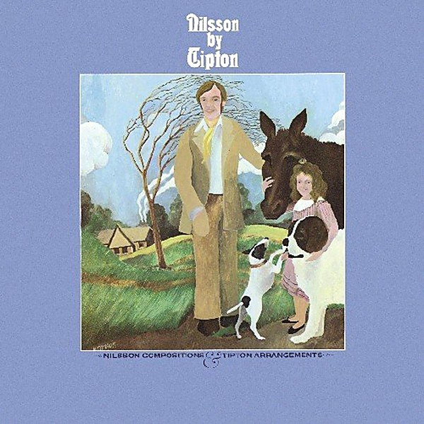

# Nilsson By Tipton

By **Harry Nilsson & George Tipton**

## Album Data

- **Catalog:** Beets
- **Format:** Digital, Album
- **Album:** Nilsson By Tipton
- **Artist:** Harry Nilsson & George Tipton
- **Albumartist:** Harry Nilsson & George Tipton
- **Genre:** Soft Rock
- **MusicBrainz Album Artist ID:** 
- **MusicBrainz Album ID:** 
- **MusicBrainz Release Group ID:** 
- **Year:** 1970
- **Catalog #:** 
- **Label:** 
- **Total Tracks:** 11

## Album Tracks

### Track 01 - Rainmaker

- **Artist:** Harry Nilsson & George Tipton
- **Format:** ALAC
- **Genre:** Easy Listening
- **Length:** 2:17
- **MusicBrainz Track ID:** 
- **Title:** Rainmaker
- **Track:** 01
- **Year:** 1970

### Track 02 - Poly High

- **Artist:** Harry Nilsson & George Tipton
- **Format:** ALAC
- **Genre:** Soft Rock
- **Length:** 2:47
- **MusicBrainz Track ID:** 
- **Title:** Poly High
- **Track:** 02
- **Year:** 1970

### Track 03 - Nobody Cares About The Railroads Anymore

- **Artist:** Harry Nilsson & George Tipton
- **Format:** ALAC
- **Genre:** Jazz
- **Length:** 1:53
- **MusicBrainz Track ID:** 
- **Title:** Nobody Cares About The Railroads Anymore
- **Track:** 03
- **Year:** 1970

### Track 04 - Think About Your Troubles

- **Artist:** Harry Nilsson & George Tipton
- **Format:** ALAC
- **Genre:** Rock
- **Length:** 2:37
- **MusicBrainz Track ID:** 
- **Title:** Think About Your Troubles
- **Track:** 04
- **Year:** 1970

### Track 05 - Marchin' Down Broadway

- **Artist:** Harry Nilsson & George Tipton
- **Format:** ALAC
- **Genre:** Soft Rock
- **Length:** 1:03
- **MusicBrainz Track ID:** 
- **Title:** Marchin' Down Broadway
- **Track:** 05
- **Year:** 1970

### Track 06 - One

- **Artist:** Harry Nilsson & George Tipton
- **Format:** ALAC
- **Genre:** Pop
- **Length:** 2:35
- **MusicBrainz Track ID:** 
- **Title:** One
- **Track:** 06
- **Year:** 1970

### Track 07 - Maybe

- **Artist:** Harry Nilsson & George Tipton
- **Format:** ALAC
- **Genre:** Downtempo
- **Length:** 2:55
- **MusicBrainz Track ID:** 
- **Title:** Maybe
- **Track:** 07
- **Year:** 1970

### Track 08 - Open Your Window

- **Artist:** Harry Nilsson & George Tipton
- **Format:** ALAC
- **Genre:** Sunshine Pop
- **Length:** 2:41
- **MusicBrainz Track ID:** 
- **Title:** Open Your Window
- **Track:** 08
- **Year:** 1970

### Track 09 - Without Her

- **Artist:** Harry Nilsson & George Tipton
- **Format:** ALAC
- **Genre:** Rock
- **Length:** 2:51
- **MusicBrainz Track ID:** 
- **Title:** Without Her
- **Track:** 09
- **Year:** 1970

### Track 10 - Mourning Glory Story

- **Artist:** Harry Nilsson & George Tipton
- **Format:** ALAC
- **Genre:** Soft Rock
- **Length:** 2:30
- **MusicBrainz Track ID:** 
- **Title:** Mourning Glory Story
- **Track:** 10
- **Year:** 1970

### Track 11 - Waiting

- **Artist:** Harry Nilsson & George Tipton
- **Format:** ALAC
- **Genre:** Soft Rock
- **Length:** 2:21
- **MusicBrainz Track ID:** 
- **Title:** Waiting
- **Track:** 11
- **Year:** 1970

