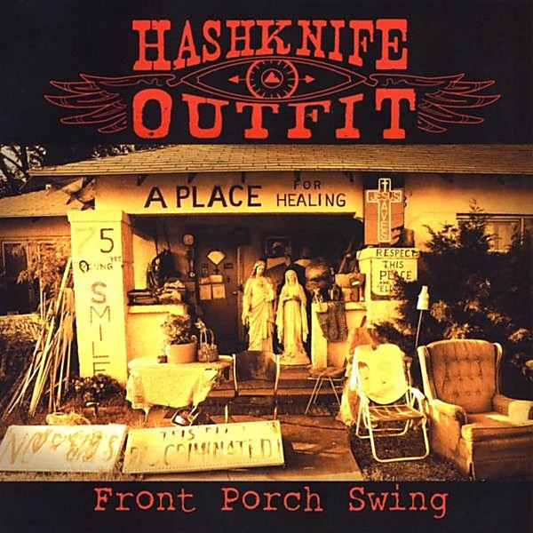

# Front Porch Swing

By **Hashknife Outfit**

## Album Data

- **Catalog:** Beets
- **Format:** Digital, Album
- **Album:** Front Porch Swing
- **Artist:** Hashknife Outfit
- **Albumartist:** Hashknife Outfit
- **Genre:** Unknown
- **MusicBrainz Album Artist ID:** 
- **MusicBrainz Album ID:** 
- **MusicBrainz Release Group ID:** 
- **Year:** 2009
- **Catalog #:** 
- **Label:** 
- **Total Tracks:** 12

## Album Tracks

### Track 01 - Born A Beast

- **Artist:** Hashknife Outfit
- **Format:** ALAC
- **Genre:** Unknown
- **Length:** 1:22
- **MusicBrainz Track ID:** 
- **Title:** Born A Beast
- **Track:** 01
- **Year:** 2009

### Track 02 - City Livin

- **Artist:** Hashknife Outfit
- **Format:** ALAC
- **Genre:** Unknown
- **Length:** 2:43
- **MusicBrainz Track ID:** 
- **Title:** City Livin
- **Track:** 02
- **Year:** 2009

### Track 03 - Jar Of Whiskey

- **Artist:** Hashknife Outfit
- **Format:** ALAC
- **Genre:** Unknown
- **Length:** 2:47
- **MusicBrainz Track ID:** 
- **Title:** Jar Of Whiskey
- **Track:** 03
- **Year:** 2009

### Track 04 - Hesitation Blues

- **Artist:** Hashknife Outfit
- **Format:** ALAC
- **Genre:** Unknown
- **Length:** 2:32
- **MusicBrainz Track ID:** 
- **Title:** Hesitation Blues
- **Track:** 04
- **Year:** 2009

### Track 05 - Sliver Of Moon

- **Artist:** Hashknife Outfit
- **Format:** ALAC
- **Genre:** Unknown
- **Length:** 2:47
- **MusicBrainz Track ID:** 
- **Title:** Sliver Of Moon
- **Track:** 05
- **Year:** 2009

### Track 06 - Dead & Gone

- **Artist:** Hashknife Outfit
- **Format:** ALAC
- **Genre:** Unknown
- **Length:** 3:42
- **MusicBrainz Track ID:** 
- **Title:** Dead & Gone
- **Track:** 06
- **Year:** 2009

### Track 07 - Sharpest Knife

- **Artist:** Hashknife Outfit
- **Format:** ALAC
- **Genre:** Unknown
- **Length:** 2:24
- **MusicBrainz Track ID:** 
- **Title:** Sharpest Knife
- **Track:** 07
- **Year:** 2009

### Track 08 - Meantime

- **Artist:** Hashknife Outfit
- **Format:** ALAC
- **Genre:** Unknown
- **Length:** 2:56
- **MusicBrainz Track ID:** 
- **Title:** Meantime
- **Track:** 08
- **Year:** 2009

### Track 09 - Unwritten Songs

- **Artist:** Hashknife Outfit
- **Format:** ALAC
- **Genre:** Unknown
- **Length:** 5:02
- **MusicBrainz Track ID:** 
- **Title:** Unwritten Songs
- **Track:** 09
- **Year:** 2009

### Track 10 - Original Sin

- **Artist:** Hashknife Outfit
- **Format:** ALAC
- **Genre:** Unknown
- **Length:** 2:19
- **MusicBrainz Track ID:** 
- **Title:** Original Sin
- **Track:** 10
- **Year:** 2009

### Track 11 - 10th St

- **Artist:** Hashknife Outfit
- **Format:** ALAC
- **Genre:** Unknown
- **Length:** 2:58
- **MusicBrainz Track ID:** 
- **Title:** 10th St
- **Track:** 11
- **Year:** 2009

### Track 12 - Cigareets & Whusky

- **Artist:** Hashknife Outfit
- **Format:** ALAC
- **Genre:** Unknown
- **Length:** 1:51
- **MusicBrainz Track ID:** 
- **Title:** Cigareets & Whusky
- **Track:** 12
- **Year:** 2009

