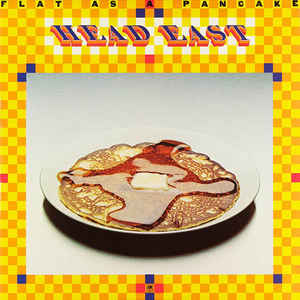

# Flat as a Pancake

By **Head East**

## Album Data

- **Catalog:** Beets
- **Format:** Digital, Album
- **Album:** Flat as a Pancake
- **Artist:** Head East
- **Albumartist:** Head East
- **Genre:** Southern Rock
- **MusicBrainz Album Artist ID:** [1f6fdb90-95a2-419e-9994-b406d562caac](https://musicbrainz.org/artist/1f6fdb90-95a2-419e-9994-b406d562caac)
- **MusicBrainz Album ID:** [1b44df31-4f44-4c89-b652-19c506a99fb3](https://musicbrainz.org/release/1b44df31-4f44-4c89-b652-19c506a99fb3)
- **MusicBrainz Release Group ID:** [bcf4c04c-0bff-370f-aaa8-fd3057b6f4b1](https://musicbrainz.org/release-group/bcf4c04c-0bff-370f-aaa8-fd3057b6f4b1)
- **Year:** 1975
- **Catalog #:** 
- **Label:** A&M Records
- **Total Tracks:** 09

## Album Tracks

### Track 01 - Never Been Any Reason

- **Artist:** Head East
- **Format:** MP3
- **Genre:** Hard Rock
- **Length:** 5:10
- **MusicBrainz Track ID:** [1557831e-9f50-4e38-a46b-048a8ced7b31](https://musicbrainz.org/recording/1557831e-9f50-4e38-a46b-048a8ced7b31)
- **Title:** Never Been Any Reason
- **Track:** 01
- **Year:** 1975

### Track 02 - One Against the Other

- **Artist:** Head East
- **Format:** MP3
- **Genre:** Southern Rock
- **Length:** 3:46
- **MusicBrainz Track ID:** [6d7fb72f-2312-4e83-a977-07c454a6db1a](https://musicbrainz.org/recording/6d7fb72f-2312-4e83-a977-07c454a6db1a)
- **Title:** One Against the Other
- **Track:** 02
- **Year:** 1975

### Track 03 - Love Me Tonight

- **Artist:** Head East
- **Format:** MP3
- **Genre:** Hard Rock
- **Length:** 4:27
- **MusicBrainz Track ID:** [047c714a-8cf4-4c4f-8e25-e7155b9bc3d3](https://musicbrainz.org/recording/047c714a-8cf4-4c4f-8e25-e7155b9bc3d3)
- **Title:** Love Me Tonight
- **Track:** 03
- **Year:** 1975

### Track 04 - City of Gold

- **Artist:** Head East
- **Format:** MP3
- **Genre:** Hard Rock
- **Length:** 3:43
- **MusicBrainz Track ID:** [d6855ba4-92c0-431a-a9ba-32fc7b1ff307](https://musicbrainz.org/recording/d6855ba4-92c0-431a-a9ba-32fc7b1ff307)
- **Title:** City of Gold
- **Track:** 04
- **Year:** 1975

### Track 05 - Fly by Night Lady

- **Artist:** Head East
- **Format:** MP3
- **Genre:** Hard Rock
- **Length:** 2:48
- **MusicBrainz Track ID:** [092cc268-f199-40bd-9fa1-1538a6ddf692](https://musicbrainz.org/recording/092cc268-f199-40bd-9fa1-1538a6ddf692)
- **Title:** Fly by Night Lady
- **Track:** 05
- **Year:** 1975

### Track 06 - Jefftown Creek

- **Artist:** Head East
- **Format:** MP3
- **Genre:** Southern Rock
- **Length:** 6:40
- **MusicBrainz Track ID:** [7b9d053d-ac27-4b0b-bf00-b0160f2066de](https://musicbrainz.org/recording/7b9d053d-ac27-4b0b-bf00-b0160f2066de)
- **Title:** Jefftown Creek
- **Track:** 06
- **Year:** 1975

### Track 07 - Lovin' Me Along

- **Artist:** Head East
- **Format:** MP3
- **Genre:** Hard Rock
- **Length:** 5:27
- **MusicBrainz Track ID:** [577b1033-9a12-45ec-8b38-6bd61d4ace0b](https://musicbrainz.org/recording/577b1033-9a12-45ec-8b38-6bd61d4ace0b)
- **Title:** Lovin' Me Along
- **Track:** 07
- **Year:** 1975

### Track 08 - Ticket Back to Georgia

- **Artist:** Head East
- **Format:** MP3
- **Genre:** Southern Rock
- **Length:** 4:04
- **MusicBrainz Track ID:** [bc865316-aa6e-49ef-997c-c82c0d2de456](https://musicbrainz.org/recording/bc865316-aa6e-49ef-997c-c82c0d2de456)
- **Title:** Ticket Back to Georgia
- **Track:** 08
- **Year:** 1975

### Track 09 - Brother Jacob

- **Artist:** Head East
- **Format:** MP3
- **Genre:** Hard Rock
- **Length:** 3:15
- **MusicBrainz Track ID:** [c02bdf02-3d24-45c3-9866-8d98e434860a](https://musicbrainz.org/recording/c02bdf02-3d24-45c3-9866-8d98e434860a)
- **Title:** Brother Jacob
- **Track:** 09
- **Year:** 1975

