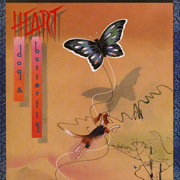

# Dog & Butterfly

By **Heart**

## Album Data

- **Catalog:** Beets
- **Format:** Digital, Album
- **Album:** Dog & Butterfly
- **Artist:** Heart
- **Albumartist:** Heart
- **Genre:** Progressive Rock
- **MusicBrainz Album Artist ID:** [bdbd48f5-abf3-4a4f-9a21-4551dbc3fde9](https://musicbrainz.org/artist/bdbd48f5-abf3-4a4f-9a21-4551dbc3fde9)
- **MusicBrainz Album ID:** [3cfce33b-9eea-357c-b0c4-42792539ff55](https://musicbrainz.org/release/3cfce33b-9eea-357c-b0c4-42792539ff55)
- **MusicBrainz Release Group ID:** [3375278e-6a10-3fbb-b65a-61514a027fc2](https://musicbrainz.org/release-group/3375278e-6a10-3fbb-b65a-61514a027fc2)
- **Year:** 1985
- **Catalog #:** 
- **Label:** 
- **Total Tracks:** 10

## Album Tracks

### Track 01 - Magic Man

- **Artist:** Heart
- **Format:** AAC
- **Genre:** Hard Rock
- **Length:** 5:27
- **MusicBrainz Track ID:** 
- **Title:** Magic Man
- **Track:** 01
- **Year:** 1987

### Track 02 - Dreamboat Annie (Fantasy Child)

- **Artist:** Heart
- **Format:** AAC
- **Genre:** Soft Rock
- **Length:** 1:10
- **MusicBrainz Track ID:** 
- **Title:** Dreamboat Annie (Fantasy Child)
- **Track:** 02
- **Year:** 1987

### Track 03 - Crazy On You

- **Artist:** Heart
- **Format:** AAC
- **Genre:** Hard Rock
- **Length:** 4:53
- **MusicBrainz Track ID:** 
- **Title:** Crazy On You
- **Track:** 03
- **Year:** 1987

### Track 04 - Soul Of The Sea

- **Artist:** Heart
- **Format:** AAC
- **Genre:** Soft Rock
- **Length:** 6:33
- **MusicBrainz Track ID:** 
- **Title:** Soul Of The Sea
- **Track:** 04
- **Year:** 1987

### Track 05 - Dreamboat Annie

- **Artist:** Heart
- **Format:** AAC
- **Genre:** Soft Rock
- **Length:** 2:01
- **MusicBrainz Track ID:** 
- **Title:** Dreamboat Annie
- **Track:** 05
- **Year:** 1987

### Track 06 - White Lightning & Wine

- **Artist:** Heart
- **Format:** ALAC
- **Genre:** Hard Rock
- **Length:** 3:53
- **MusicBrainz Track ID:** 
- **Title:** White Lightning & Wine
- **Track:** 06
- **Year:** 1976

### Track 06 - White Lightning And Wine

- **Artist:** Heart
- **Format:** AAC
- **Genre:** Indie Rock
- **Length:** 3:53
- **MusicBrainz Track ID:** 
- **Title:** White Lightning And Wine
- **Track:** 06
- **Year:** 1987

### Track 07 - (Love Me Like Music) I'll Be Your Song

- **Artist:** Heart
- **Format:** AAC
- **Genre:** Soft Rock
- **Length:** 3:20
- **MusicBrainz Track ID:** 
- **Title:** (Love Me Like Music) I'll Be Your Song
- **Track:** 07
- **Year:** 1987

### Track 08 - Sing Child

- **Artist:** Heart
- **Format:** AAC
- **Genre:** Hard Rock
- **Length:** 4:55
- **MusicBrainz Track ID:** 
- **Title:** Sing Child
- **Track:** 08
- **Year:** 1987

### Track 09 - How Deep It Goes

- **Artist:** Heart
- **Format:** AAC
- **Genre:** Soft Rock
- **Length:** 3:49
- **MusicBrainz Track ID:** 
- **Title:** How Deep It Goes
- **Track:** 09
- **Year:** 1987

### Track 10 - Dreamboat Annie (Reprise)

- **Artist:** Heart
- **Format:** AAC
- **Genre:** Hard Rock
- **Length:** 3:50
- **MusicBrainz Track ID:** 
- **Title:** Dreamboat Annie (Reprise)
- **Track:** 10
- **Year:** 1987

## See also

- [Dreamboat Annie](Dreamboat_Annie.md)
- [Secret Heart Illustrated](Secret_Heart_Illustrated.md)
- [Roon: Alive in Seattle (Live)](../../Roon/Heart/Alive_in_Seattle_Live.md)
- [Roon: Beautiful Broken](../../Roon/Heart/Beautiful_Broken.md)
- [Roon: Dog & Butterfly](../../Roon/Heart/Dog_and_Butterfly.md)
- [Roon: Dreamboat Annie](../../Roon/Heart/Dreamboat_Annie.md)
- [Roon: Little Queen](../../Roon/Heart/Little_Queen.md)
- [Vinyl: Dog & Butterfly](../../Vinyl/Heart/Dog_and_Butterfly.md)
- [Vinyl: Dreamboat Annie](../../Vinyl/Heart/Dreamboat_Annie.md)
- [Vinyl: ](../../Vinyl/Heart/Heart.md)
- [Vinyl: Little Queen](../../Vinyl/Heart/Little_Queen.md)
- [Vinyl: Magazine](../../Vinyl/Heart/Magazine.md)
