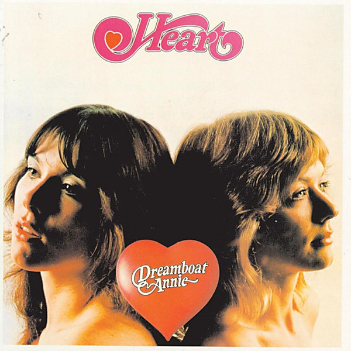

# Dreamboat Annie

By **Heart**

## Album Data

- **Catalog:** Beets
- **Format:** Digital, Album
- **Album:** Dreamboat Annie
- **Artist:** Heart
- **Albumartist:** Heart
- **Genre:** Soft Rock
- **MusicBrainz Album Artist ID:** 
- **MusicBrainz Album ID:** 
- **MusicBrainz Release Group ID:** 
- **Year:** 1987
- **Catalog #:** SX-TT 979
- **Label:** Slipped Disc Records
- **Total Tracks:** 08

## Album Tracks

### Track 01 - Devil Delight

- **Artist:** Heart
- **Format:** AAC
- **Genre:** Hard Rock
- **Length:** 5:19
- **MusicBrainz Track ID:** [9a5778f9-8e89-4f0b-a702-8c9e85584af3](https://musicbrainz.org/recording/9a5778f9-8e89-4f0b-a702-8c9e85584af3)
- **Title:** Devil Delight
- **Track:** 01
- **Year:** 1978

### Track 02 - Magic Man

- **Artist:** Heart
- **Format:** AAC
- **Genre:** Hard Rock
- **Length:** 10:12
- **MusicBrainz Track ID:** [333c08ab-d8ef-422f-bc3d-7e88f463b44c](https://musicbrainz.org/recording/333c08ab-d8ef-422f-bc3d-7e88f463b44c)
- **Title:** Magic Man
- **Track:** 02
- **Year:** 1978

### Track 03 - The Rover

- **Artist:** Heart
- **Format:** AAC
- **Genre:** Hard Rock
- **Length:** 5:02
- **MusicBrainz Track ID:** [3e50ca7b-4cbe-4b26-b15c-4f6344296fc5](https://musicbrainz.org/recording/3e50ca7b-4cbe-4b26-b15c-4f6344296fc5)
- **Title:** The Rover
- **Track:** 03
- **Year:** 1978

### Track 04 - Rock and Roll

- **Artist:** Heart
- **Format:** AAC
- **Genre:** Hard Rock
- **Length:** 4:29
- **MusicBrainz Track ID:** [2f2b5fbd-2130-4991-929e-bd59d43d53ec](https://musicbrainz.org/recording/2f2b5fbd-2130-4991-929e-bd59d43d53ec)
- **Title:** Rock and Roll
- **Track:** 04
- **Year:** 1978

### Track 05 - Heartless

- **Artist:** Heart
- **Format:** AAC
- **Genre:** Pop Rock
- **Length:** 5:11
- **MusicBrainz Track ID:** [0859ecb0-284f-40cc-8c10-d2ed937d7aed](https://musicbrainz.org/recording/0859ecb0-284f-40cc-8c10-d2ed937d7aed)
- **Title:** Heartless
- **Track:** 05
- **Year:** 1978

### Track 06 - The Battle of Evermore

- **Artist:** Heart
- **Format:** AAC
- **Genre:** Folk Rock
- **Length:** 5:08
- **MusicBrainz Track ID:** [d75d74cd-92e3-4962-87a2-be629c1371e6](https://musicbrainz.org/recording/d75d74cd-92e3-4962-87a2-be629c1371e6)
- **Title:** The Battle of Evermore
- **Track:** 06
- **Year:** 1978

### Track 07 - White Lightning and Wine

- **Artist:** Heart
- **Format:** AAC
- **Genre:** Indie Rock
- **Length:** 5:38
- **MusicBrainz Track ID:** [85793276-659c-4907-b311-01d134f985d8](https://musicbrainz.org/recording/85793276-659c-4907-b311-01d134f985d8)
- **Title:** White Lightning and Wine
- **Track:** 07
- **Year:** 1978

### Track 08 - Crazy on You

- **Artist:** Heart
- **Format:** AAC
- **Genre:** Hard Rock
- **Length:** 3:24
- **MusicBrainz Track ID:** [d7626283-3b3a-474a-a4d1-4934a6980bf4](https://musicbrainz.org/recording/d7626283-3b3a-474a-a4d1-4934a6980bf4)
- **Title:** Crazy on You
- **Track:** 08
- **Year:** 1978

## See also

- [Dog & Butterfly](Dog_and_Butterfly.md)
- [Secret Heart Illustrated](Secret_Heart_Illustrated.md)
- [Roon: Alive in Seattle (Live)](../../Roon/Heart/Alive_in_Seattle_Live.md)
- [Roon: Beautiful Broken](../../Roon/Heart/Beautiful_Broken.md)
- [Roon: Dog & Butterfly](../../Roon/Heart/Dog_and_Butterfly.md)
- [Roon: Dreamboat Annie](../../Roon/Heart/Dreamboat_Annie.md)
- [Roon: Little Queen](../../Roon/Heart/Little_Queen.md)
- [Vinyl: Dog & Butterfly](../../Vinyl/Heart/Dog_and_Butterfly.md)
- [Vinyl: Dreamboat Annie](../../Vinyl/Heart/Dreamboat_Annie.md)
- [Vinyl: ](../../Vinyl/Heart/Heart.md)
- [Vinyl: Little Queen](../../Vinyl/Heart/Little_Queen.md)
- [Vinyl: Magazine](../../Vinyl/Heart/Magazine.md)
